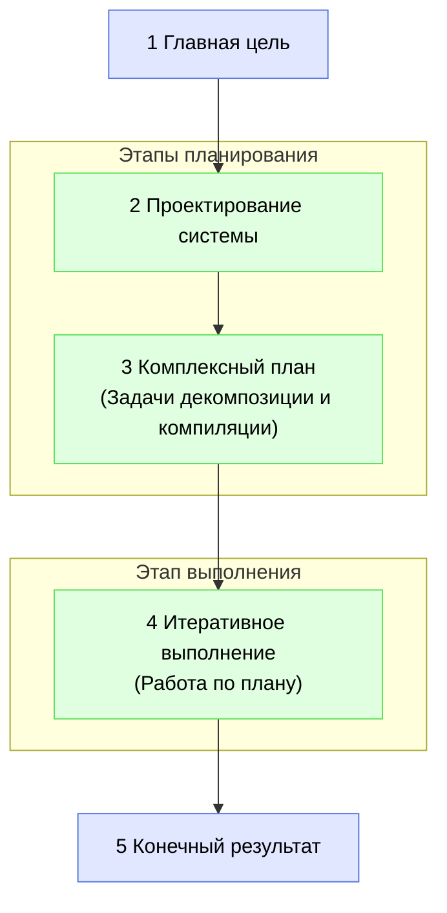

# Фаза разработки в IDGL

## Обоснование

Разработка любой значительной функции или системы с использованием фреймворка IDGL проводится в виде серии **Фаз разработки**. Фаза — это самодостаточная единица работы, предназначенная для достижения одной, сфокусированной `Главной цели`. Небольшой проект может состоять из одной фазы, в то время как крупномасштабное приложение строится как последовательность нескольких взаимосвязанных фаз (например, «Фаза создания каркаса», за которой следует «Фаза аутентификации» и т. д.).

Эта модель обеспечивает гибкий и масштабируемый подход, позволяя специалистам планировать и выполнять сложную работу управляемыми, итеративными этапами.

## Пять шагов фазы разработки

Каждая фаза разработки следует последовательному пятиступенчатому процессу, переходя от высокоуровневой цели к конкретному, проверенному результату.

### 1. Определение главной цели
Это сфокусированная задача для текущей фазы. Она определяет «почему» и служит источником для `intent.md` верхнего уровня для этого объема работ.
*   **Пример:** «Реализовать полную систему аутентификации и регистрации пользователей».

### 2. Проектирование системы
Это генеративная задача по созданию архитектурного плана для достижения цели фазы. Она определяет «что» и «как».
*   **Намерение:** «На основе главной цели спроектировать высокоуровневую архитектуру для системы аутентификации».
*   **Артефакт:** Документ по проектированию системы для этой конкретной фазы.

### 3. Комплексное планирование
Это центральный этап оркестрации для фазы. Он использует `Проектирование системы` в качестве входных данных для создания полного графа зависимостей всех необходимых работ.
*   **Намерение:** «Используя приложенное проектирование системы, определить все задачи декомпозиции, исследования и компиляции, необходимые для создания системы аутентификации».
*   **Артефакт:** Заполненная структура каталогов `.idgl/` для генеративных задач этой фазы.

### 4. Итеративное выполнение
Это этап «работы», на котором специалист по IDGL выполняет задачи, изложенные в плане.
*   **Процесс:** Специалист систематически проходит по каждой папке с задачами (будь то декомпозиция или компиляция), используя основной цикл IDGL для создания требуемого артефакта для этого шага.

### 5. Конечный результат
Это материальный, проверенный результат фазы.
*   **Источник:** `Конечный результат` — это артефакт, созданный последней задачей `компиляции`, определенной в плане для этой фазы.
*   **Следующий шаг:** Этот результат служит стабильной базой и отправной точкой для *следующей* фазы разработки. 