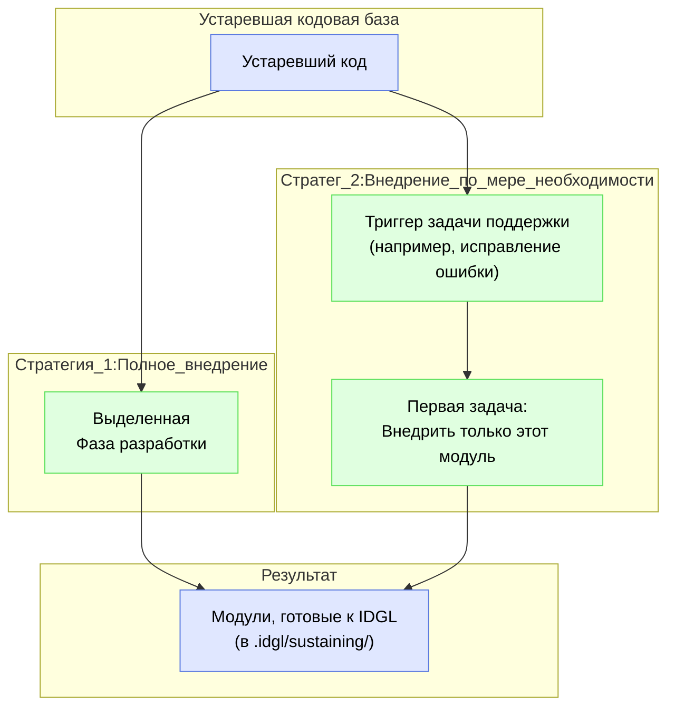

# Внедрение устаревших артефактов

## Обоснование

Основной принцип IDGL заключается в том, что вся разработка руководствуется явной, контролируемой версиями **Спецификацией** (`intent.md`). Устаревшие проекты, по определению, не имеют этих артефактов. **Внедрение устаревших артефактов** — это процесс создания этих основополагающих спецификаций для существующего кода, что делает его полностью совместимым с **Жизненным циклом поддержки** IDGL.

Это не универсальный процесс. В зависимости от потребностей проекта и ресурсов, специалист может выбрать одну из двух основных стратегий: комплексное «Полное внедрение» или более гибкий подход «Внедрение по мере необходимости».

## Стратегия 1: Полное внедрение (в рамках Фазы разработки)

Это комплексное, на уровне проекта, усилие по внедрению всего устаревшего приложения за один раз.

*   **Когда использовать:** Когда есть стратегическое обязательство модернизировать всю устаревшую систему, и у вас есть выделенные ресурсы для крупномасштабной работы по документированию и структурированию.
*   **Процесс:** Внедрение рассматривается как формальная **Фаза разработки**.
    1.  **Главная цель:** «Внедрить устаревший проект «Монолит» в фреймворк IDGL».
    2.  **Проектирование системы:** Эта задача анализирует монолит и создает спецификацию, которая определяет его основные архитектурные модули.
    3.  **Комплексный план:** Эта задача создает план для выполнения задачи внедрения для каждого определенного модуля.
    4.  **Выполнение:** Специалист выполняет сгенерированные задачи (например, `01_onboard_auth_module/`, `02_onboard_payment_module/`). Намерение для каждой из них — реконструировать спецификацию для этой части устаревшего кода.
*   **Результат:** Каталог `.idgl/sustaining/` полностью заполняется базовыми структурами для всех модулей устаревшего приложения, что делает весь проект готовым для будущей работы по поддержке.

## Стратегия 2: Внедрение по мере необходимости (в рамках деятельности по поддержке)

Это непрерывный, гибкий подход, при котором части устаревшей системы внедряются по мере необходимости.

*   **Когда использовать:** Это наиболее распространенный и практичный подход. Он интегрирует работу по созданию спецификаций в естественный поток повседневного обслуживания и разработки.
*   **Процесс:**
    1.  Специалист получает задачу исправить ошибку в устаревшем модуле (например, в системе аутентификации).
    2.  Он переходит в `.idgl/sustaining/` и видит, что папка `authentication/` еще не существует.
    3.  Его **первая генеративная задача** — внедрить модуль. Он создает новую задачу `sustaining/authentication/00_onboard_module/` с намерением: «Проанализировать устаревший код аутентификации, сгенерировать его спецификацию и установить ее в качестве базового артефакта».
    4.  После завершения этой задачи и создания базового состояния, он может создать свою **вторую генеративную задачу** для фактического исправления ошибки: `sustaining/authentication/fix-login-bug/`.
*   **Преимущество:** Это создает благотворный цикл. Покрытие спецификациями системы органично увеличивается по мере того, как разработчики работают с разными частями кода. Это позволяет избежать большого, предварительного проекта по внедрению и делает создание документации естественной частью процесса обслуживания. 