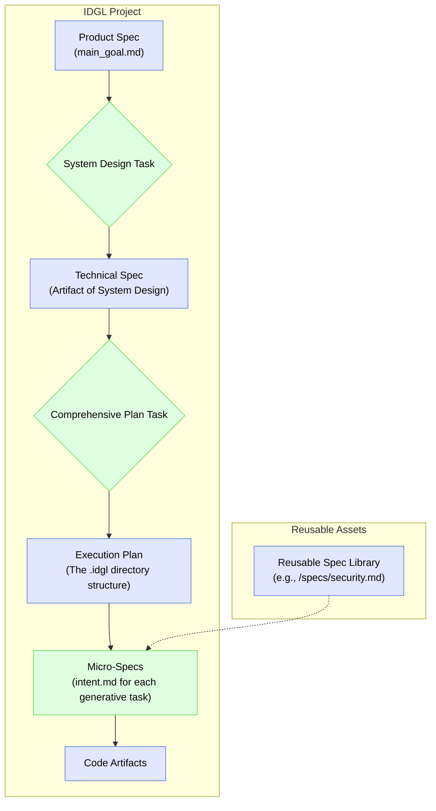

# The IDGL Spec: The Authoritative Source of Truth

## Rationale: IDGL as Spec-Driven Development

The **Intent-Driven Generative Lifecycle (IDGL)** is a methodology for executing **specifications** with the assistance of artificial intelligence. The "Spec" is the primary, version-controlled artifact of the entire development process, not side material. The code produced is a downstream translation of the rich intent captured in the spec.

A specification is the authoritative, written description of intent, covering:
1.  **What** to build (functional requirements, success criteria).
2.  **Why** it should behave that way (values, business rules, safety constraints).
3.  **How** to verify success (tests, evaluation criteria).

This approach ensures human and machine alignment around a single, unambiguous source of truth.

## Mapping Specs to the IDGL Framework

The different files and artifacts we have defined throughout the IDGL methodology are simply different flavors and scopes of specifications.

### Flavors of Specs in IDGL

*   **Product Spec (`main_goal.md`):** This is the highest-level spec. It defines the goal for an entire `Development Phase`, focusing on user stories, business value, and overall success criteria.

*   **Technical / Architectural Spec:** This is the artifact produced by the `01_system_design` task within a phase. It defines interfaces, data contracts, and technology choices, providing the "how" for the "what" described in the Product Spec.

*   **Test Spec / Micro-Spec (`intent.md`):** This is the most granular spec. The `intent.md` for any given generative task is a self-contained, executable specification. It should include concrete examples, edge cases, and acceptance criteria that can be used to validate the generated artifact.

### Reusable & Composable Specs

To promote consistency and reuse, an IDGL project can maintain a central library of common specifications, for example:
*   `/specs/security-guidelines.md`
*   `/specs/ux-style-guide.md`
*   `/specs/privacy-policy.md`

The `intent.md` for any generative task can then import or reference these common specs, ensuring that all generated artifacts adhere to the same set of high-level constraints. This makes the entire process more robust, maintainable, and aligned with organizational policy. 