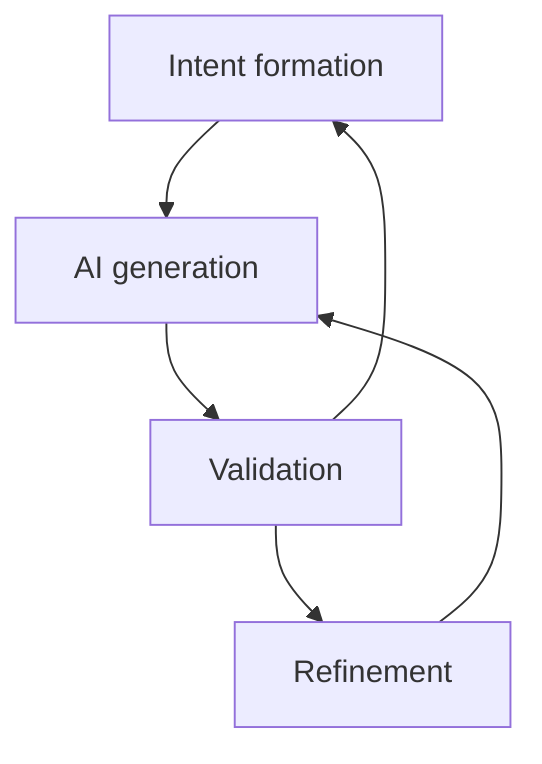

# Intent-Driven Generative Lifecycle (IDGL): Core Concept

This document outlines the core principles of the Intent-Driven Generative Lifecycle (IDGL), a systematic methodology for crafting AI-generated content.

## Definition

The Intent-Driven Generative Lifecycle (IDGL) is a structured process for creating any form of content with the assistance of artificial intelligence, including software development and any domain where AI can generate artifacts, such as text, images, code, or data.

The fundamental unit of IDGL is the "ai-gen" cycle, which consists of four primary stages:

1.  **Intent Formation**: This initial step involves clearly defining the desired outcome. The goal is to articulate a precise and actionable intent that will guide the AI generation process.

2.  **AI Generation**: Based on the formulated intent, the AI model generates the content. This is the primary creation phase where the initial artifact is produced.

3.  **Validation**: The generated artifact is critically evaluated against the original intent. The key question is: "Does this meet the specified requirements?"

4.  **Refinement**: If the validation step reveals discrepancies or opportunities for improvement (e.g., bug fixes, refactoring), the process enters the refinement stage. This involves initiating a new, scoped **refinement sub-task**. This sub-task is a formal generative task with its own clear intent (e.g., "Fix the off-by-one error in this function" or "Refactor this component to use the new data service"). The loop then returns to the **AI Generation** stage within the context of this new sub-task.

If the validation process determines that the generated output is fundamentally misaligned with the goal and simple refinement is insufficient, the loop can be restarted from the **Intent Formation** stage. This allows for a re-evaluation and reformulation of the core objective. 