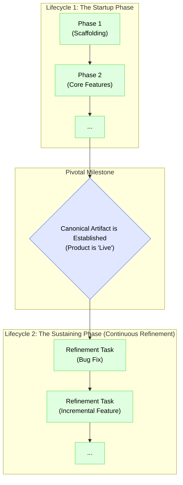

# The Two Lifecycles of an IDGL Project

## Rationale: From Startup to Sustaining

The lifecycle of a project developed using IDGL mirrors the journey of a startup: an initial, high-intensity phase of creation followed by a long-term phase of sustained, iterative development. This document defines these two strategic lifecycles. The transition between them is a pivotal milestone, marking the point where the core artifact is considered stable and established.

## Lifecycle 1: The Startup Phase (Initial Generation)

This is the primary creation stage, focused on building the core project from a concept to a stable, functional product.

*   **Unit of Work:** The formal, multi-step **Development Phase**, as defined in `07-idgl-development-phase.md`.
*   **Process:** This lifecycle consists of a sequence of planned `Development Phases`. Each phase is a significant strategic investment, complete with its own `System Design` and `Comprehensive Plan`, necessary for navigating the uncertainty of new creation.
*   **When to Use:** Use this lifecycle for building the initial version of an application or for adding major new epics that are akin to launching a new product line.

## Lifecycle 2: The Sustaining Phase (Continuous Refinement)

This lifecycle begins after the pivotal milestone where the canonical artifact is considered stable and "live." It represents the ongoing, day-to-day evolution and maintenance of the established product.

*   **Unit of Work:** The agile, ad-hoc **Generative Task**.
*   **Process:** This lifecycle consists of a continuous stream of individual, focused generative tasks. These tasks target the existing, stable codebase and are typically smaller and more predictable, allowing them to bypass the formal 5-step phase structure for greater efficiency.
*   **When to Use:** Use this lifecycle for the regular work of software development: fixing bugs, adding incremental features, performing performance tweaks, and managing technical debt.

This two-lifecycle model provides a complete strategic framework for both building and sustaining a project using the IDGL methodology. 