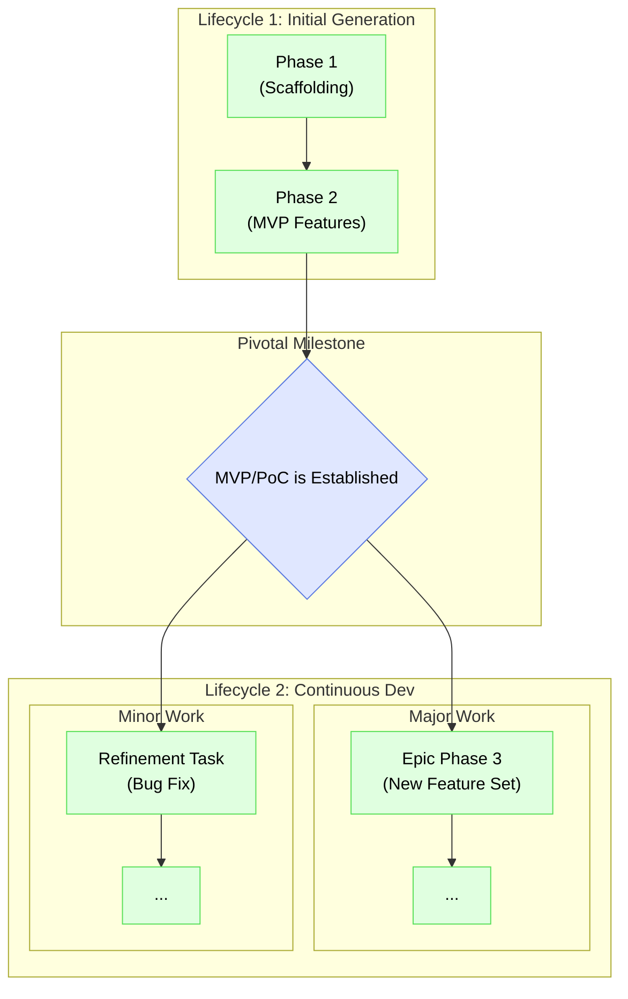
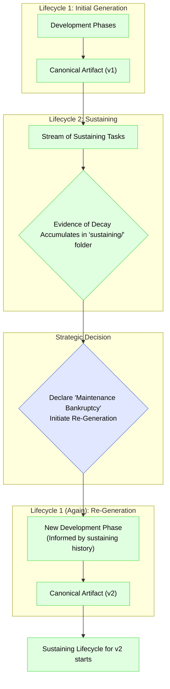

# The Two Lifecycles of an IDGL Project

## Rationale: From Initial Creation to Continuous Evolution

The lifecycle of a project is divided into two major stages: the **Initial Generation** to create the first version of the artifact, and a perpetual **Continuous Development** stage for all subsequent work. This model provides the flexibility to handle both large, planned feature epics and small, incremental changes after the initial release.



## Lifecycle 1: Initial Generation
This is the special, one-time process of creating the first canonical artifact (e.g., the MVP or PoC) from a blank slate.

*   **Unit of Work:** The formal, multi-step **Development Phase**, as defined in `07-idgl-development-phase.md`.
*   **Process:** This consists of a sequence of one or more `Development Phases` required to get to the first stable, releasable version of the product.

## Lifecycle 2: Continuous Development
This lifecycle begins after the initial artifact is established and covers all subsequent evolution of the product. It has two modes of operation depending on the scale of the work.

*   **Mode A: Major Epics (Building the "rest" of the product)**
    *   **Unit of Work:** The formal **Development Phase**.
    *   **Process:** When adding a significant new feature set, a new `Development Phase` is initiated. It follows the full 5-step process but uses the existing codebase as its starting baseline.
    *   **When to Use:** For large, planned feature epics that require their own design and comprehensive planning.

*   **Mode B: Incremental Changes**
    *   **Unit of Work:** The ad-hoc **Generative Task**.
    *   **Process:** For smaller changes, a single generative task is initiated. This is a more agile approach that bypasses the formal phase structure.
    *   **When to Use:** For bug fixes, performance tweaks, minor enhancements, and other small-scale, incremental work.

This two-mode model for continuous development provides the right level of structure for any task, ensuring both agility for small changes and rigor for major additions.

---

## Registering Work in the Directory Structure

The two modes of the Continuous Development lifecycle are reflected in how work is organized within the `.idgl` directory. The numbered phase folders represent the chronological history of the project's initial creation and major epics, while a separate `sustaining/` folder, organized by the project's architecture, provides a living archive for all maintenance and incremental work.

### Registering Major Epics

When adding a major new feature set, a new, numbered **Development Phase** folder is added to the sequence. This logs the project's major historical milestones.

```
.idgl/
│
├── 📁 01-scaffolding-phase/
├── 📁 02-authentication-phase/
└── 📁 03-product-catalog-phase/  // <-- A new phase for a major new epic
```

### Registering Incremental Changes (The Golden Mean)

For smaller, ad-hoc tasks, work is registered inside a top-level `sustaining/` directory that is organized by feature. To balance ease-of-use with long-term scalability, each feature folder uses a hybrid "active workspace vs. cold archive" model.

```
.idgl/
│
└── 📁 sustaining/
    │
    └── 📁 authentication/                 // The feature-specific context
        │
        ├── 📁 fix-recent-login-bug/      // <-- New tasks are created here as a flat list
        ├── 📁 add-new-tooltip/          // <-- for a clean, active workspace
        │
        └── 📁 archive/                  // <-- A dedicated home for old, completed tasks
            │
            ├── 📁 2024/
            │   ├── 📁 fix-old-bug-from-q3/
            │   └── 📁 another-old-task/
            │
            └── 📁 2023/
                └── ...

```

#### The Workflow

*   **For the Active Developer:** The workflow is simple and low-friction. A practitioner working on a new bug fix creates a new task folder directly inside the relevant feature directory (e.g., `sustaining/authentication/`). The list of folders they see is a clean, relevant list of current and recent work.

*   **For Long-Term Curation:** To prevent the active workspace from becoming a dump, a periodic archiving process is used. At the end of a quarter or year, completed task folders are simply moved from the root of the feature directory into the appropriate `archive/[year]/` sub-directory.

This "golden mean" approach provides the best of both worlds: a simple, flat structure for day-to-day work and a scalable, organized archive for the long-term project history.

---

## The Full Lifecycle: Managing Technical Debt with Re-Generation Phases

The Sustaining Lifecycle is not just a passive maintenance mode; it is an active process that produces a critical data asset: the service history of each feature, logged in the `sustaining/` directory. This history is the primary tool for managing the long-term health of the codebase.

Over time, the accumulation of bug fixes and minor changes can lead to architectural drift and technical debt. When the cost and complexity of adding to a feature become too high, the methodology provides a strategic "escape hatch": the **Re-Generation Phase**.



### The Re-Generation Phase

A Re-Generation Phase is a formal **Development Phase** initiated with the specific `Main Goal` of rebuilding and replacing an existing, decayed feature.

*   **Trigger:** A strategic decision, informed by the evidence in the `sustaining/` folder (e.g., high frequency of bugs, increasing complexity of changes, poor performance).
*   **Process:** It follows the standard 5-step process of a Development Phase. Critically, the `01_system_design` task for this phase uses the entire maintenance history from the `sustaining/` folder as a primary input. This ensures that the design of "v2" is explicitly informed by all the documented problems and patches of "v1".
*   **Result:** A new, clean version of the feature's artifact, which replaces the old one in the codebase. The old `sustaining/` history is archived, and a new, clean log begins for the revitalized feature.

This final feedback loop ensures that the IDGL is not just a methodology for creating software, but a complete framework for managing the entire, long-term lifecycle of a project, preventing decay and ensuring its continued health and maintainability. 