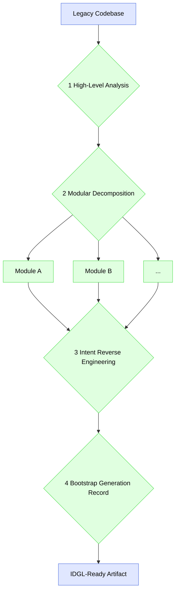

# Legacy Artifact Onboarding

## Definition

**Legacy Artifact Onboarding** is the systematic process of integrating a pre-existing project or component, created outside of the IDGL framework, into the **Intent-Driven Generative Lifecycle**. The primary objective is to reverse-engineer the implicit intent and structure of the legacy code to create the necessary metadata (such as `Generation Records`) required for future development using IDGL.

This process essentially "bootstraps" a legacy project, making it fully compatible with the **Continuous Refinement** phase of the IDGL.

## The Onboarding Process

### 1. High-Level Intent Formulation

*   **Objective:** To define the overall purpose and business value of the legacy project.
*   **Action:** Create a top-level document that answers: What problem does this project solve? Who are the users? What are the core features? This document serves as the mission statement for the entire artifact.

### 2. Modular Decomposition

*   **Objective:** To break down the monolithic legacy codebase into smaller, logically coherent modules or components. The size of a module should align with what can be considered a single, manageable `Active Artifact`.
*   **Action:** Identify and document the major functional areas of the project (e.g., "Authentication Service," "Reporting UI," "Payment Gateway"). This aligns with the principles of **Generative Task Orchestration**.

### 3. Intent Reverse Engineering (Per Module)

*   **Objective:** To create a detailed `Guiding Strategy` for each module identified in the previous step.
*   **Action:** For each module, use an AI assistant to perform a "reverse engineering" generative task.
    *   **Input:** The source code of the module.
    *   **Intent:** "Analyze this code and generate a detailed document describing its purpose, key functions, business logic, inputs, outputs, and dependencies."
    *   **Output:** A comprehensive document that will become the `Guiding Strategy` for this module.

### 4. Bootstrap Generation Record Creation

*   **Objective:** To create the initial, baseline `Generation Record` for each module, making it officially part of the IDGL.
*   **Action:** For each module, create a new `Generation Record` with the following structure:
    *   **Guiding Strategy:** The intent document generated in the previous step.
    *   **Active Artifact:** The actual, existing source code of the legacy module.
    *   **Refinement History:** An empty list, as no IDGL-based refinements have occurred yet.
    *   **Final Validation Summary:** A note, such as "Baseline artifact established from legacy codebase on [Date]. Ready for continuous refinement."

Once this process is complete for all modules, the legacy project is considered fully onboarded and is ready for all future work to be conducted through the **Continuous Refinement** lifecycle phase. 