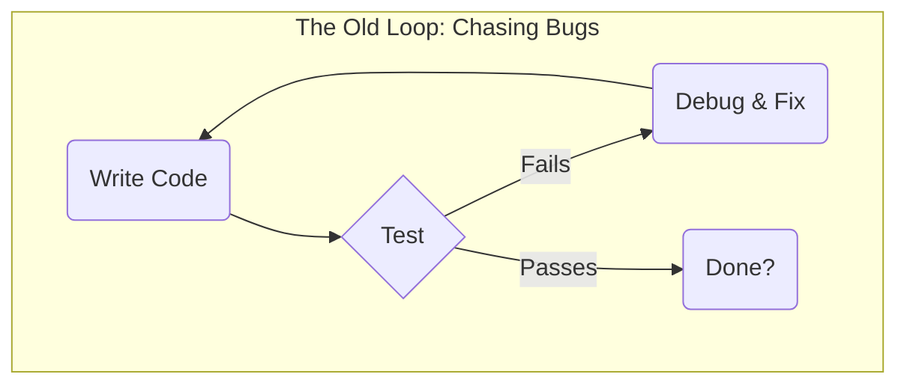
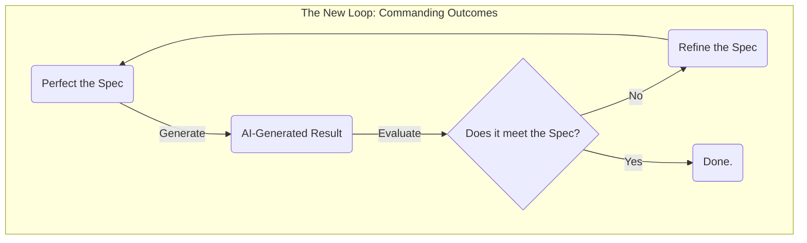

# The Core Paradigm: From Coder to Architect

For decades, the core of our craft has been **the act of coding**. We solved problems by translating human requirements directly into machine instructions. The better we were at this translation, the more valuable we were.

Generative AI has fundamentally inverted this model.

The new bottleneck is no longer the **translation** of intent into code, but the **articulation** of the intent itself. The AI can generate vast quantities of code instantly, but it has no understanding of purpose, no concept of value, and no strategic judgment. It can answer the "how" with incredible speed, but it cannot ask "what" or "why."

This creates a new paradigm, defined by a simple choice:

*   **The Coder (The Past):** Competes with AI on the "how." They focus on the mechanics of code generation, a battle they will inevitably lose. They become tactical code janitors, cleaning up the output of a machine they don't truly command.
*   **The Architect (The Future):** Commands the AI with the "why." They focus on defining a flawless, verifiable intent that the AI can execute. They become strategic directors, wielding AI as a powerful and predictable force multiplier.

IDGL is the discipline for making this leap. It provides the methodology to stop being a Coder and start being an Architect.

---

## The Two Loops: Where Do You Spend Your Time?

This paradigm shift is best understood by looking at the two development loops—the old and the new.

### The Old Loop: The Drudgery of Debugging

The traditional development loop is reactive. A developer writes code, tests it, and then spends the majority of their time in a frustrating, tactical loop of debugging and fixing.

In this world, your value is proportional to your skill at debugging—an endless, low-leverage task.

### The New Loop: The Leverage of Refining Intent

The IDGL loop is proactive. The Architect's primary work is to perfect a `Spec`. The generation of code is outsourced to the AI, and the Architect's time is spent in a high-leverage strategic loop: evaluating the outcome against the original intent and refining the `Spec` until it is perfect.

In this world, your value is proportional to your skill at **defining and verifying intent**. You are no longer chasing bugs in code; you are eliminating ambiguity in thought. This is the core work of the Architect.
