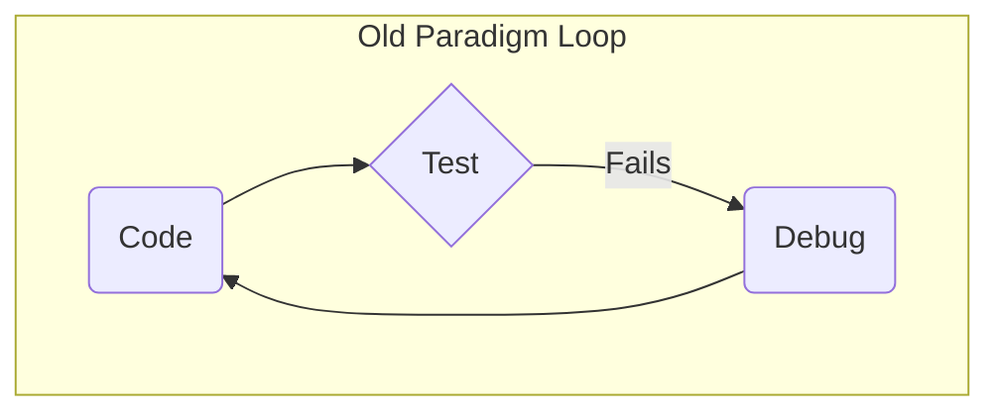
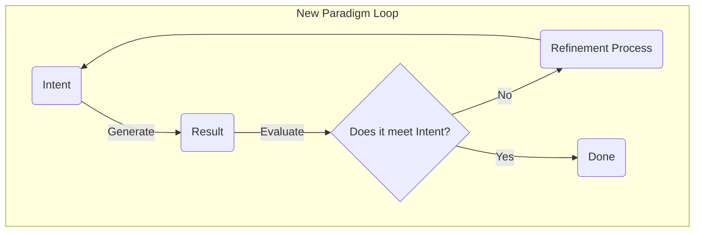
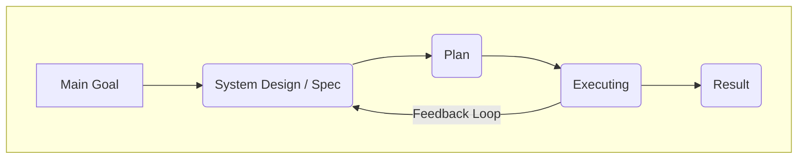
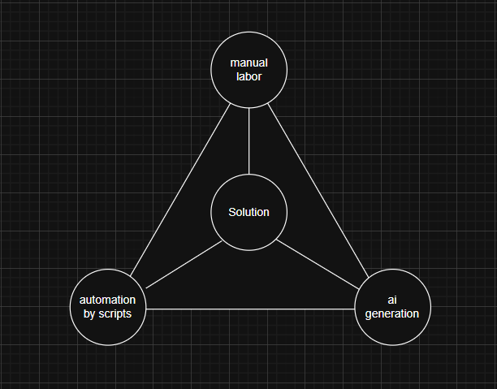

# The Core Paradigm: From Incremental Process to Generative Result

## The Old Paradigm: The Sanctity of Process

Traditional software development, even in its most agile forms, is fundamentally about managing a **process**. It is a discipline born from the constraints of human-driven coding.

- **The Core Problem:** How do we coordinate the complex, error-prone, and time-consuming labor of many people writing code to build a large system?
- **The Solution:** We create a process. We break work into small, manageable units (stories, tasks). We organize these units in time (sprints, backlogs). We incrementally build, test, and integrate.
- **The Primary Artifact:** The source code.
- **The Focus:** The **path** to the result. We spend our energy managing the journey.

This model is designed to make an inefficient process manageable. It is an optimization of a legacy constraint.

It forces the practitioner into a tight, labor-intensive loop of manual creation and correction.

## The New Paradigm: The Authority of the Result

The agentic model, as defined by the Intent-Driven Generative Lifecycle (IDGL), proposes **a complete change in approach**. The process is no longer the focus. The generative power of AI makes the act of "coding" **very fast and easy to produce**.

- **The Core Problem:** How do we define a perfect, desired result with such precision and clarity that a machine can generate it whole?
- **The Solution:** We create a **Specification**. We invest our primary effort in **the thinking needed to define** the objective, rationale, and verifiable criteria for success.
- **The Primary Artifact:** The **Spec**.
- **The Focus:** The **destination**. We spend our energy perfecting the blueprint of the result itself.

In this paradigm, iteration does not happen on the code; it happens on the **intent**. The feedback loop is not `code -> test -> debug`, but `spec -> generate -> evaluate -> refine-spec`.

The practitioner's focus shifts to **a more effective loop** of refining the specification itself.

### The Art of Refinement

Because generation is fast and cheap, the **Refinement Process** is not a simple, linear correction. It is a rich, creative space where a practitioner can use sophisticated strategies to improve the `Intent`. These strategies include:

*   **Multi-Variant Generation:** The practitioner can instruct the AI to generate multiple versions of the artifact based on the same `Intent`. They can then use the AI as a thinking partner to compare the trade-offs of each version, selecting the best approach to incorporate back into the `Spec`.

*   **AI-Assisted Decomposition:** For a complex `Intent`, the practitioner can use the AI's analytical capabilities to break it down into a series of smaller, more manageable sub-intents. The AI helps to create the plan, which the practitioner then validates and executes.

*   **Pre-computation of Intermediates:** Instead of generating the entire artifact at once, the practitioner can generate "semi-finished products" or reusable details in advance. This allows for faster experimentation and composition of the final `Solution` from a palette of pre-generated, validated components.

The challenge is no longer about managing the labor of construction, but about mastering the discipline of thought required to create an executable specification. We are moving from being assemblers to being architects.

## The Practical Realities of This Shift

This is not a theoretical distinction; it has **real financial and practical effects**.

- **The Way We Iterate Changes Completely:** In the old paradigm, the cost of an iteration is high. It involves hours or days of manual coding. In the new paradigm, the cost of generating the artifact is near zero. A developer can "re-compile" the entire application from a modified Spec in minutes.

- **The Main Cost Changes:** The primary cost is no longer the developer-hours required to *write code*. The primary cost is **the expert thinking** required to *author a high-quality Spec*. The bottleneck shifts from **doing the work to defining the work**.

- **The Work Becomes More Strategic:** The focus of the work moves from low-level implementation details to high-level system design, domain modeling, and the precise articulation of intent. We are not just getting faster at the old job; we are doing a fundamentally different, **a more impactful job**.

## The Strategic Development Cycle

While the loops above describe the core work of a practitioner on a single task, the IDGL scales to entire systems through a strategic macro-cycle. This cycle orchestrates multiple generative tasks to build a complete application.

This strategic cycle maps directly to the formal IDGL process:

1.  **Main Goal:** The initial high-level business objective.
2.  **System Design / Spec:** The critical work of authoring the complete `Spec` (e.g., the `01-concept/` directory). This is the primary act of system architecture.
3.  **Plan:** The creation of the executable plan for the AI (e.g., the `02-implementation/` directory and its configuration files).
4.  **Executing:** The practitioner runs the plan, guiding the AI through the series of `Generative Tasks` to create the code.
5.  **Result:** The final, validated software product.

The most important feature is the **Feedback Loop**. If a flaw is discovered during execution, the practitioner does not fix the code. They loop back to the **System Design**, correct the `Spec`, update the `Plan`, and re-execute. This ensures the `Spec` is always the single source of truth.

## The Solution Space

In the new paradigm, the final `Solution` is not created by a single method, but emerges from a **Solution Space** defined by the interplay of three interconnected modalities. The art of the practitioner is to understand how to combine and orchestrate these forces.

1.  **Manual Labor (Human Intellect):** This is the strategic work of authoring the `Spec` and validating the `Solution`. It is the primary guiding force that gives direction to the other modalities.

2.  **Automation by Scripts (Deterministic Generation):** This modality creates the predictable, structural foundation. It uses tools like CLI commands and template engines to build the skeleton that other modalities will flesh out. It is often informed by initial manual setup.

3.  **AI Generation (Non-Deterministic Generation):** This modality provides the creative, complex implementation. It takes the `Spec` (defined by Manual Labor) and populates the structure (created by Automation) with specific, nuanced code.

A truly effective practitioner understands that these are not separate tools to be chosen, but interconnected forces to be orchestrated. The final `Solution` is a product of their synthesis.
