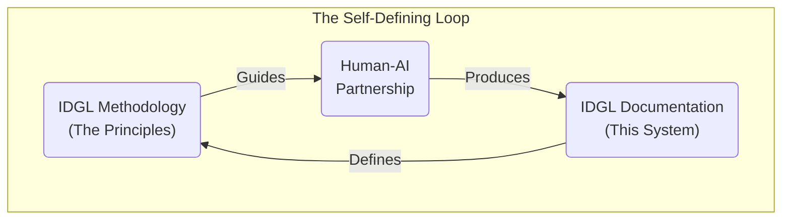

# IDGL: From Chaos to Control

Generative AI has introduced a new tension into our work: the incredible **speed** of AI versus the professional **discipline** required to build robust software. This chaos forces a choice upon every engineer:

Are we **Gamblers**, who hope for a lucky prompt and spend our days cleaning up the mess?

Or are we **Architects**, who command AI with a clear plan to guarantee the result?

This repository contains the **Intent-Driven Generative Lifecycle (IDGL)**: the definitive playbook for becoming an Architect in the AI era. It is a lightweight, tool-agnostic discipline for turning the chaos of generative AI into predictable, controllable outcomes by shifting our focus from the **labor** of writing code to the **leverage** of perfecting intent.

---

## The Path to Becoming an Architect
This documentation is your guide to mastering the Architect's Way. It is structured to build your understanding from the foundational philosophy to practical application.

*   **The Core Doctrine:** The foundational principles and mindset of the Architect.
    *   **[The Core Paradigm](./00-core.md)**
    *   **[The Architect's Mindset](./00-idgl-philosophy.md)**
    *   **[The Architect: A Profile](./06-the-architect-profile.md)**
    *   **[FAQ](./07-faq.md)**
*   **The Architect's Workflow:** The practical methodology for commanding the AI.
    *   **[The Anatomy of a Spec](./02-anatomy-of-a-spec.md)**
    *   **[The Artifact Lifecycle](./03-the-artifact-lifecycle.md)**
*   **The Architect's Playbook:** The catalog of repeatable strategies for advanced results.
    *   **[Communication Principles](./04-communication-principles.md)**
    *   **[Advanced Plays (Patterns)](./05-patterns.md)**

---

## Getting Started: From Theory to Practice
Reading is not enough. The path to becoming an Architect is through building. We have a clear, pragmatic guide for your first step, whether you are an individual developer or a team lead.

**[Click here to begin your journey →](./GETTING-STARTED.md)**

---

## The Ultimate Proof: A Self-Defining System

The ultimate proof of the Architect's discipline? **When it is robust enough to forge itself.**

This entire IDGL framework is the product of its own process. A system that can bootstrap its own creation is not a theory; it's a **proven reality.**

**[You can explore the `Specs` that define this system here →](./00-meta-specs/)**

