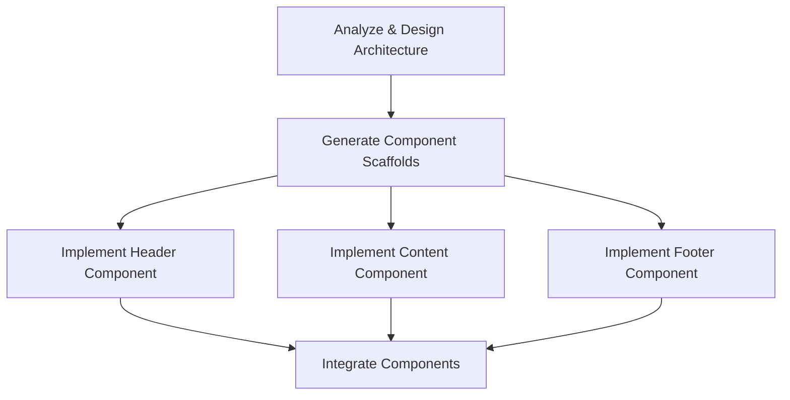
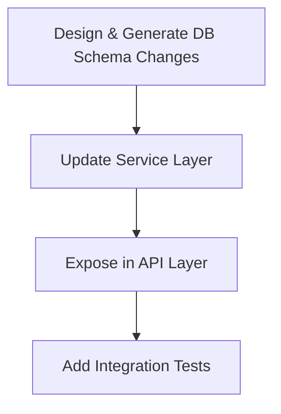

# Pattern: AI-Assisted Task Decomposition

#### 1. Context

You are operating within an Intent-Driven Generative Lifecycle (IDGL). The default and preferred approach is the **Maximal Scope Principle**: attempting to generate the largest possible cohesive unit of work that can still be rigorously and confidently validated by a human expert. 

**Key Insight:** Decomposition is the exception, not the rule. It represents a deliberate trade-off: accepting increased coordination overhead in exchange for manageable validation boundaries and reduced generation risk.

#### 2. Problem

A high-level goal cannot be achieved in a single generative task (violating the Maximal Scope Principle) when one or more of the following conditions are met:

- **Capability Limit:** The task exceeds the AI's context window or reasoning capacity.
- **Validation Limit:** The generated output is too large or complex for a human to validate reliably (typically >500 lines or >30 minutes of review time).
- **Division of Labor:** The work requires different domain expertise for validation (e.g., database specialist vs. UI designer).
- **Domain Partitioning:** The prompt context must be strictly separated for decoupled domains that have distinct tech stacks, testing strategies, or review gates.
- **Risk Isolation:** A critical component needs to be generated and validated independently before dependent work proceeds.
- **Regulatory Compliance:** Different parts of the system have different compliance requirements that must be validated separately.

In these cases, a structured method is needed to split the work without introducing unnecessary planning overhead or losing the benefits of AI-driven generation.

#### 3. Solution: The AI-Assisted Workflow

Employ **Task Decomposition**: the deliberate and minimal split of one high-level intent into a small number of substantial, independently verifiable generative tasks. This is a collaborative process where the practitioner guides an AI agent to create the plan.

##### Step 1: The High-Level Prompt
The practitioner initiates the process with a prompt to the AI, asking it to act as an architect and propose a decomposition plan based on the high-level intent.

> **Example Prompt:** "My goal is to 'Refactor a monolithic UI component into smaller, testable sub-components.' The component is ~800 lines. Your task is to act as a senior software architect. Propose a detailed decomposition plan. For each sub-task, define its inputs, outputs, contracts, and validation criteria. Use a mix of sequential and parallel steps where appropriate. Present the plan as a Mermaid diagram and a detailed task specification list."

##### Step 2: AI-Generated Plan
The AI analyzes the request and generates a candidate decomposition plan, including a diagram, task list, contracts, and validation steps.

##### Step 3: Human Validation and Refinement
The practitioner's critical role is to review and validate the AI's proposed plan. They can then approve the plan or provide feedback for refinement.

> **Example Refinement Prompt:** "The overall structure is good, but the contracts between the new sub-components are not well-defined. Please update the 'Analyze & Design Architecture' task to output a formal JSON or YAML specification defining the precise props and interfaces for each new component. All subsequent tasks must use this specification as their primary input contract."

This loop continues until the practitioner is satisfied with the AI-generated plan.

##### IV. Strategic Consideration: Choosing the Executor

Once a satisfactory plan has been generated and validated, the practitioner faces a critical strategic choice: **who executes the sub-tasks?** In keeping with the core IDGL philosophy of "The Practitioner, Not the Process," the answer is not always the AI.

1.  **AI as Executor:** This is the default path for well-defined, routine tasks where speed is the primary concern. The practitioner feeds the `Spec` for each sub-task to the AI for generation.

2.  **Human as Executor:** This is a disciplined and often superior choice for tasks where long-term ownership, deep learning, and nuanced implementation are more important than raw speed. The practitioner uses the AI-generated plan as a world-class blueprint to guide their own hands-on coding.

This second approach is the most effective guardrail against the "AI owning the work." It ensures the practitioner builds and retains a deep, intuitive understanding of the codebase, using the AI as a powerful partner in the strategic planning phase rather than a replacement in the execution phase. The choice of executor is a deliberate act of engineering judgment.

##### Core Requirements

Each decomposed sub-task must have:
- **Its own complete spec** that can be understood and executed in isolation
- **A stable boundary** aligned to a natural contract seam (e.g., an API specification, data transfer objects, schema definition, or component interface)
- **Explicit inputs and outputs** (artifacts/contracts), with no sharing of raw source code across domain boundaries
- **Concise acceptance criteria** and a dedicated test plan
- **Independent verifiability** - the task's correctness can be validated without reference to other tasks

##### Execution Modes

Execution is limited to two simple modes:

1. **Sequential Chaining:** For tasks with direct dependencies
   - Pattern: `T1 → T2 → T3`
   - Use when: Later tasks require the validated output of earlier tasks
   - Contract flow: Each task produces an artifact that becomes the input contract for the next
   
2. **Parallel Fan-Out/Fan-In:** For independent work that can be done concurrently
   - Pattern: `T0 → (T1 | T2 | T3) → T4`
   - Use when: Multiple tasks can proceed independently and be integrated via a stable interface
   - Contract requirement: Pre-defined integration interface that all parallel tasks conform to

This approach keeps coordination lightweight and avoids complex, roadmap-heavy planning for what should be a straightforward structural split.

#### 4. The AI-Generated Decomposition Plan

This section contains the detailed artifacts that are the output of the AI-assisted workflow.

##### Task Definition Schema

Each task in a decomposition should be defined with:

```yaml
task:
  id: unique-identifier
  objective: what-and-why
  inputs:
    - artifact: previous-task-output
    - contract: interface-specification
  outputs:
    - artifact: generated-code-or-config
    - contract: interface-for-next-task
  acceptance_criteria:
    - functional: does-it-work
    - quality: is-it-maintainable
    - tests: are-tests-comprehensive
  estimated_validation_time: 15-30-minutes
```

##### Decomposition Decision Matrix

| Condition | Single Task | Decompose |
|-----------|------------|-----------|
| Output < 500 lines | ✓ | |
| Single domain expertise | ✓ | |
| Validation < 30 min | ✓ | |
| Uniform tech stack | ✓ | |
| Output > 1000 lines | | ✓ |
| Multiple expertise needed | | ✓ |
| Validation > 1 hour | | ✓ |
| Cross-domain boundaries | | ✓ |

##### Representation

A decomposition plan can be represented as:
- A simple numbered list with dependencies noted
- A basic flow diagram (as shown in examples)
- A table with columns: Task | Inputs | Outputs | Dependencies

No canonical manifest or complex tooling is required.

#### 5. Examples of AI-Generated Decomposition Plans

##### Example 1: Multi-Stage UI Component Refactoring

**High-Level Intent:** "Refactor a monolithic UI component into smaller, testable sub-components"

**Why Decomposition:** The monolithic component is 800+ lines, requires architectural decisions, and needs parallel implementation of independent sub-components.

**AI-Generated Plan (Diagram):**



**AI-Generated Plan (Task Specifications):**

1. **Analyze & Design Architecture**
   - Input: Monolithic component source code
   - Output: Architecture specification (JSON/YAML) defining component boundaries, properties, and relationships
   - Contract: Component interface definitions
   - Validation: Review for logical separation and interface completeness

2. **Generate Component Scaffolds**
   - Input: Architecture specification
   - Output: Stub files with interfaces, types, and placeholder implementations
   - Contract: Type definitions and property interfaces
   - Validation: Verify all interfaces match specification

3. **Implement Components (Parallel)**
   - Input: Component stubs + relevant code from monolith
   - Output: Complete component implementations with tests
   - Contract: Predefined component interfaces
   - Validation: Each component works in isolation with mock data

4. **Integrate Components**
   - Input: All implemented components
   - Output: Refactored container component using sub-components
   - Validation: Full system works identically to original

##### Example 2: Cross-Layer Feature Addition

**High-Level Intent:** "Add a tagging feature across database, service, and API layers"

**Why Decomposition:** Changes span multiple architectural layers with different validation requirements and expertise.

**AI-Generated Plan (Sequential):**



**AI-Generated Plan (Task Specifications):**

1. **Design & Generate DB Schema Changes**
   - Input: Current schema + tagging requirements
   - Output: Migration scripts + updated schema
   - Contract: Schema definition (tables, relationships, constraints)
   - Validation: DBA review for performance and correctness

2. **Update Service Layer**
   - Input: New schema definition
   - Output: Data access objects, service methods
   - Contract: Service interface (method signatures, DTOs)
   - Validation: Unit tests pass, business logic correct

3. **Expose in API Layer**
   - Input: Service interface
   - Output: API endpoints, request/response models
   - Contract: OpenAPI specification
   - Validation: API tests pass, documentation complete

4. **Add Integration Tests**
   - Input: API specification
   - Output: End-to-end test suite
   - Validation: All scenarios covered, tests pass

#### 6. Advanced AI-Assisted Patterns

##### Pattern: Exploratory Decomposition

When the full scope is uncertain, use an exploratory first task:

```
T0[Explore & Analyze] → T1[Design Solution] → (T2 | T3 | T4)[Implement]
```

##### Pattern: Progressive Validation

For high-risk changes, add validation gates:

```
T1[Generate Core] → V1[Validate] → T2[Generate Extensions] → V2[Validate] → T3[Integrate]
```

##### Pattern: Contract-First Decomposition

Define all interfaces before implementation:

```
T0[Define All Contracts] → (T1 | T2 | T3)[Implement to Contracts] → T4[Integrate]
```

#### 7. Guardrails and Anti-Patterns

##### Guardrails (Do's)

- **Maximize task scope** within validation limits
- **Define contracts explicitly** before parallel work begins
- **Keep decomposition shallow** (1-2 levels maximum)
- **Batch related changes** into single tasks when possible
- **Document integration points** clearly in task specs
- **Estimate validation time** for each task (target: 15-45 minutes)

##### Anti-Patterns (Don'ts)

- **Micro-decomposition:** Splitting into tasks < 100 lines or < 15 min validation
- **Implicit contracts:** Assuming components will "just work together"
- **Deep nesting:** Creating decomposition trees > 2 levels deep
- **Premature decomposition:** Splitting before confirming single-task approach won't work
- **Cross-contamination:** Sharing implementation details instead of contracts between tasks
- **Over-planning:** Creating detailed project plans instead of simple task lists

#### 8. Decision Checklist

Before decomposing, ask:

1. **Can this be validated as a single task in under 60 minutes?** 
   - If yes → Don't decompose
   
2. **Does this cross multiple domain boundaries with different validation needs?**
   - If yes → Decompose along domain boundaries
   
3. **Can failed generation be easily recovered from?**
   - If no → Decompose to isolate risk
   
4. **Are there natural contract points in the architecture?**
   - If yes → Decompose at those boundaries
   
5. **Would parallel execution significantly reduce time-to-completion?**
   - If yes → Consider parallel decomposition

#### 9. Metrics for Success

A well-executed decomposition exhibits:

- **Validation efficiency:** Each task validates in 15-45 minutes
- **Contract stability:** Interfaces remain unchanged during implementation
- **Independence:** Tasks can be reordered (within dependency constraints) without breaking
- **Completeness:** Integration requires no additional "glue code"
- **Traceability:** Clear path from original intent to final integrated solution

#### 10. Relationship to Other IDGL Patterns

- **Spec Compilation Pattern:** Each decomposed task needs its own compiled spec
- **Generation Record Pattern:** Each task produces its own generation record for audit
- **Development Phase Pattern:** Large decompositions may constitute a full development phase
- **Legacy Onboarding Pattern:** Decomposition useful for incremental legacy system transformation