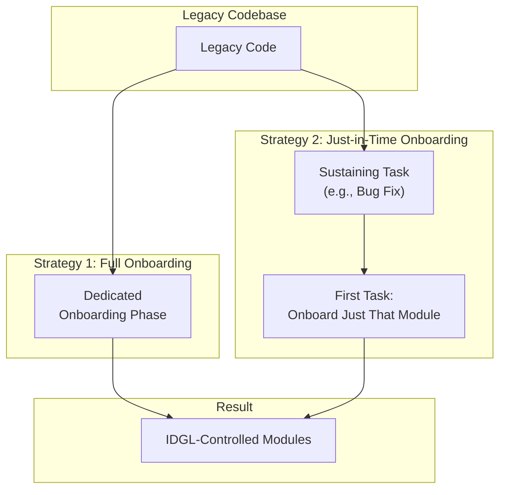

# The Legacy Onboarding Play

## 1. The Play
The Architect's control comes from the `Spec`. Legacy projects, by definition, lack this contract. The **Legacy Onboarding** play is the Architect's strategy for generating these foundational specs for pre-existing code, bringing it under the control of the IDGL.

This is not a one-size-fits-all process. The Architect chooses between two primary strategies: a comprehensive "Full Onboarding" or a more agile, "Just-in-Time" approach.

## 2. Strategy 1: Full Onboarding
This is a comprehensive, project-level effort to onboard an entire legacy application in one go.

*   **When to Run This Play:** When there is a strategic commitment to modernize an entire legacy system and dedicated resources are available.
*   **How to Run It:** The onboarding is treated as a formal **Development Phase**.
    1.  The Architect uses an AI planning partner to analyze the monolith and identify its core architectural modules.
    2.  For each module, an AI agent is instructed to reverse-engineer a `Draft Spec` from the legacy code.
    3.  The **Architect reviews and edits the `Draft Spec`**, correcting any logic to reflect the *desired* behavior, not just the existing buggy behavior. This human-led step produces the canonical `Spec`.

## 3. Strategy 2: Just-in-Time Onboarding
This is a continuous, agile approach where parts of the legacy system are onboarded as needed. This is the most common and practical strategy.

*   **When to Run This Play:** As part of the normal flow of day-to-day maintenance and development.
*   **How to Run It:**
    1.  The Architect receives a task to fix a bug in a legacy module.
    2.  The Architect's first generative task is to prompt an AI: *"Your task is to act as a reverse engineer. Analyze the attached legacy authentication code and generate a complete **Draft Spec** for it."*
    3.  The **Architect carefully reviews the `Draft Spec`**. They edit it to correct any logic, add missing edge cases, and ensure it represents the *correct, desired behavior* of the module. This produces the canonical `Spec`.
    4.  Once the corrected `Spec` is established, the Architect can then create their second generative task for the actual bug fix.

This agile approach creates a virtuous cycle: the system's `Spec` coverage increases organically as developers touch different parts of the code, making the creation of documentation a natural part of the maintenance process. 