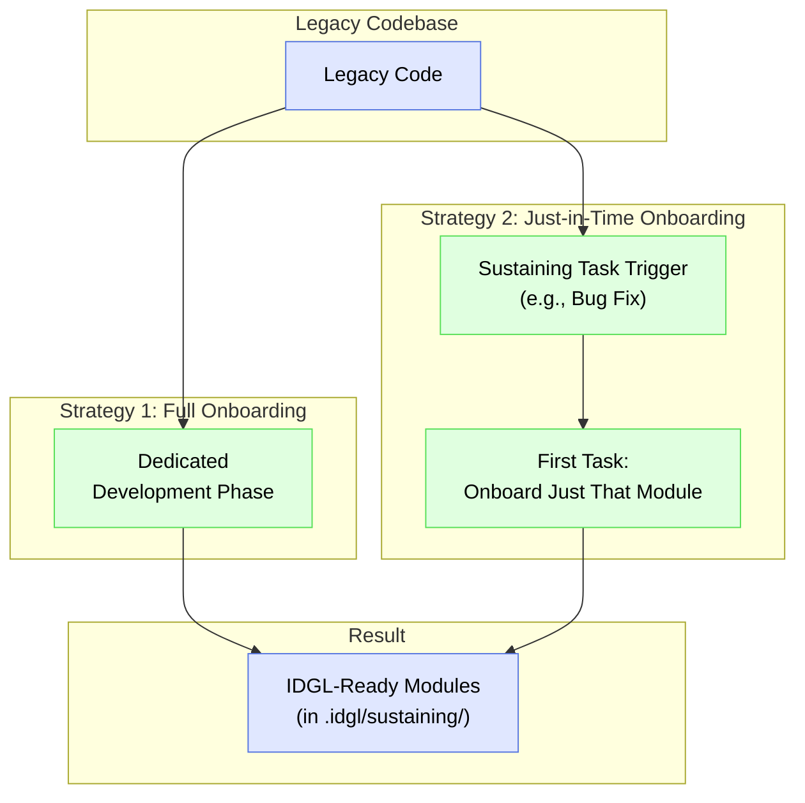

# Legacy Artifact Onboarding

## Rationale

A core principle of the IDGL is that all development is guided by an explicit, version-controlled **Spec** (`intent.md`). Legacy projects, by definition, lack these artifacts. **Legacy Artifact Onboarding** is the process of generating these foundational specs for pre-existing code, making it fully compatible with the IDGL's **Sustaining Lifecycle**.

This is not a one-size-fits-all process. Depending on project needs and resources, a practitioner can choose between two primary strategies: a comprehensive "Full Onboarding" or a more agile, "Just-in-Time" approach.

## Strategy 1: Full Onboarding (as a Development Phase)

This is a comprehensive, project-level effort to onboard an entire legacy application in one go.

*   **When to Use:** When there is a strategic commitment to modernize an entire legacy system and you have dedicated resources for a large-scale documentation and structuring effort.
*   **Process:** The onboarding is treated as a formal **Development Phase**.
    1.  **Main Goal:** "Onboard the legacy 'Monolith' project into the IDGL framework."
    2.  **System Design:** An AI-assisted task where the practitioner prompts an AI to analyze the monolith and produce a spec that identifies its core architectural modules.
    3.  **Comprehensive Plan:** An AI-assisted task to create a plan to execute an onboarding task for each identified module.
    4.  **Execution (Per Module):**
        *   An AI agent is instructed to reverse-engineer a `Draft Spec` from the legacy code.
        *   The **practitioner reviews and edits the `Draft Spec`**, correcting any logic to reflect the *desired* behavior, not just the existing buggy behavior. This human-led step produces the canonical `Spec v1.0`.
*   **Result:** The `.idgl/sustaining/` directory is fully populated with the baseline structures for all modules of the legacy application, making the entire project ready for future sustaining work.

## Strategy 2: Just-in-Time Onboarding (as a Sustaining Activity)

This is a continuous, agile approach where parts of the legacy system are onboarded as needed.

*   **When to Use:** This is the most common and practical approach. It integrates the work of creating specs into the natural flow of day-to-day maintenance and development.
*   **Process:**
    1.  A practitioner receives a task to fix a bug in a legacy module (e.g., the authentication system).
    2.  They navigate to `.idgl/sustaining/` and see that the `authentication/` folder does not yet exist.
    3.  **Onboarding Task:**
        *   **Step A (AI-Generated Draft):** The practitioner's first generative task is to prompt an AI: *"Your task is to act as a reverse engineer. Analyze the attached legacy authentication code and generate a complete **Draft Spec** for it."*
        *   **Step B (Human-Led Correction):** The practitioner carefully reviews the `Draft Spec`. They edit it to correct any logic, add missing edge cases, and ensure it represents the *correct, desired behavior* of the module. This produces the canonical `Spec v1.0`.
    4.  **Bug-Fix Task:** Once the corrected `Spec v1.0` is established, the practitioner can then create their **second generative task** for the actual bug fix: `sustaining/authentication/fix-login-bug/`.
*   **Benefit:** This creates a virtuous cycle. The system's spec coverage increases organically as developers touch different parts of the code. It avoids a large, upfront onboarding project and makes the creation of documentation a natural part of the maintenance process. 