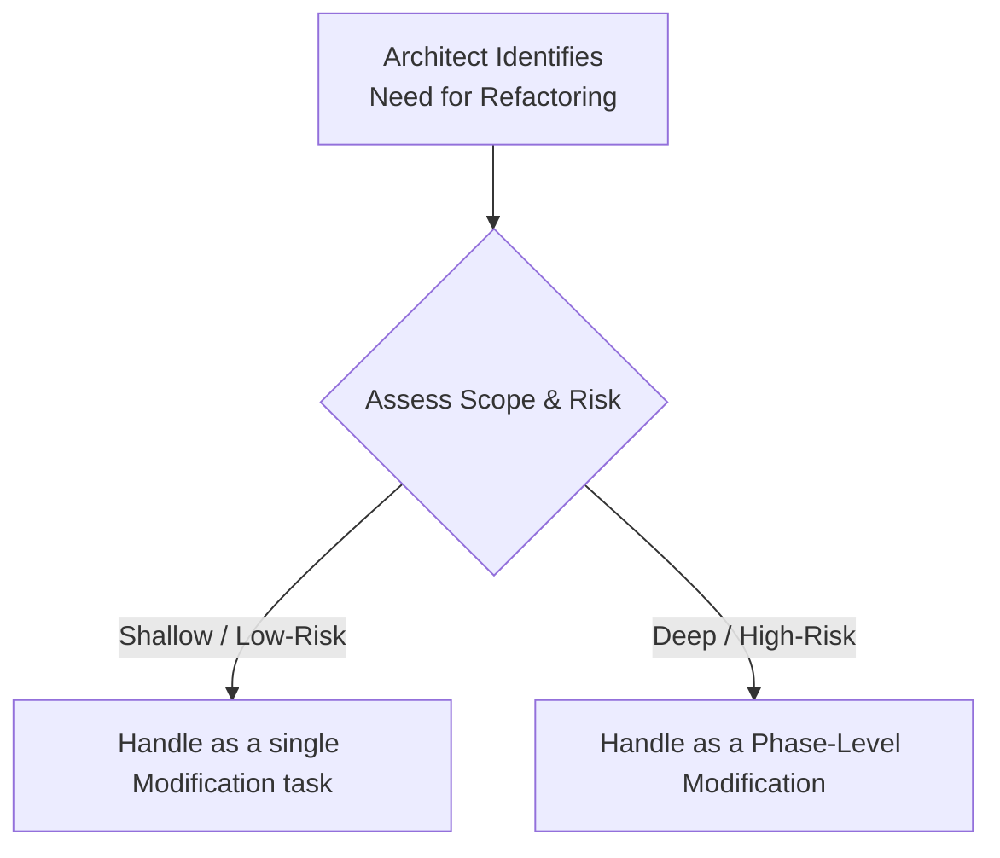

# The Managed Refactoring Play

## 1. The Play
Refactoring is a strategic, human-led activity, not a blind, automated process. The **Managed Refactoring** play is the Architect's strategy for maintaining absolute control over changes to the codebase, from minor tweaks to major architectural overhauls.

In this play, the Architect is the strategist who defines the goal in a `Spec`, and the AI is the tool that executes the tedious, large-scale changes with speed and precision.

## 2. The Two Scales of Refactoring
The Architect must first assess the scope and risk of the change to choose the correct approach.

### Strategy 1: Shallow Refactoring (A Modification Task)
This is for localized, low-risk changes that improve the health of a component without altering its contract.

*   **Examples:** Renaming a variable, extracting a complex function into a private method.
*   **How to Run It:** A shallow refactoring is treated as a standard **Modification** task. The Architect authors a clear `Spec` that specifies the desired change, which the AI then executes.
    *   **Example Spec:** *"In the attached `auth.service.ts` file, the `checkUser` function is too long. Extract the password validation logic into a separate private method named `_validatePassword`. The new method must have the same level of error handling and the external behavior of `checkUser` must not change."*

### Strategy 2: Deep Refactoring (A Phase-Level Modification)
This is for large-scale, high-risk, architectural changes that fundamentally reshape a part of the system.

*   **Examples:** Migrating a backend framework, breaking a monolith into microservices.
*   **How to Run It:** A deep refactoring is a large-scale **Modification**, and must be managed with the discipline of a formal project phase.
    *   The Architect's critical first step is to create a `Spec` for the new, desired architecture. This often involves using an AI planning partner to analyze the old system and propose a new design.
    *   The Architect validates and refines this AI-generated architectural plan.
    *   The rest of the phase proceeds as a series of coordinated **Modification** tasks, using the new architectural `Spec` as the guide.

This disciplined, dual-process approach ensures that every refactoring effort, no matter its size, is a deliberate, spec-driven, and traceable activity that improves the health of the project. 