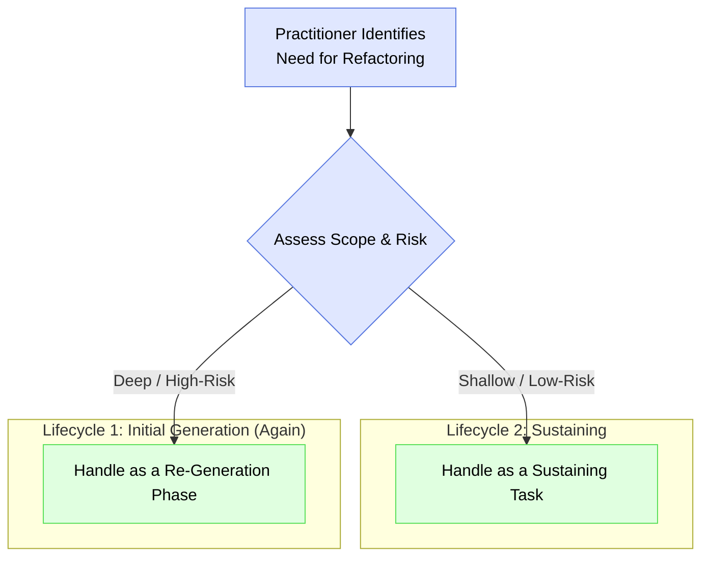

# Refactoring with IDGL: A Strategic, Spec-Driven Approach

## The Human-AI Partnership in Refactoring

In the IDGL framework, refactoring is a strategic, human-led activity, not a blind, automated process. The AI serves as a powerful and efficient tool for executing changes, but the IDGL Practitioner is the architect who directs the process. This partnership has a clear division of labor:

*   **The IDGL Practitioner (The Strategist):** Identifies the need for refactoring, defines the precise goal in a high-quality **Spec** (`intent.md`), and serves as the ultimate validator of the result.
*   **The AI (The Tool):** Analyzes the codebase for potential improvements and executes the tedious, large-scale changes defined in the practitioner's spec with speed and precision.

## Two Scales of Refactoring

The IDGL provides two distinct, formal processes for handling refactoring, depending on the scope and risk of the change. The practitioner must strategically decide which process is appropriate for the task at hand.



### 1. Shallow Refactoring (as a Sustaining Task)

This process is used for localized, low-risk changes that improve the health of a specific component without altering the system's architecture.

*   **Examples:** Renaming a variable for clarity, extracting a complex function, converting a single module to a new pattern (e.g., `async/await`).
*   **Process:** A shallow refactoring is treated as an ad-hoc **Generative Task** within the **Sustaining Lifecycle**. The practitioner authors a clear `intent.md` that specifies the desired change, which the AI then executes.
    *   **Example Intent:** *"In the attached `auth.service.ts` file, the `checkUser` function is too long. Extract the password validation logic into a separate private method named `_validatePassword` and update the original function to call it. The new method must have the same level of error handling as the original logic."*
*   **Directory Structure:** A new task folder is created within the `sustaining/` directory of the relevant feature.
    ```
    .idgl/sustaining/authentication/refactor-login-function-for-clarity/
    ```

### 2. Deep Refactoring (as a Re-Generation Phase)

This process is reserved for large-scale, high-risk, architectural changes that fundamentally reshape a part of the system.

*   **Examples:** Migrating a backend framework, breaking a monolith into microservices, changing a core database paradigm.
*   **Process:** A deep refactoring **must be escalated to a formal Re-Generation Phase**. This is a full **Development Phase** where the key architectural tasks are AI-assisted.
    *   **Key AI-Assisted Step:** The `01_system_design` task for this phase is critical. The practitioner prompts the AI to act as a senior architect, providing the entire maintenance history from the `sustaining/` folder as context. The AI's task is to propose a new, clean architecture that explicitly solves the documented problems of the old one.
    *   **Human Validation:** The practitioner then validates and refines this AI-generated architectural plan before proceeding with the rest of the phase.
*   **Directory Structure:** A new, numbered `Development Phase` folder is created at the root of the `.idgl` directory.
    ```
    .idgl/04-refactor-backend-to-microservices-phase/
    ```

By providing distinct, formal processes for both shallow and deep refactoring, the IDGL ensures that every change, from a simple renaming to a full architectural overhaul, is a deliberate, spec-driven, and traceable activity, safeguarding the long-term health and maintainability of the project. 