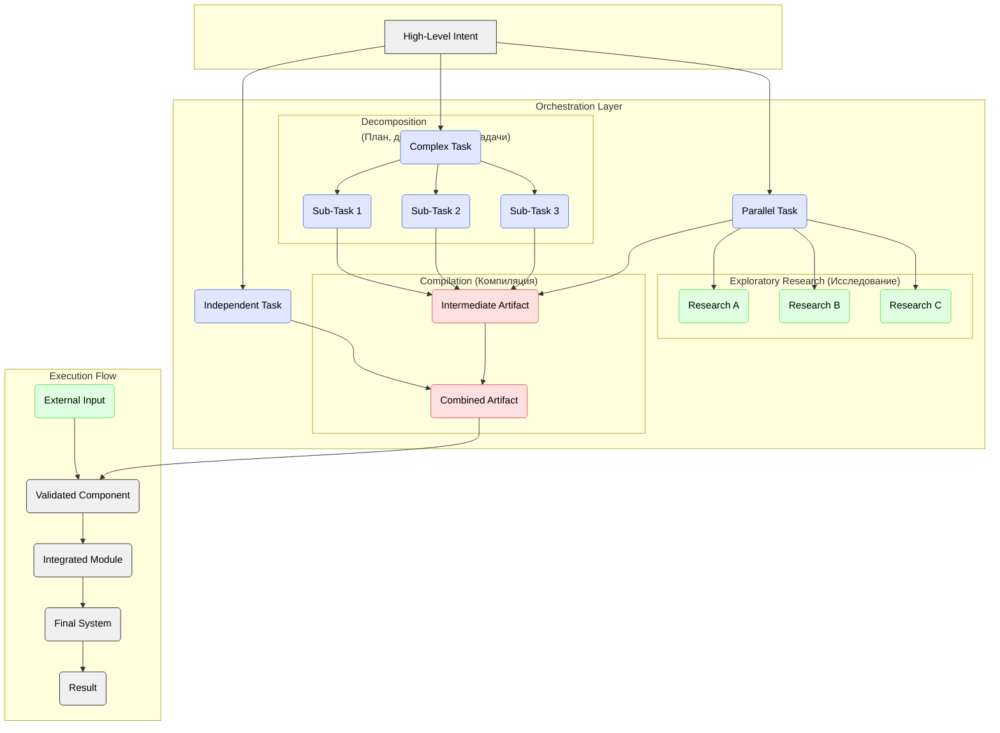

# Generative Task Orchestration

## Definition

While the ideal **Intent** given to an AI assistant should be as comprehensive and large as possible to maximize context, **Generative Task Orchestration** is the strategic process employed for exceptionally large-scale or complex goals that cannot be reliably handled in a single generative cycle. The primary principle is to manage the task's scope, ensuring that each generated **Artifact** can still be effectively validated. This involves breaking down the overarching intent only when necessary, rather than as a default practice.

This process recognizes that a high-level goal may be too large or complex for a single "ai-gen" cycle. Instead of tackling it monolithically, it employs several strategies to break down, solve, and reassemble the problem, allowing for different paths to the final result.

## Core Strategies

Orchestration involves a flexible path toward the final result, utilizing the following strategies as needed:

1.  **Decomposition:**
    *   **Description:** The process of breaking down an exceptionally large or ambiguous generative task into a series of smaller, yet still substantial, sub-tasks. Each sub-task is then addressed in its own "ai-gen" cycle.
    *   **Purpose:** To reduce overwhelming complexity and ensure that the artifact generated from each sub-task is a coherent, verifiable module.
    *   **Example:** Decomposing the high-level intent "Build a complete multi-vendor e-commerce marketplace" into major, more manageable epics like:
        *   `Implement user and vendor identity management system (accounts, profiles, roles).`
        *   `Develop the product catalog module with multi-vendor support.`
        *   `Create a unified shopping cart and multi-stage checkout flow.`
        *   `Build the order processing and fulfillment pipeline.`

2.  **Compilation / Composition:**
    *   **Description:** The process of integrating the artifacts produced from multiple, smaller generative tasks into a single, cohesive, and functional whole.
    *   **Purpose:** To assemble the final, complete artifact after its constituent parts have been individually generated and validated.
    *   **Example:** Combining the validated backend services and frontend components into a working authentication flow.

3.  **Exploratory Research:**
    *   **Description:** Conducting a side-investigation to close knowledge gaps or resolve uncertainties that block the progress of a generative task. This is itself a generative task, where the artifact might be information, a decision, or a proof-of-concept.
    *   **Purpose:** To gather necessary information before proceeding with the primary task.
    *   **Example:** When unsure about which encryption library to use, a research task is initiated to compare options. The resulting decision (the artifact) informs the main development task.

By using these orchestration strategies, we ensure a scalable and maintainable workflow where progress is made in verifiable increments, leading to a more robust and reliable final artifact. 