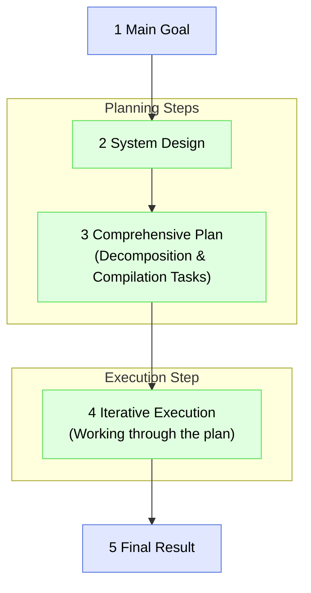

# The IDGL Development Phase

## Rationale

The development of any significant feature or system using the IDGL framework is conducted in a series of **Development Phases**. A phase is a self-contained unit of work designed to achieve a single, focused `Main Goal`. A small project may consist of a single phase, while a large-scale application is built as a sequence of multiple, interconnected phases (e.g., a "Scaffolding Phase" followed by an "Authentication Phase," etc.).

This model provides a flexible and scalable approach, allowing practitioners to plan and execute complex work in manageable, iterative stages.

## The Five Steps of a Development Phase

Each Development Phase follows a consistent five-step process, moving from a high-level goal to a concrete, validated result.

### 1. Main Goal Definition
This is the focused objective for the current phase. It defines the "why" and serves as the source for the top-level `intent.md` for this body of work.
*   **Example:** "Implement a complete user authentication and registration system."

### 2. System Design
This is a generative task to create the architectural blueprint for achieving the phase's goal. It defines the "what" and "how."
*   **Intent:** "Based on the Main Goal, design the high-level architecture for the authentication system."
*   **Artifact:** A System Design Document for this specific phase.

### 3. Comprehensive Planning
This is the central orchestration step for the phase. It uses the `System Design` as its input to create a complete dependency graph of all necessary work.
*   **Intent:** "Using the attached System Design, define all decomposition, research, and compilation tasks needed to build the authentication system."
*   **Artifact:** The populated `.idgl/` directory structure for this phase's generative tasks.

### 4. Iterative Execution
This is the "work" step where the IDGL Practitioner executes the tasks laid out in the plan.
*   **Process:** The practitioner systematically works through each task folder (whether decomposition or compilation), using the core IDGL cycle to produce the required artifact for that step.

### 5. Final Result
This is the tangible, validated output of the phase.
*   **Origin:** The `Final Result` is the artifact produced by the final `compilation` task defined in the plan for this phase.
*   **Next Step:** This result serves as the stable baseline and starting point for the *next* Development Phase. 