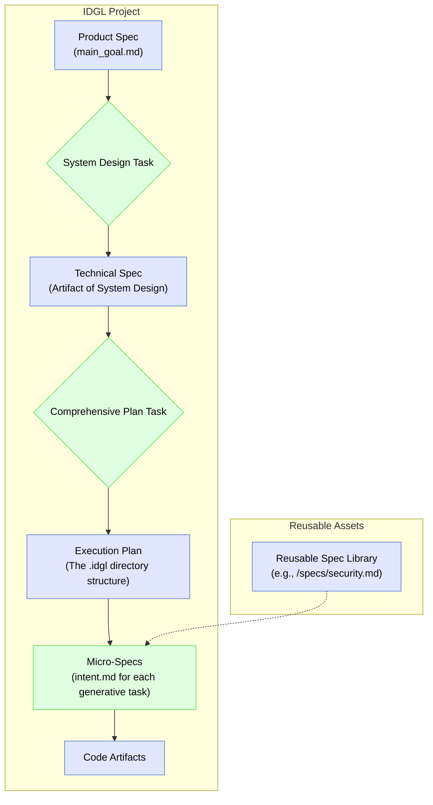

# Spec Patterns in a Development Phase

For very large or complex projects, the IDGL system provides organizational patterns to manage complexity. These patterns introduce higher-level "contextual specs". These patterns and specs are optional tools, to be used only when the scale of a project requires them.

## The Phase-Based Spec Flow

When a project is organized into a formal **[Development Phase](./09-idgl-lifecycle-phases.md)**, the specifications follow a clear hierarchy, as shown below. This is a pattern for ensuring alignment on large-scale work.

### Contextual Specs in a Development Phase

*   **Product Spec (`main_goal.md`):** This is the highest-level spec. It defines the goal for an entire `Development Phase`, focusing on user stories, business value, and overall success criteria.

*   **Technical / Architectural Spec:** This is the artifact produced by the `01_system_design` task within a phase. It defines interfaces, data contracts, and technology choices, providing the "how" for the "what" described in the Product Spec.

### Reusable & Composable Specs

To promote consistency and reuse across a large project, a team can maintain a central library of common specifications, for example:
*   `/specs/security-guidelines.md`
*   `/specs/ux-style-guide.md`
*   `/specs/privacy-policy.md`

The `intent.md` for any generative task can then import or reference these common specs, ensuring that all generated artifacts adhere to the same set of high-level constraints. This makes the entire process more robust, maintainable, and aligned with organizational policy.
