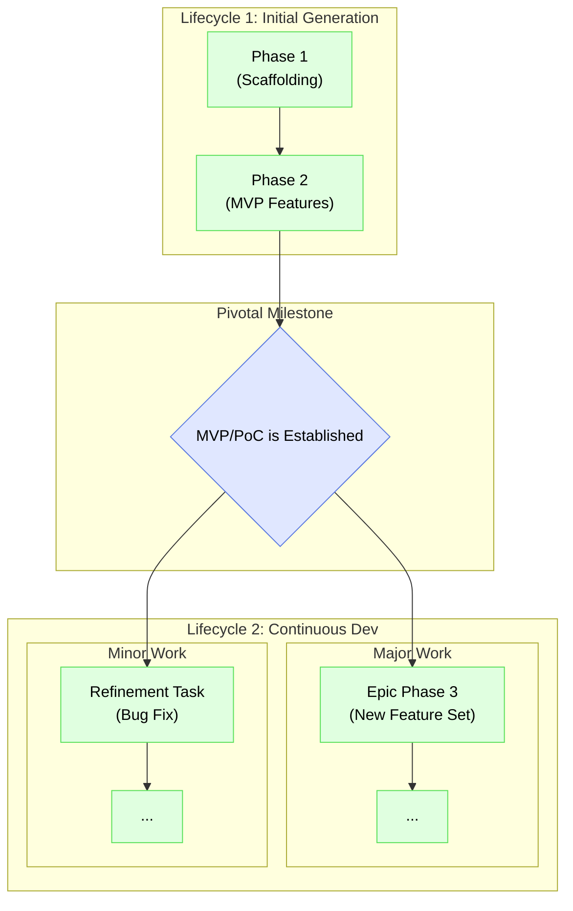
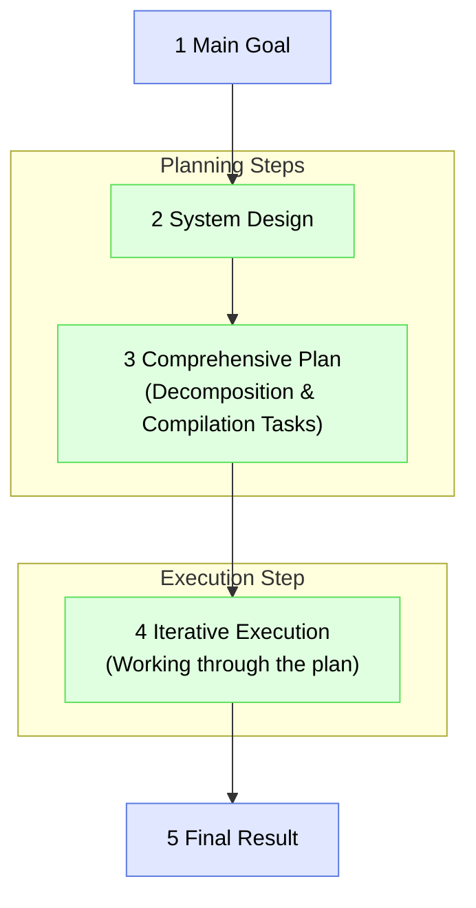
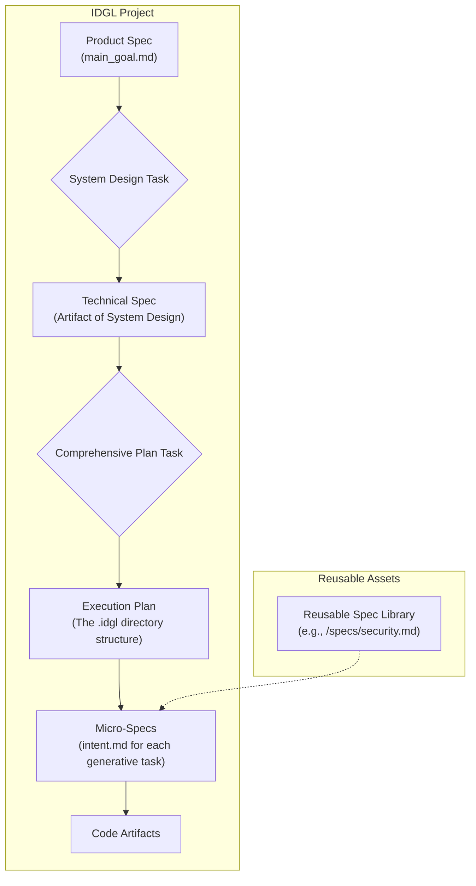
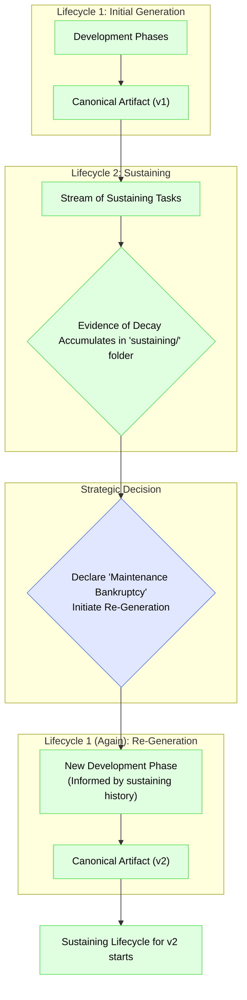

# The Two Lifecycles of an IDGL Project

## Rationale: From Initial Creation to Continuous Evolution

The lifecycle of a project is divided into two major stages: the **Initial Generation** to create the first version of the artifact, and a perpetual **Continuous Development** stage for all subsequent work. This model provides the flexibility to handle both large, planned feature epics and small, incremental changes after the initial release.

## Lifecycle 1: Initial Generation
This is the special, one-time process of creating the first canonical artifact (e.g., the MVP or PoC) from a blank slate.

*   **Unit of Work:** The formal, multi-step **Development Phase**.
*   **Process:** This consists of a sequence of one or more `Development Phases` required to get to the first stable, releasable version of the product.

### The Five Steps of a Development Phase
Each Development Phase follows a consistent five-step process, moving from a high-level goal to a concrete, validated result.

1.  **Main Goal Definition:** The focused objective for the phase. It defines the "why" and is the source for the top-level `intent.md`.
2.  **System Design:** A generative task to create the architectural blueprint. It defines the "what" and "how."
3.  **Comprehensive Planning:** The central orchestration step. It uses the `System Design` to create a complete dependency graph of all work.
4.  **Iterative Execution:** The "work" step where the practitioner executes the tasks laid out in the plan.
5.  **Final Result:** The tangible, validated output of the phase, which serves as the baseline for the next phase.

### Spec Hierarchy in a Development Phase
The specifications within a phase follow a clear hierarchy.

## Lifecycle 2: Continuous Development
This lifecycle begins after the initial artifact is established and covers all subsequent evolution of the product. It has two modes of operation depending on the scale of the work.

*   **Mode A: Major Epics (Building the "rest" of the product)**
    *   **Unit of Work:** The formal **Development Phase**.
    *   **Process:** When adding a significant new feature set, a new `Development Phase` is initiated. It follows the full 5-step process but uses the existing codebase as its starting baseline.
    *   **When to Use:** For large, planned feature epics that require their own design and comprehensive planning.

*   **Mode B: Incremental Changes**
    *   **Unit of Work:** The ad-hoc **Generative Task**.
    *   **Process:** For smaller changes, a single generative task is initiated. This is a more agile approach that bypasses the formal phase structure.
    *   **When to Use:** For bug fixes, performance tweaks, minor enhancements, and other small-scale, incremental work.

This two-mode model for continuous development provides the right level of structure for any task, ensuring both agility for small changes and rigor for major additions.

---

## Directory Structure Implementation

The way work is organized on the file system is a direct reflection of these lifecycle modes. For the complete, detailed specification of how to structure the `.idgl` directory for both major phases and sustaining tasks, see the authoritative pattern document:

*   **[./07-Pattern-Directory-Structure.md](./07-Pattern-Directory-Structure.md)**

---

## The Full Lifecycle: Managing Technical Debt with Re-Generation Phases

The Sustaining Lifecycle is not just a passive maintenance mode; it is an active process that produces a critical data asset: the service history of each feature, logged in the `sustaining/` directory. This history is the primary tool for managing the long-term health of the codebase.

Over time, the accumulation of bug fixes and minor changes can lead to architectural drift and technical debt. When the cost and complexity of adding to a feature become too high, the methodology provides a strategic "escape hatch": the **Re-Generation Phase**.

### The Re-Generation Phase

A Re-Generation Phase is a formal **Development Phase** initiated with the specific `Main Goal` of rebuilding and replacing an existing, decayed feature.

*   **Trigger:** A strategic decision, informed by the evidence in the `sustaining/` folder (e.g., high frequency of bugs, increasing complexity of changes, poor performance).
*   **Process:** It follows the standard 5-step process of a Development Phase. Critically, the `01_system_design` task for this phase uses the entire maintenance history from the `sustaining/` folder as a primary input. This ensures that the design of "v2" is explicitly informed by all the documented problems and patches of "v1".
*   **Result:** A new, clean version of the feature's artifact, which replaces the old one in the codebase. The old `sustaining/` history is archived, and a new, clean log begins for the revitalized feature.

This final feedback loop ensures that the IDGL is not just a methodology for creating software, but a complete framework for managing the entire, long-term lifecycle of a project, preventing decay and ensuring its continued health and maintainability. 