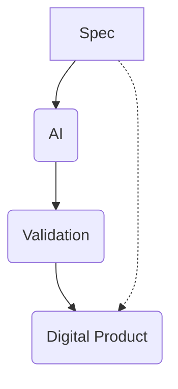

# The IDGL Conceptual Model

The Intent-Driven Generative Lifecycle (IDGL) is not an incremental improvement on the traditional Software Development Lifecycle (SDLC). It is a new paradigm designed to leverage AI as a holistic, integrated partner, evolving the entire development process rather than merely automating isolated parts of it. The entire system is built upon the interaction of four core concepts, as illustrated below.

## The Core Components

1.  **The Spec:** This is the authoritative, version-controlled definition of a desired outcome. It is a formal specification, authored by a human, that describes what to build, why it's needed, and how to validate its correctness.

2.  **The AI (The Generative Engine):** The AI acts as a powerful synthesis engine. Its role is to take the formal Spec and generate a candidate **Artifact** for evaluation.

3.  **The Validation:** This is the essential act of human judgment that serves as the system's quality gate. The criteria defined in the `Spec` are used to verify the AI-generated Artifact.

4.  **The Digital Product:** This is the tangible, **validated output** of the cycle. It is an Artifact that has successfully passed the Validation stage. Examples of Digital Products include:
    *   A block of source code.
    *   A user story or technical documentation.
    *   A diagram or user interface mockup.
    *   A configuration file.
    *   A set of test data.

## The Spec: The Authoritative Driver

In the IDGL system, the "Spec" is not merely a document; it is the primary, version-controlled artifact that captures all structured communication and intent.

### Core Mandate: Answering What, Why, and How

The Spec is the authoritative answer to three fundamental questions:

1.  **What** to build (functional requirements, success criteria).
2.  **Why** it should behave that way (values, business rules, safety constraints).
3.  **How** to verify success (tests, evaluation criteria, acceptance criteria).

By making the Spec the central artifact, IDGL ensures that human and machine efforts are aligned around a single, unambiguous source of truth. It becomes an executable contract: if a generated Artifact fails the tests defined in its Spec during Validation, a bug has been found in the implementation, not the intent.

### Key Engineering Properties

A well-formed Spec exhibits several key properties:

*   **Human & Machine Alignment:** Because Specs are written in structured natural language (like Markdown), they serve as a single source of truth that both human stakeholders (engineers, product, legal) and AI models can understand, act upon, and be evaluated against.
*   **Reusability & Composability:** Like code libraries, Specs can be modular. A project can import standardized Specs for security, privacy, or user experience, ensuring consistency and saving time.

### Practical Flavors

In practice, Specs can take several flavors depending on their purpose:

*   **Product Spec:** Defines user stories, flow diagrams, and KPIs.
*   **Technical Spec:** Outlines interfaces, data contracts, and performance budgets.
*   **Safety/Governance Spec:** Contains red-team prompts, ethical boundaries, and legal constraints.
*   **Test Spec:** Provides formal input/output pairs and property-based assertions.

## Core Distinctions of the IDGL Model

To clarify the unique identity of the IDGL system, it is helpful to contrast it with other concepts.

### IDGL vs. Traditional Software Development

| Aspect | Traditional Approach | IDGL Approach |
|--------|---------------------|---------------|
| **Organization** | Tasks and sprints | Outcome-focused intents |
| **Planning** | Upfront detailed planning | Adaptive planning from intents |
| **AI Role** | Tool for specific tasks | Strategic partner in generation |
| **Human Role** | Task executor | Strategic director and validator |
| **Output** | Completed tasks | Working, demonstrable results |
| **Adaptation** | Change management process | Continuous intent refinement |

### What IDGL Is Not

*   **It is not a Project Management Methodology.** IDGL is not focused on breaking work into tasks, time tracking, or resource allocation. It is a product development lifecycle.
*   **It is not Pure AI Automation.** Human strategic judgment, validation, and course correction remain central and essential to the process. The AI assists, but it does not replace the engineer.
*   **It is not a Heavy, Prescriptive Toolset.** IDGL is a lightweight, adaptable framework, like a timeless Swiss army knife. It is designed to evolve easily with the rapid changes in AI capabilities, not to lock users into a specific, heavy toolset.
