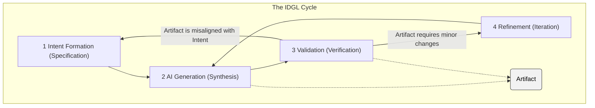

# The Generative Task: A Specification for Execution

## 1. Introduction: From Concept to Execution

While the **[Conceptual Model](./00-the-conceptual-model.md)** defines the high-level philosophy of the IDGL system, this document specifies the **Generative Task**—the formal, executable process for turning a `Spec` into a validated `Digital Product`.

The Generative Task is the engine that drives the IDGL system. It is not merely a workflow suggestion but a rigorous engineering discipline for controlling the process of AI-driven development.

## 2. Anatomy of a Generative Task

A Generative Task is the fundamental unit of execution in IDGL. Its scope is defined not by the theoretical capability of the AI, but by the practical limits of human validation.

A Task has two primary properties:

*   **Intent-Driven:** Its execution is governed entirely by a formal **[Spec](./00-the-conceptual-model.md#the-spec-the-authoritative-artifact)**.
*   **Verifiable Scope:** Its scope must be constrained to what a practitioner can rigorously validate. This is a critical safety and quality constraint. While an AI could generate a monolith, only a verifiable component can be a valid Task output. Macro-level objectives are therefore handled by orchestrating multiple, verifiable Generative Tasks.

## 3. The IDGL Cycle: The Execution Engine

Every Generative Task is executed via the **IDGL Cycle**, a formal engine for turning a specification into a validated artifact.

The cycle consists of four distinct stages acting upon the central Artifact:

1.  **Intent Formation (The Specification):** The developer authors the formal Spec, defining the task's goal, constraints, and acceptance criteria.
2.  **AI Generation (The Synthesis):** The AI acts as a synthesis engine, taking the structured intent and generating a candidate Artifact.
3.  **Validation (The Judgment):** This is the essential act of human judgment that serves as the system's quality gate. The practitioner executes the **Verification Criteria** from the Spec to gather objective evidence, then applies their own expertise to render a final verdict: **Approved** or **Rejected**. This act can be an informal mental process. For tasks of significant size or risk, the practitioner may create a formal **Record of Judgment** to provide an audit trail.

4.  **Refinement (The Iteration):** If the practitioner's judgment is **Rejected**, the next step depends on the nature of the failure. For most issues, a new, scoped refinement sub-task is created, returning the cycle to the **AI Generation** stage. If the failure represents a fundamental misalignment between the Artifact and the goal, the cycle returns to the **Intent Formation** stage to author a new, better-defined Spec. This iterative loop continues until the Artifact is **Approved**.

5.  **The Artifact:** As shown in the diagram, this is the central object created and refined by the cycle. While a **[Digital Product](./00-the-conceptual-model.md#the-three-pillars-of-idgl)** is the high-level term for any output of the system, an **Artifact** is the specific, tangible output of a single Generative Task.
