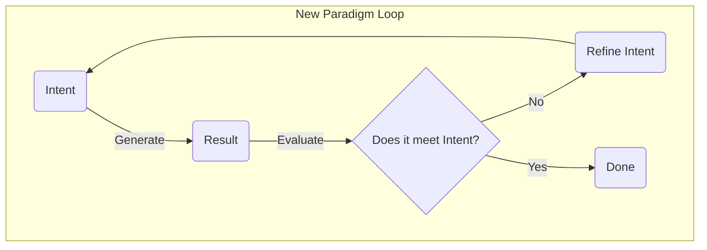

# End-to-End Tutorial: An Introduction

## Goal

This tutorial demonstrates the Intent-Driven Generative Lifecycle (IDGL) in action. Its purpose is to make the core IDGL concepts practical and easy to understand.

We will walk through a single, complete **Generative Task**: creating a tested software component from a high-level idea.

## What You Will See

This is not a traditional coding tutorial. You will not see a step-by-step guide on how to *write* code. Instead, you will see a demonstration of the core IDGL workflow:

1.  **Defining Intent:** We will start with a simple, high-level goal.
2.  **Creating a Specification:** We will transform that goal into a precise, verifiable `Spec` that an AI can understand.
3.  **Generating an Artifact:** We will use that `Spec` to guide an AI in generating the complete, tested code.
4.  **Validating the Result:** We will formally validate the AI-generated code against the criteria in our `Spec`.

## The Core Loop

This entire process is designed to show the new development loop in practice:

By the end of this tutorial, you will have a clear, practical understanding of how an IDGL Practitioner works and why this new paradigm is a more effective way to create software.
