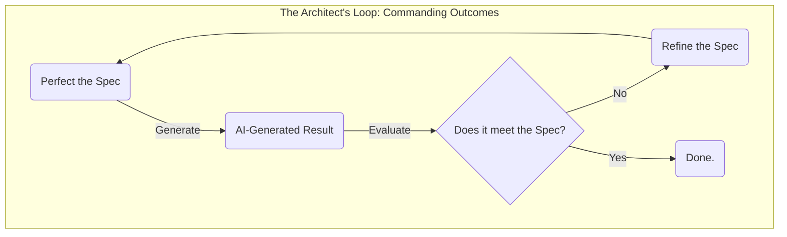

# Your First Mission: The Vanguard Project

## 1. The Goal
This tutorial is your first hands-on project as an **Architect**. Its purpose is to guide you through a complete, end-to-end generative workflow.

You will take a high-level idea and transform it into a fully-specified, AI-generated, and human-validated software component.

## 2. The Architect's Workflow
This is not a traditional coding tutorial. You will not be writing code. Instead, you will be executing the **Architect's Workflow**:

1.  **Defining Intent:** You will start with a simple, high-level goal.
2.  **Authoring a Contract:** You will transform that goal into a precise, verifiable `Spec` that will serve as the AI's contract.
3.  **Supervising Execution:** You will use that `Spec` to command an AI to generate the complete, tested code.
4.  **Enforcing the Verdict:** You will rigorously validate the AI-generated code against the criteria in your `Spec` to ensure the contract was fulfilled.

## 3. The Architect's Loop
This entire process is designed to show the Architect's core feedback loop in action:

By the end of this tutorial, you will have a clear, practical understanding of how an Architect works and why this new paradigm is a more powerful way to create software.
