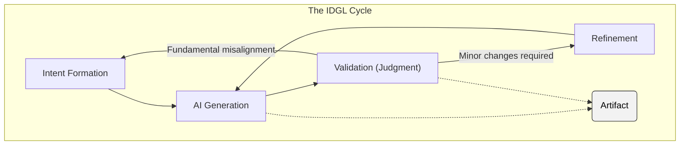
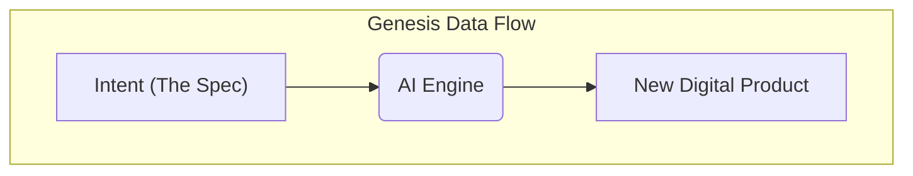
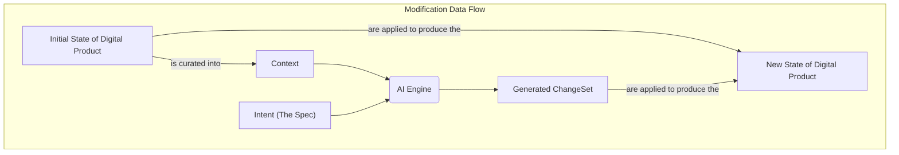

# The Generative Task: A Specification for Execution

## 1. Introduction: The Engine of IDGL

While the **[Conceptual Model](./00-the-conceptual-model.md)** defines the high-level philosophy of the IDGL system, this document specifies the **Generative Task**—the formal, executable process for turning a `Spec` into a validated `Digital Product`.

The Generative Task is the engine that drives the IDGL system. Its execution is modeled by the **IDGL Cycle**, while its interaction with the environment is modeled by one of two distinct **Data Flows**, depending on the task's nature.

## 2. Anatomy of a Generative Task

A Generative Task is the fundamental unit of execution in IDGL. Its scope is defined not by the theoretical capability of the AI, but by the practical limits of human validation.

A Task has two primary properties:

*   **Intent-Driven:** Its execution is governed entirely by a formal **[Spec](./00-the-conceptual-model.md#the-spec-the-authoritative-driver)**.
*   **Verifiable Scope:** Its scope must be constrained to what can be rigorously validated by a human expert. This is a critical safety and quality constraint.

## 3. The IDGL Cycle: The Universal Process View

The IDGL Cycle is the abstract, behavioral model of the generative engine. Every Generative Task, regardless of its data flow, is executed via this cycle. It turns a specification into a validated **Artifact**.

*   **1. Intent Formation (The Specification):** A developer authors the formal Spec.
*   **2. AI Generation (The Synthesis):** The AI acts as a synthesis engine, generating a candidate Artifact.
*   **3. Validation (The Judgment):** A human expert renders a final verdict: **Approved** or **Rejected**.
*   **4. Refinement (The Iteration):** If rejected, the cycle returns to either **AI Generation** (for minor issues) or **Intent Formation** (for major issues).
*   **5. The Artifact:** The specific, tangible output of a single Generative Task.

## 4. The Two Data Flows

There are two distinct data flow models that describe the engine's interaction with its environment.

### Flow A: Genesis (Creating a New Digital Product)

This flow models the creation of a new Digital Product from a blank slate. The AI's output directly becomes the new product.

### Flow B: Modification (Changing an Existing Digital Product)

This flow models the creation of new artifacts or the modification of existing ones within a pre-existing Digital Product. It relies on a curated **Context** to guide the AI.

**Key Components of Modification Flow:**
*   **Context:** A curated subset of the `Initial State` provided to the AI.
*   **Generated ChangeSet:** The output from the AI, which contains a set of `add`, `modify`, or `delete` operations.
*   **Apply:** The action of applying the `ChangeSet` to the `Initial State` to produce the `New State`.
