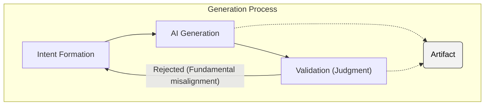
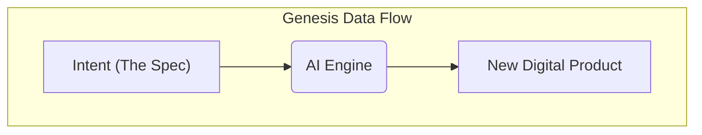
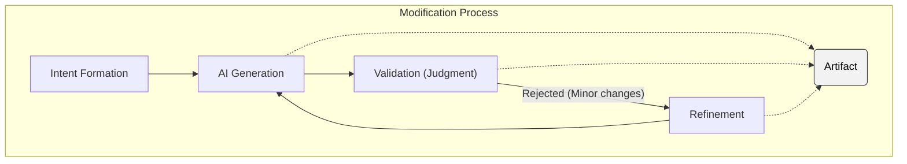
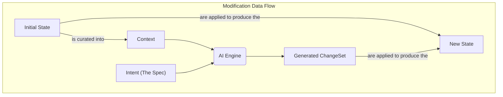
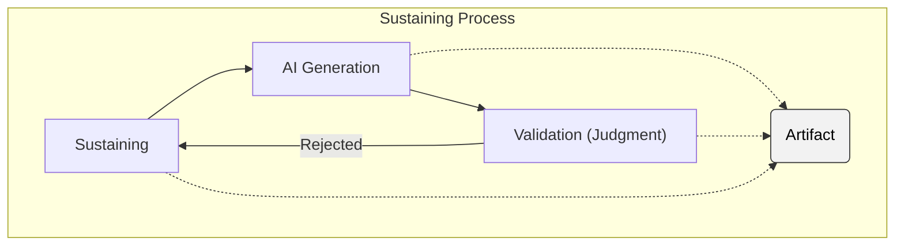

# The Artifact Lifecycle: The IDGL Processes

## 1. Introduction: The Lifecycle of an Artifact

This document defines the core processes of the Intent-Driven Generative Lifecycle (IDGL). While the **[Generative Task](#2-anatomy-of-a-generative-task)** is the fundamental unit of execution, its behavior is governed by one of three distinct processes that define the lifecycle of an **Artifact**, from its initial creation to its ongoing maintenance.

The core philosophy is to achieve a perfect **Generation**, where a well-formed `Spec` is transformed directly into a correct `Artifact`. The **Modification** and **Sustaining** processes provide the robust, formal mechanisms for the practical reality of iterative development and long-term maintenance.

## 2. Anatomy of a Generative Task

A Generative Task is the fundamental unit of execution in IDGL. Its scope is defined not by the theoretical capability of the AI, but by the practical limits of human validation. It has two universal properties:

*   **Intent-Driven:** Its execution is governed entirely by a formal **[Spec](./02-anatomy-of-a-spec.md)**.
*   **Verifiable Scope:** Its scope must be constrained to what can be rigorously validated by a human expert.

## 3. The Generation Process

This process is executed exactly once per Digital Product. It represents the ideal "happy path" for the initial creation of an Artifact from a blank slate. A rejection at this stage is more likely to indicate a fundamental misalignment with the `Spec`.

#### Process Flow

#### Data Flow Implementation: The Genesis Flow
The `AI Generation` stage in this process is implemented by the **Genesis Data Flow**, which creates a new Digital Product from a single input: the `Spec`.

## 4. The Modification Process

This process is used for all planned, iterative changes to an existing Artifact. A rejection is more likely to be a minor implementation issue that can be fixed via a fast **Refinement** loop.

#### Process Flow

#### Data Flow Implementation: The Modification Flow
The `AI Generation` stage in this process is implemented by the **Modification Data Flow**, which uses a curated **Context** to produce a **ChangeSet**.

*   **Context:** A curated subset of the `Initial State` provided to the AI.
*   **Generated ChangeSet:** The output from the AI, containing a set of `add`, `modify`, or `delete` operations.
*   **Apply:** The action of applying the `ChangeSet` to the `Initial State` to produce the `New State`.

## 5. The Sustaining Process

This process models the ongoing maintenance or evolution of an Artifact, where changes are driven by a continuous cycle of generation and validation.

#### Process Flow

#### Data Flow Implementation
The `AI Generation` stage in this process is also implemented by the **Modification Data Flow**.
