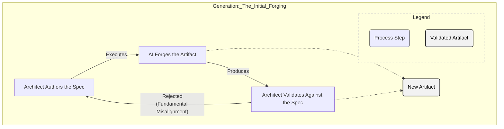
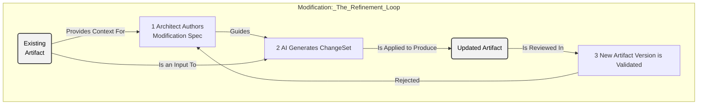

# The Artifact Lifecycle: The Architect's Workflow

A `Spec` is a contract, but a contract is useless without a formal process for executing it. The Artifact Lifecycle defines the two disciplined workflows an Architect uses to translate a `Spec` into a tangible, validated result.

Every action an Architect takes on an artifact falls into one of these two processes: **Generation** or **Modification**. Understanding them is key to maintaining control and predictability throughout a project.

---

## 1. The Generation Workflow: Forging the Initial Artifact

This workflow is used exactly once per artifact: the moment of its creation. It is the ideal "happy path," where a high-quality `Spec` is used to forge a new artifact from a blank slate.

A rejection at this stage is significant. It doesn't suggest a minor bug; it signals a fundamental flaw in the `Spec` itself, requiring the Architect to return to the contract and refine their intent.

### Process Flow

---

## 2. The Modification Workflow: Controlled, Iterative Change

This is the Architect's primary workflow for all planned, iterative changes to an **existing artifact**. It is the main loop of day-to-day development and long-term maintenance. The process is always initiated with an existing artifact and a new `Spec` that defines the desired changes.

Unlike in Generation, a rejection here is expected and managed. It typically indicates a minor implementation issue that the Architect can correct via a rapid **Refinement** loop, adjusting the `Spec` to provide clearer instructions for the next generation attempt.

### Process Flow

