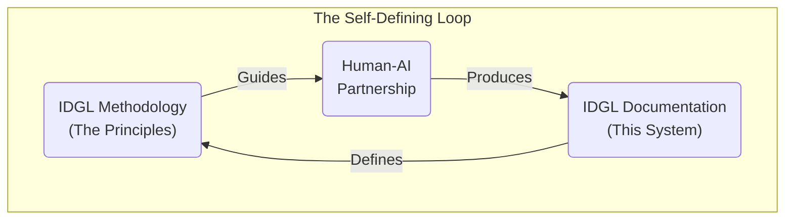

# IDGL: From Chaos to Control

Generative AI has introduced a new tension into our work: the incredible **speed** of AI versus the professional **discipline** required to build robust software. This chaos forces a choice upon every engineer:

Are we **Gamblers**, who hope for a lucky prompt and spend our days cleaning up the mess?

Or are we **Architects**, who command AI with a clear plan to guarantee the result?

This repository contains the **Intent-Driven Generative Lifecycle (IDGL)**: the definitive playbook for becoming an Architect in the AI era. It is a lightweight, tool-agnostic discipline for turning the chaos of generative AI into predictable, controllable outcomes by shifting our focus from the **labor** of writing code to the **leverage** of perfecting intent.

---

## The Path to Becoming an Architect

IDGL is a mindset, and this documentation is your guide. The path is structured to build your understanding from the foundational philosophy to practical mastery.

### Step 1: Understand the New World (The "Why")
Before learning the techniques, you must understand the new paradigm. These documents explain the core conflict and the mindset of the Architect.

*   **[The Core Paradigm](./00-core.md):** Defines the fundamental shift from a "Code-First" to a "Spec-First" world.
*   **[The IDGL Philosophy](./00-idgl-philosophy.md):** Outlines the principles and mindset required to partner effectively with AI.

### Step 2: Learn the Architect's Toolkit (The "How")
This is the practical methodology—the core tools the Architect uses to command the AI and control the outcome.

*   **[The Anatomy of a Spec](./02-anatomy-of-a-spec.md):** The standard for authoring the `Spec`—the Architect's "executable contract."
*   **[The Artifact Lifecycle](./03-the-artifact-lifecycle.md):** The formal processes for generating and sustaining software.
*   **[The Communication Principles](./04-communication-principles.md):** The foundational skills for guiding any generative agent.

### Step 3: Master the Architect's Plays (The "Advanced Strategy")
Once you've learned the core tools, you can master the advanced plays that are out of reach for the Gambler.

*   **[IDGL Patterns](./05-patterns.md):** The catalog of powerful, reusable strategies for taming legacy code, manufacturing certainty, and more.

---

## Your First Step: The Vanguard Project

The path to becoming an Architect is not just about reading; it's about building. The best way to begin is with a pragmatic, low-risk first step called the **Vanguard Project**.

We have a complete, hands-on tutorial that walks you through this entire process, from a simple idea to a fully validated software component. This is the definitive starting point for your journey.

**[Start the End-to-End Tutorial →](./02-implementation/02-end-to-end-tutorial/00-tutorial-overview.md)**

---

## The Ultimate Proof: A Self-Defining System

The ultimate proof of the Architect's discipline? **When it is robust enough to forge itself.**

This entire IDGL framework is the product of its own process. A system that can bootstrap its own creation is not a theory; it's a **proven reality.**

