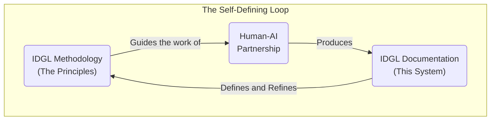
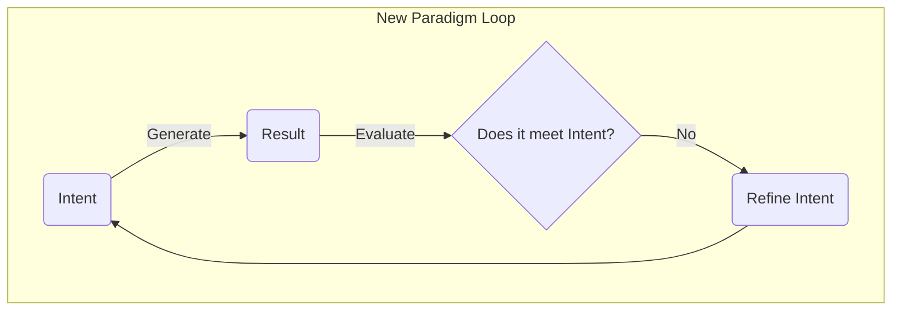
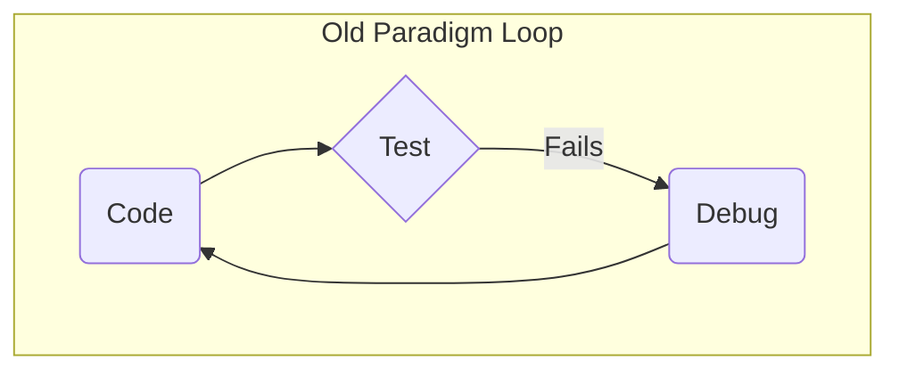
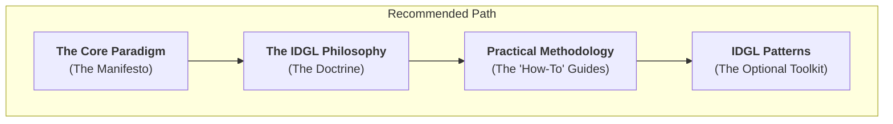
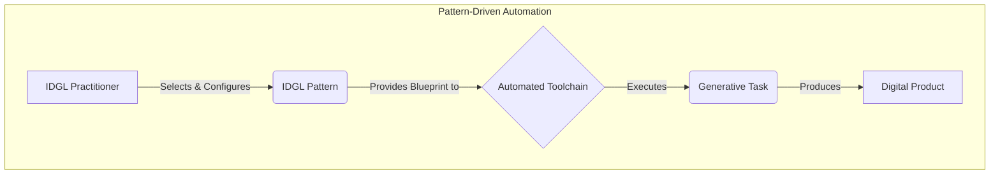

> "In an era where AI transforms software development, the most valuable skill isn't writing code - it's communicating intent with precision."  
> — Sean Grove, OpenAI

# Welcome to the AI-Native SDLC

The world of software is undergoing a fundamental transformation. The old Software Development Lifecycle (SDLC) is slowly but surely being "AI-ized," as every role and process evolves to incorporate artificial intelligence. This is not a temporary trend; it is the birth of a new, **AI-native development system.**

The **Intent-Driven Generative Lifecycle (IDGL)** is a first-principles blueprint for this new world. It is a lightweight, pragmatic methodology built on a single, powerful premise: **human intent**, captured in a formal `Spec`, must be the primary, authoritative source of truth. Our goal is no longer to manually code a solution, but to craft a perfect `Spec` and then use AI to search a vast solution space for the best possible implementation.

This is a system for engineers who want to be **architects, not gamblers.** It provides the discipline to turn the unpredictable "magic" of AI into a predictable engineering process. It's guided by three timeless principles: **YAGNI**, **Embrace Alternatives**, and—most importantly—**The Practitioner, Not the Process.**

Crucially, the IDGL is a system that was **used to define itself.** This very documentation is the "proof-of-work," created through the same `spec -> generate -> evaluate -> refine` loop that it describes. It is a complete, expert-level system for developing software in partnership with artificial intelligence.

Welcome aboard the bus to the train of progress.

---
# The IDGL Development System: A Blueprint for the AI-Native SDLC

## The Inevitable AI-ization of Software Development

If we observe the software development lifecycle (SDLC) in dynamic, we see a clear and accelerating trend: the **"AI-ization"** of our industry. Aspect by aspect, role by role, traditional processes are being augmented, simplified, consolidated, or replaced by AI-assisted and AI-agentic systems. This is not a temporary phase, but a fundamental evolution towards a new, **AI-native development system**.

The **Intent-Driven Generative Lifecycle (IDGL)** is a methodological attempt to architect this future state. It is not an incremental improvement on the old way of doing things, but a first-principles blueprint for a system designed for a world where AI is a fully adapted, first-class partner in creation.

Its core tenets are:
*   **Reuse over Reinvention:** The fundamental job of the generative AI is to act as an advanced search and synthesis engine. We must leverage its ability to find and adapt the most relevant and popular solutions from its vast training data, rather than "reinventing the bicycle" with every new project.
*   **A System That Defines Itself:** This documentation is the ultimate proof-of-work for the methodology it describes. It is an artifact that was created by applying the IDGL's own principles: a human practitioner and an AI agent engaged in a `spec -> generate -> evaluate -> refine-spec` loop to define the very system they were using. A methodology that can be used to successfully define and build itself is not just a theory; it is a coherent and proven reality.

This collection of documents is the result of that process: a complete, expert-level system for developing software in partnership with artificial intelligence.

## The Core Philosophy

The IDGL system is an engineering discipline built on a single, powerful premise: **human intent**, not the generated code, must be the primary, authoritative source of truth.

To achieve this, IDGL defines a clear partnership model: the **human acts as the strategic director**, providing vision and judgment, while the **AI serves as a powerful tactical executor**, generating comprehensive solutions from that strategic guidance. The human defines the "what" and "why"; the AI handles the "how."

This relationship is formalized through an auditable link between a human-authored `Spec` (the intent) and an AI-generated `Digital Product` (the implementation). This introduces a degree of formal process, but this should not be seen as overhead. Much like TypeScript adds a layer of structure to JavaScript to enable enterprise-level scalability, the IDGL process brings a necessary formalism to AI collaboration to ensure it is predictable, reliable, and auditable. For a detailed exploration of the guiding principles and common pitfalls of this approach, see **[The IDGL Philosophy](./00-idgl-philosophy.md)**.

### Engineering for Predictable Excellence

A core challenge in working with Large Language Models (LLMs) is their **non-deterministic nature**: the same input prompt can produce outputs of dramatically different quality on separate runs. One attempt might yield a basic, functional result, while the next might produce a sophisticated, architecturally brilliant artifact—a "flash of inspiration."

The IDGL philosophy refuses to leave quality to chance. We don't want to simply *hope* for a high-quality outcome. Instead, we use an iterative process to build a system that **engineers predictable excellence.**

This process works as follows:
1.  We start with a set of instructions (a "prompt") to guide the AI.
2.  Occasionally, the AI will produce an exceptionally high-quality result—a "lucky" outcome.
3.  Instead of just accepting this good fortune, we analyze *why* the output was superior.
4.  We then encode these success criteria back into our master instructions, making them more explicit and robust.

This cycle transforms a "lucky" outcome, which is unreliable, into a **repeatable, engineered result**. It elevates the development system from one that is merely "good enough" (producing variable results) to one that **explicitly and reliably demands excellence** by design.

## Where to Start: The End-to-End Tutorial

The best way to understand the IDGL is to see it in action. Before diving into the detailed methodology, we recommend starting with our end-to-end practical tutorial.

*   **[End-to-End Tutorial: Creating a React Hook](./02-implementation/02-end-to-end-tutorial/00-tutorial-overview.md)**

This tutorial walks through a complete, realistic Generative Task, from a high-level idea to a fully tested and validated software component. It is the most direct way to get a feel for the new development loop and the role of the IDGL practitioner.

## The Core Documentation

The IDGL is defined by a set of documents that build upon one another. The recommended learning path is as follows:

### 1. The Vision: The "What & Why"
This is the manifesto that defines the new generative paradigm. It is the definitive starting point.

*   **[The Core Paradigm](./00-core.md):** Defines the shift from process-centric to result-centric development and introduces the core concepts of the IDGL.

### 2. The Mindset: The "How to Think"
This is the doctrine for the practitioner. It provides the formal methodology and mental models for operating effectively within the new paradigm.

*   **[The IDGL Philosophy](./00-idgl-philosophy.md):** Defines the tenets, principles, and mindset required to partner effectively with generative AI.

### 3. The Practical Methodology: The "How to Do"
These documents provide the specific, actionable engineering standards for executing generative tasks.

*   **[The Anatomy of a Spec](./02-anatomy-of-a-spec.md):** The standard for authoring a high-quality Spec.
*   **[The Artifact Lifecycle](./03-the-artifact-lifecycle.md):** The processes for generating, modifying, and sustaining software.
*   **[The Communication Principles](./04-communication-principles.md):** The foundational skill for guiding any generative agent.

## IDGL Patterns: The Blueprints for Automation

Once you have a firm grasp of the core methodology, you can explore the optional but powerful **[IDGL Patterns](./01-patterns/)**.

Unlike the mandatory Core Methodology, Patterns are formalized, reusable solutions to recurring challenges in a human-AI development lifecycle. They are the **architectural blueprints for an automated IDGL toolchain.**

While the formality of the IDGL process provides structure, it is not intended to create manual "paperwork." This routine is explicitly designed to be alleviated by a suite of automation tools — from simple scripts to a dedicated development server—that handle the boilerplate, manage the data flows, and enforce the architectural consistency defined in the Patterns.

The IDGL, as a pure methodology, is a good and necessary start. However, the logical continuation of its evolution is the **Agentic-Driven Generative Lifecycle (ADGL)**: an opinionated, automated framework that brings the IDGL's principles to life. For a concrete guide on implementing this next stage, see the **[ADGL Framework](./03-ad-framework/)**.

## Core Roles

- IDGL Practitioner: See [The IDGL Practitioner Profile](./06-idgl-practitioner-profile.md).

## Why This Matters: The Bus to the Train of Progress

The world of AI is changing at an incredible speed. The temptation to fall behind is real, just as is the paradox of "not having time" to learn the very tools that promise to save us time. It can feel like trying to catch a train of progress that is already moving into the distance.

The IDGL is the bus to that train.

It is a lightweight, pragmatic system designed to go *with* the AI flow, not against it. The effort spent to comprehend and internalize this methodology has an immediate ROI, boosting productivity enough to create the very time needed to master it. It is the right instrument for this moment of transition, providing the structure needed to make the AI transformation real and concrete today, while being designed to naturally evolve into the fully-fledged, automated ADGL framework of tomorrow.

As sharing brings greater rewards than hoarding, this system is open for all. Welcome aboard.
