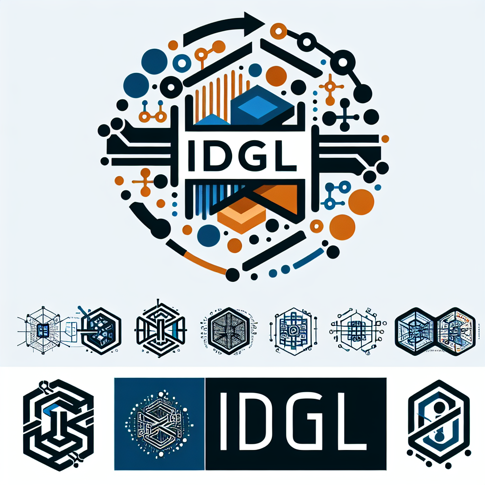

# IDGL: From Chaos to Control

Generative AI has introduced a new tension into our work: the incredible **speed** of AI versus the professional **discipline** required to build robust software. This chaos forces a choice upon every engineer:

Are we **Gamblers**, who hope for a lucky prompt and spend our days cleaning up the mess?

Or are we **Architects**, who command AI with a clear plan to guarantee the result?

This repository contains the **Intent-Driven Generative Lifecycle (IDGL)**, a lightweight, tool-agnostic discipline for becoming an Architect in the AI era.

---

### Get Started in 60 Seconds

1.  **Choose Your Boot Configuration:**
    *   **[Generic IDGL Config →](./04-ai-agent-boot-config/GENERIC-USER-GUIDE.md)** (for general development, code generation, system design)
    *   **[MFU Generation Config →](./04-ai-agent-boot-config/domain-specific-configs/MFU-USER-GUIDE.md)** (for meeting documentation, content analysis, knowledge transfer)

2.  **Initialize Your AI Agent:**
    *   Start a new chat session with your chosen AI.
    *   Paste the entire contents of the downloaded file as your first prompt.

3.  **Become the Architect.**
    *   The AI is now a configured IDGL partner. Start commanding it.

**💡 Quick Decision Guide:**
- **Use Generic Config** if you're doing general software development, system design, or learning IDGL
- **Use MFU Config** if you're working with meeting documentation, content analysis, or knowledge transfer

---

To master the philosophy and learn the advanced plays, dive deeper:

**[→ Read The Architect's Way](./00-the-architects-way.md.md)**

---

### Your First Conversation: Example Prompts

Once the AI is configured, you can direct it using plain language. Here are some examples to get you started.

#### Activating an Agent Role: A Cheat Sheet

Use these prompts to put the AI into a specific professional persona for the task at hand.

| Goal | Example Prompt |
|---|---|
| **Decompose a large task** | `"Act as a Decomposition Specialist. This is a big feature. Help me break it down into smaller, manageable `Specs`."` |
| **Create a formal plan** | `"Act as a Spec Compiler. I need to build a user authentication endpoint. Let's create the `Spec` for it."` |
| **Generate code from a plan** | `"Act as a Code Generator. The `Spec` for the auth endpoint is approved. Please generate the code."` |
| **Analyze existing code** | `"Act as a Code Analyst. Tell me about the public methods in this file: `src/utils/api.ts`."` |
| **Onboard legacy code** | `"Act as a Legacy Spec Generator. Reverse-engineer a formal `Spec` for this file so I can refactor it safely."` |
| **Analyze meeting content** | `"Act as a Content Analyst. Analyze this meeting transcript and identify the main themes and key decisions."` |
| **Generate meeting follow-up** | `"Act as a Documentation Generator. The content analysis is complete. Please generate the meeting follow-up in the specified format."` |

*For more advanced, multi-step scenarios, see the **[→ Specs Cookbook](./08-specs-cookbook.md)**.*

#### Key Plays from the Cookbook

*   **To get a structured comparison of options:**
    > "Before you answer, write two detailed paragraphs, one arguing for each of these solutions. Do not jump to conclusions. Then, tell me which one is better and why."

*   **To have the AI guide you on solving an error:**
    > "If you were a senior software developer working on this project, what type of context would you need to solve this error? Tell me step-by-step instructions on how I can give you that context."

*   **To set a high quality bar for code generation:**
    > "Proceed like a 10x engineer. I expect clean, efficient, and well-documented code. Anticipate edge cases and include robust error handling."

*... and many more in the **[→ Full Prompt Cookbook](./08-prompt-cookbook.md)**.*

---

### Domain-Specific Boot Configurations

IDGL supports domain-specific boot configurations that are tailored to specific use cases while maintaining the core methodology:

*   **📋 [MFU Generation Config](./04-ai-agent-boot-config/domain-specific-configs/mfu-generation-boot-config.yaml)**: Specialized for meeting follow-up documentation generation (includes default spec)
*   **🔧 [Domain-Specific Analysis](./04-ai-agent-boot-config/domain-specific-configs/domain-specific-boot-config-analysis.md)**: Detailed reasoning for domain-specific approach
*   **📚 [Generic IDGL Config](./04-ai-agent-boot-config/idgl-boot-config.yaml)**: Universal configuration for general development

Each domain-specific config maintains IDGL's core principles while adding specialized patterns, agent protocols, and workflows for the target domain. Domain-specific configs include default specifications for immediate use, with support for custom spec overrides.

**🎯 Related Implementations:**
- **[MFU Generation Implementation](./02-implementation/05-mfu-generation/)** - Complete implementation example with specs and definitions
- **[Shared Spec Library](./05-spec-library/)** - Canonical specifications for organizational standardization

### Real-World Implementations

#### React Project Scanner

See IDGL in action with our **[React Project Scanner](./02-implementation/04-react-project-scanner/)**, a complete implementation that demonstrates the full power of the framework:

*   **🔍 AST Parser**: Analyzes React TypeScript patterns with semantic understanding
*   **📊 Dependency Graph**: Maps project relationships and submodule structures  
*   **🏗️ Built with IDGL**: Every component follows the `Spec` → Generate → Validate → Refine loop
*   **✅ Production Ready**: Handles enterprise-scale projects with 10,000+ files

#### Meeting Follow-Up Generation

Our **[MFU Generation Implementation](./02-implementation/05-mfu-generation/)** showcases domain-specific IDGL application:

*   **📋 Content-Driven Approach**: Analyzes actual meeting content rather than using templates
*   **🎯 Multiple Output Formats**: Action-oriented, knowledge-focused, hybrid, and summary formats
*   **🔍 Quality Validation**: Ensures documentation accurately reflects meeting content
*   **📚 Complete Methodology**: From definition to specification to boot configuration
*   **🚀 Zero-Friction Usage**: Boot config includes default spec for immediate use
*   **🔧 Flexible Overrides**: Support for custom and shared spec overrides

These implementations show how Architects use IDGL to build complex tools that would be impossible to create with traditional development approaches.

