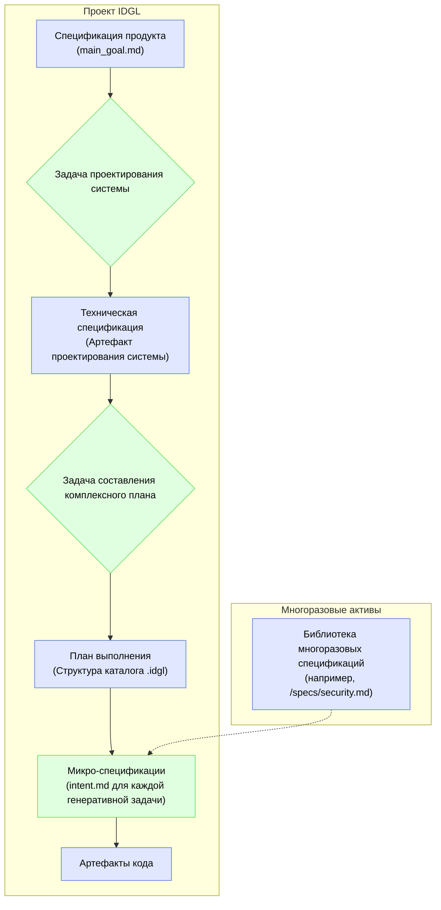

# Спецификация IDGL: Авторитетный источник истины

## Обоснование: IDGL как разработка, управляемая спецификациями

**Intent-Driven Generative Lifecycle (IDGL)** — это методология выполнения **спецификаций** с помощью искусственного интеллекта. «Спецификация» является основным, контролируемым версиями артефактом всего процесса разработки, а не побочным материалом. Создаваемый код является последующим переводом богатого намерения, зафиксированного в спецификации.

Спецификация — это авторитетное, письменное описание намерения, охватывающее:
1.  **Что** создавать (функциональные требования, критерии успеха).
2.  **Почему** оно должно вести себя именно так (ценности, бизнес-правила, ограничения безопасности).
3.  **Как** проверять успех (тесты, критерии оценки).

Такой подход обеспечивает согласованность действий человека и машины вокруг единого, недвусмысленного источника истины.

## Сопоставление спецификаций с фреймворком IDGL

Различные файлы и артефакты, которые мы определили в методологии IDGL, являются просто разными видами и областями применения спецификаций.

### Виды спецификаций в IDGL

*   **Спецификация продукта (`main_goal.md`):** Это спецификация самого высокого уровня. Она определяет цель для целой `Фазы разработки`, фокусируясь на пользовательских историях, бизнес-ценности и общих критериях успеха.

*   **Техническая / Архитектурная спецификация:** Это артефакт, создаваемый задачей `01_system_design` в рамках фазы. Он определяет интерфейсы, контракты данных и выбор технологий, предоставляя «как» для «что», описанного в спецификации продукта.

*   **Тестовая спецификация / Микро-спецификация (`intent.md`):** Это самая гранулированная спецификация. `intent.md` для любой данной генеративной задачи является самодостаточной, исполняемой спецификацией. Она должна включать конкретные примеры, крайние случаи и критерии приемки, которые можно использовать для проверки сгенерированного артефакта.

### Многоразовые и компонуемые спецификации

Для обеспечения согласованности и повторного использования проект IDGL может поддерживать центральную библиотеку общих спецификаций, например:
*   `/specs/security-guidelines.md`
*   `/specs/ux-style-guide.md`
*   `/specs/privacy-policy.md`

`intent.md` для любой генеративной задачи может затем импортировать или ссылаться на эти общие спецификации, гарантируя, что все сгенерированные артефакты соответствуют одному и тому же набору высокоуровневых ограничений. Это делает весь процесс более надежным, поддерживаемым и соответствующим политике организации. 