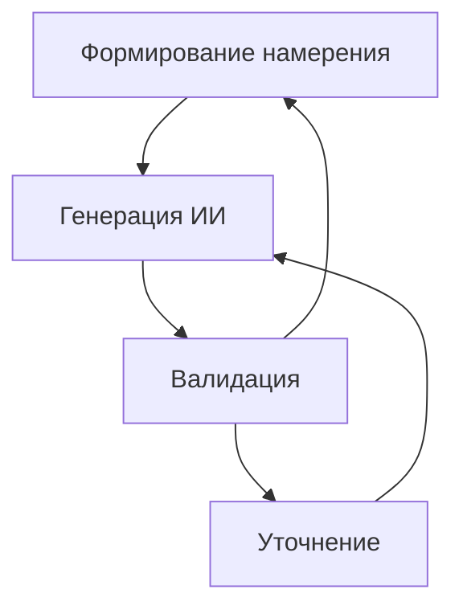

# Жизненный цикл генерации, управляемый намерениями (IDGL): Основная концепция

Этот документ описывает основные принципы Жизненного цикла генерации, управляемого намерениями (IDGL), систематической методологии для создания контента с помощью ИИ.

## Определение

Жизненный цикл генерации, управляемый намерениями (IDGL) — это структурированный процесс создания любого вида контента с помощью искусственного интеллекта, включая разработку программного обеспечения и любую область, где ИИ может генерировать артефакты, такие как текст, изображения, код или данные.

Основной единицей IDGL является цикл "ai-gen", который состоит из четырех основных этапов:

1.  **Формирование намерения**: Этот начальный шаг включает в себя четкое определение желаемого результата. Цель состоит в том, чтобы сформулировать точное и действенное намерение, которое будет направлять процесс генерации ИИ.

2.  **Генерация ИИ**: На основе сформулированного намерения модель ИИ генерирует контент. Это основная фаза создания, на которой производится первоначальный артефакт.

3.  **Валидация**: Сгенерированный артефакт критически оценивается на соответствие первоначальному намерению. Ключевой вопрос: «Соответствует ли это указанным требованиям?»

4.  **Уточнение**: Если этап валидации выявляет расхождения или возможности для улучшения (например, исправление ошибок, рефакторинг), процесс переходит на стадию уточнения. Это включает в себя запуск новой, ограниченной **подзадачи по уточнению**. Эта подзадача является формальной генеративной задачей со своим собственным четким намерением (например, «Исправить ошибку "off-by-one" в этой функции» или «Выполнить рефакторинг этого компонента для использования новой службы данных»). Затем цикл возвращается на этап **Генерации ИИ** в контексте этой новой подзадачи.

Если процесс валидации определяет, что сгенерированный результат в корне не соответствует цели и простого уточнения недостаточно, цикл может быть перезапущен с этапа **Формирования намерения**. Это позволяет пересмотреть и переформулировать основную цель. 