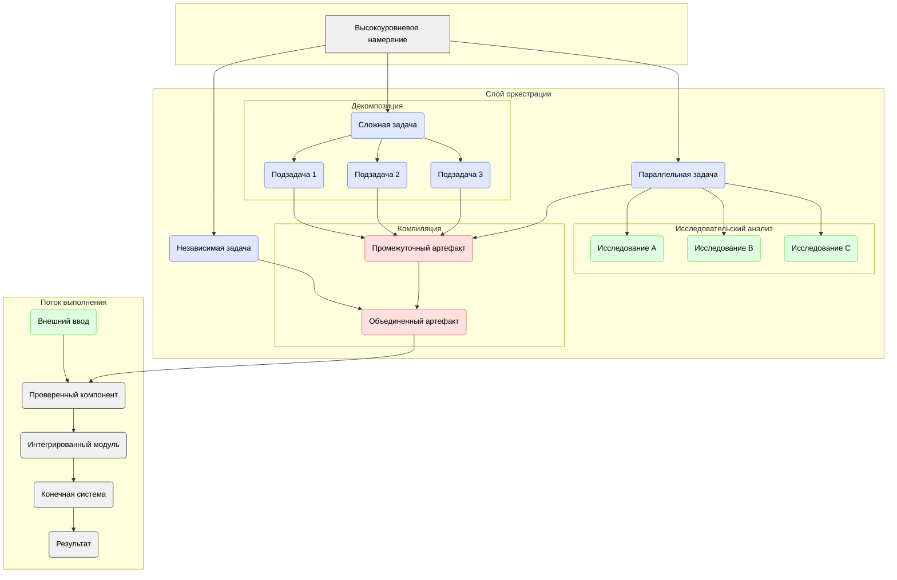

# Оркестрация генеративных задач

## Определение

В то время как идеальное **Намерение**, передаваемое ассистенту ИИ, должно быть как можно более всеобъемлющим и масштабным для максимизации контекста, **Оркестрация генеративных задач** — это стратегический процесс, применяемый для исключительно крупномасштабных или сложных целей, которые не могут быть надежно обработаны за один генеративный цикл. Основной принцип заключается в управлении объемом задачи, обеспечивая, чтобы каждый сгенерированный **Артефакт** все еще можно было эффективно проверить. Это включает в себя разбиение всеобъемлющего намерения только при необходимости, а не по умолчанию.

Этот процесс признает, что высокоуровневая цель может быть слишком большой или сложной для одного цикла "ai-gen". Вместо того чтобы подходить к ней монолитно, он использует несколько стратегий для разбиения, решения и повторной сборки проблемы, что позволяет использовать разные пути к конечному результату.

## Основные стратегии

Оркестрация предполагает гибкий путь к конечному результату, используя при необходимости следующие стратегии:

1.  **Декомпозиция:**
    *   **Описание:** Процесс разбиения исключительно большой или неоднозначной генеративной задачи на серию меньших, но все же существенных подзадач. Каждая подзадача затем решается в своем собственном цикле "ai-gen".
    *   **Цель:** Уменьшить ошеломляющую сложность и обеспечить, чтобы артефакт, сгенерированный из каждой подзадачи, был целостным, проверяемым модулем.
    *   **Пример:** Декомпозиция высокоуровневого намерения «Создать полноценный многопользовательский торговый маркетплейс» на более крупные и управляемые эпики, такие как:
        *   `Реализовать систему управления идентификацией пользователей и продавцов (учетные записи, профили, роли).`
        *   `Разработать модуль каталога товаров с поддержкой нескольких продавцов.`
        *   `Создать единую корзину покупок и многоэтапный процесс оформления заказа.`
        *   `Построить конвейер обработки и выполнения заказов.`

2.  **Компиляция / Композиция:**
    *   **Описание:** Процесс интеграции артефактов, полученных из нескольких меньших генеративных задач, в единое, целостное и функциональное целое.
    *   **Цель:** Собрать окончательный, полный артефакт после того, как его составные части были индивидуально сгенерированы и проверены.
    *   **Пример:** Объединение проверенных бэкенд-сервисов и фронтенд-компонентов в рабочий процесс аутентификации.

3.  **Исследовательский анализ:**
    *   **Описание:** Проведение побочного исследования для устранения пробелов в знаниях или разрешения неопределенностей, которые блокируют выполнение генеративной задачи. Это само по себе является генеративной задачей, где артефактом может быть информация, решение или доказательство концепции.
    *   **Цель:** Собрать необходимую информацию перед тем, как приступить к основной задаче.
    *   **Пример:** Если неясно, какую библиотеку шифрования использовать, инициируется исследовательская задача для сравнения вариантов. Полученное решение (артефакт) информирует основную задачу разработки.

Используя эти стратегии оркестрации, мы обеспечиваем масштабируемый и поддерживаемый рабочий процесс, в котором прогресс достигается проверяемыми шагами, что приводит к более надежному и качественному конечному артефакту. 