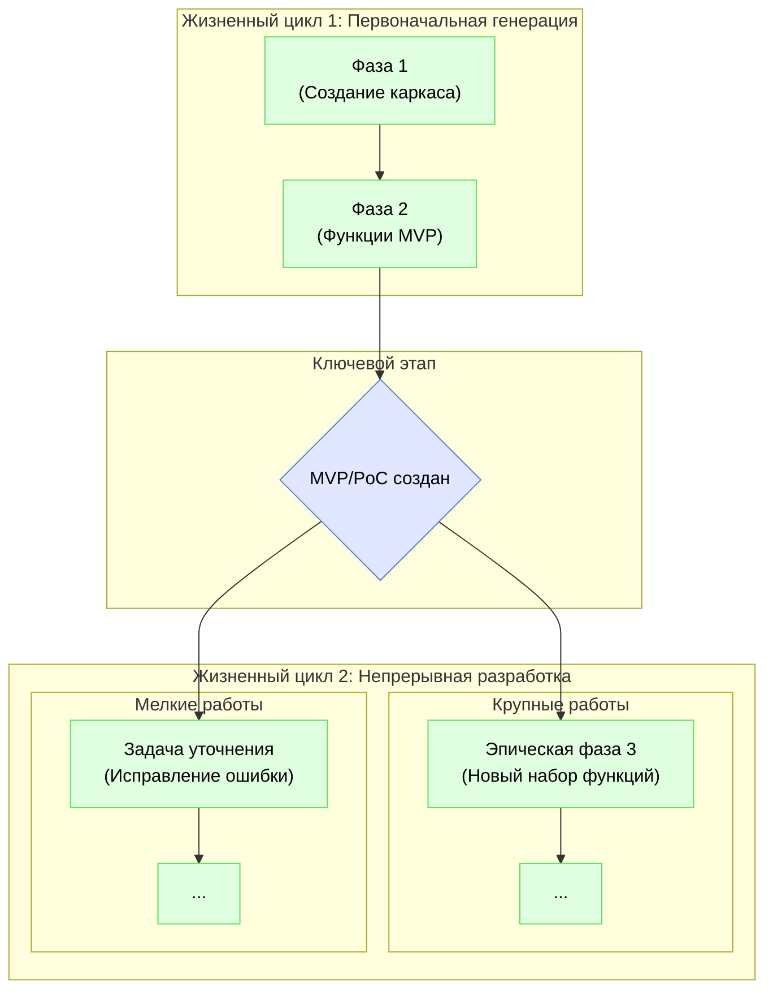
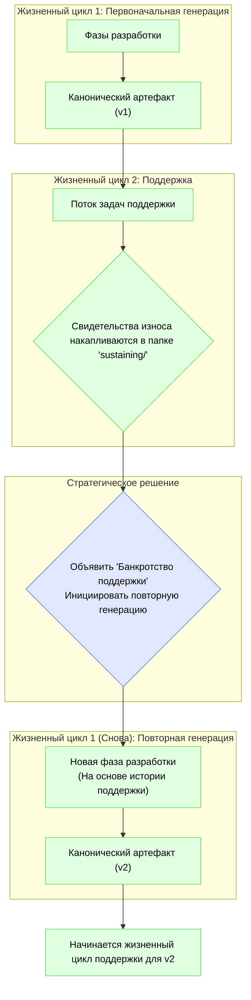

# Два жизненных цикла проекта IDGL

## Обоснование: От первоначального создания до непрерывной эволюции

Жизненный цикл проекта делится на два основных этапа: **Первоначальная генерация** для создания первой версии артефакта и постоянный этап **Непрерывной разработки** для всей последующей работы. Эта модель обеспечивает гибкость для обработки как крупных, запланированных эпиков функций, так и небольших, инкрементных изменений после первоначального выпуска.



## Жизненный цикл 1: Первоначальная генерация
Это особый, одноразовый процесс создания первого канонического артефакта (например, MVP или PoC) с чистого листа.

*   **Единица работы:** Формальная, многоэтапная **Фаза разработки**, как определено в `07-idgl-development-phase-ru.md`.
*   **Процесс:** Состоит из последовательности одной или нескольких `Фаз разработки`, необходимых для получения первой стабильной, готовой к выпуску версии продукта.

## Жизненный цикл 2: Непрерывная разработка
Этот жизненный цикл начинается после создания первоначального артефакта и охватывает всю последующую эволюцию продукта. Он имеет два режима работы в зависимости от масштаба работы.

*   **Режим A: Крупные эпики (Создание "остальной части" продукта)**
    *   **Единица работы:** Формальная **Фаза разработки**.
    *   **Процесс:** При добавлении значительного нового набора функций инициируется новая `Фаза разработки`. Она следует полному 5-этапному процессу, но использует существующую кодовую базу в качестве отправной точки.
    *   **Когда использовать:** Для крупных, запланированных эпиков функций, которые требуют собственного проектирования и комплексного планирования.

*   **Режим B: Инкрементные изменения**
    *   **Единица работы:** Специальная **Генеративная задача**.
    *   **Процесс:** Для небольших изменений инициируется одна генеративная задача. Это более гибкий подход, который обходит формальную структуру фаз.
    *   **Когда использовать:** Для исправления ошибок, оптимизации производительности, незначительных улучшений и других мелкомасштабных, инкрементных работ.

Эта двухрежимная модель для непрерывной разработки обеспечивает правильный уровень структуры для любой задачи, гарантируя как гибкость для небольших изменений, так и строгость для крупных дополнений.

---

## Регистрация работы в структуре каталогов

Два режима жизненного цикла непрерывной разработки отражены в том, как работа организована в каталоге `.idgl`. Пронумерованные папки фаз представляют хронологическую историю первоначального создания проекта и крупных эпиков, в то время как отдельная папка `sustaining/`, организованная по архитектуре проекта, предоставляет живой архив для всех работ по обслуживанию и инкрементных изменений.

### Регистрация крупных эпиков

При добавлении крупного нового набора функций в последовательность добавляется новая, пронумерованная папка **Фазы разработки**. Это регистрирует основные исторические вехи проекта.

```
.idgl/
│
├── 📁 01-scaffolding-phase/
├── 📁 02-authentication-phase/
└── 📁 03-product-catalog-phase/  // <-- Новая фаза для нового крупного эпика
```

### Регистрация инкрементных изменений (Золотая середина)

Для небольших, специальных задач работа регистрируется в каталоге верхнего уровня `sustaining/`, который организован по функциям. Чтобы сбалансировать простоту использования с долгосрочной масштабируемостью, каждая папка функции использует гибридную модель «активное рабочее пространство против холодного архива».

```
.idgl/
│
└── 📁 sustaining/
    │
    └── 📁 authentication/                 // Контекст конкретной функции
        │
        ├── 📁 fix-recent-login-bug/      // <-- Новые задачи создаются здесь в виде плоского списка
        ├── 📁 add-new-tooltip/          // <-- для чистого, активного рабочего пространства
        │
        └── 📁 archive/                  // <-- Специальное место для старых, завершенных задач
            │
            ├── 📁 2024/
            │   ├── 📁 fix-old-bug-from-q3/
            │   └── 📁 another-old-task/
            │
            └── 📁 2023/
                └── ...

```

#### Рабочий процесс

*   **Для активного разработчика:** Рабочий процесс прост и не создает препятствий. Специалист, работающий над исправлением новой ошибки, создает новую папку задачи непосредственно в соответствующем каталоге функции (например, `sustaining/authentication/`). Список папок, который он видит, представляет собой чистый, релевантный список текущих и недавних работ.

*   **Для долгосрочного курирования:** Чтобы предотвратить превращение активного рабочего пространства в свалку, используется периодический процесс архивации. В конце квартала или года завершенные папки задач просто перемещаются из корня каталога функции в соответствующий подкаталог `archive/[год]/`.

Этот подход «золотой середины» обеспечивает лучшее из обоих миров: простую, плоскую структуру для повседневной работы и масштабируемый, организованный архив для долгосрочной истории проекта.

---

## Полный жизненный цикл: Управление техническим долгом с помощью фаз повторной генерации

Жизненный цикл поддержки — это не просто пассивный режим обслуживания; это активный процесс, который создает критически важный информационный актив: историю обслуживания каждой функции, регистрируемую в каталоге `sustaining/`. Эта история является основным инструментом для управления долгосрочным здоровьем кодовой базы.

Со временем накопление исправлений ошибок и незначительных изменений может привести к смещению архитектуры и техническому долгу. Когда стоимость и сложность добавления к функции становятся слишком высокими, методология предоставляет стратегический «аварийный выход»: **Фазу повторной генерации**.



### Фаза повторной генерации

Фаза повторной генерации — это формальная **Фаза разработки**, инициируемая с конкретной `Главной целью` перестройки и замены существующей, изношенной функции.

*   **Триггер:** Стратегическое решение, основанное на данных из папки `sustaining/` (например, высокая частота ошибок, возрастающая сложность изменений, низкая производительность).
*   **Процесс:** Он следует стандартному 5-этапному процессу Фазы разработки. Критически важно, что задача `01_system_design` для этой фазы использует всю историю обслуживания из папки `sustaining/` в качестве основного входного данного. Это гарантирует, что проектирование «v2» будет явно основано на всех задокументированных проблемах и исправлениях «v1».
*   **Результат:** Новая, чистая версия артефакта функции, которая заменяет старую в кодовой базе. Старая история `sustaining/` архивируется, и для обновленной функции начинается новый, чистый журнал.

Этот последний цикл обратной связи гарантирует, что IDGL — это не просто методология для создания программного обеспечения, а полноценный фреймворк для управления всем долгосрочным жизненным циклом проекта, предотвращения износа и обеспечения его постоянного здоровья и поддерживаемости. 