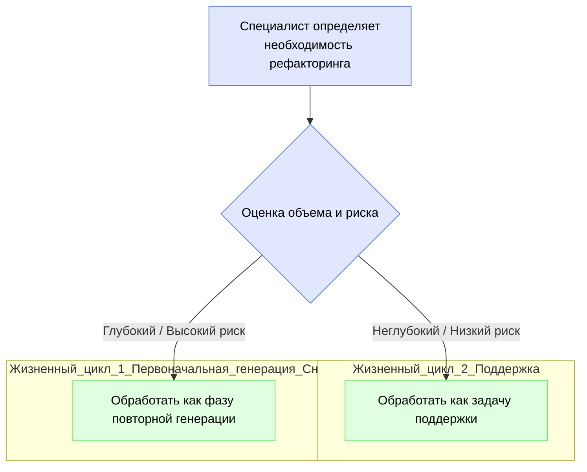

# Рефакторинг с помощью IDGL: стратегический, управляемый спецификациями подход

## Партнерство человека и ИИ в рефакторинге

В рамках фреймворка IDGL рефакторинг — это стратегическая, управляемая человеком деятельность, а не слепой, автоматизированный процесс. ИИ служит мощным и эффективным инструментом для выполнения изменений, но специалист по IDGL является архитектором, который руководит процессом. В этом партнерстве существует четкое разделение труда:

*   **Специалист по IDGL (Стратег):** Определяет необходимость рефакторинга, формулирует точную цель в высококачественной **Спецификации** (`intent.md`) и выступает в качестве конечного валидатора результата.
*   **ИИ (Инструмент):** Анализирует кодовую базу на предмет потенциальных улучшений и выполняет утомительные, крупномасштабные изменения, определенные в спецификации специалиста, с высокой скоростью и точностью.

## Два масштаба рефакторинга

IDGL предоставляет два различных, формальных процесса для проведения рефакторинга, в зависимости от объема и риска изменений. Специалист должен стратегически решить, какой процесс подходит для данной задачи.



### 1. Неглубокий рефакторинг (как задача поддержки)

Этот процесс используется для локализованных, низкорискованных изменений, которые улучшают состояние конкретного компонента без изменения архитектуры системы.

*   **Примеры:** Переименование переменной для ясности, извлечение сложной функции, преобразование одного модуля к новому шаблону (например, `async/await`).
*   **Процесс:** Неглубокий рефакторинг рассматривается как специальная **Генеративная задача** и регистрируется в рамках **Жизненного цикла поддержки**.
*   **Структура каталога:** Новая папка задачи создается в каталоге `sustaining/` соответствующей функции.
    ```
    .idgl/sustaining/authentication/refactor-login-function-for-clarity/
    ```

### 2. Глубокий рефакторинг (как фаза повторной генерации)

Этот процесс предназначен для крупномасштабных, высокорискованных, архитектурных изменений, которые коренным образом изменяют часть системы.

*   **Примеры:** Миграция бэкенд-фреймворка, разделение монолита на микросервисы, изменение основной парадигмы базы данных.
*   **Процесс:** Глубокий рефакторинг **должен быть переведен в формальную Фазу повторной генерации**. Это полноценная **Фаза разработки** с конкретной `Главной целью` перестройки устаревшей или изношенной части системы.
*   **Ключевой шаг:** Задача `01_system_design` для этой фазы является критически важной. Она должна использовать всю историю обслуживания из папки `sustaining/` в качестве основного входного данного, гарантируя, что новая архитектура будет явно основана на задокументированных проблемах старой.
*   **Структура каталога:** Новая, пронумерованная папка `Фазы разработки` создается в корневом каталоге `.idgl`.
    ```
    .idgl/04-refactor-backend-to-microservices-phase/
    ```

Предоставляя различные, формальные процессы как для неглубокого, так и для глубокого рефакторинга, IDGL гарантирует, что каждое изменение, от простого переименования до полной архитектурной перестройки, является преднамеренной, управляемой спецификациями и отслеживаемой деятельностью, обеспечивая долгосрочное здоровье и поддерживаемость проекта. 