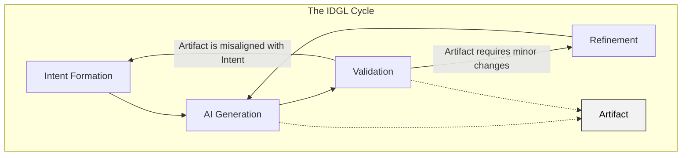

# The IDGL Cycle

This document outlines the core concept of the IDGL Development System: the lifecycle of a **[Generative Task](./00-generative-task-definition.md)**.

The IDGL system is built entirely around a single, scalable process for executing any Generative Task. This lifecycle ensures that every piece of work is intentional, validated, and traceable. All other structures in the IDGL framework, such as Phases and Lifecycles, are patterns for organizing and managing collections of these tasks.

## The IDGL Cycle

Any Generative Task, regardless of its size, is executed via the **IDGL Cycle**:

1.  **Intent Formation**: This initial step involves clearly defining the desired outcome for the task. The goal is to articulate a precise and actionable **Intent** that will guide the AI generation process.

2.  **AI Generation**: Based on the formulated intent, the AI model generates an **Artifact**. This is the primary creation phase where the initial version of the deliverable is produced.

3.  **Validation**: The generated artifact is critically evaluated against the original intent. The key question is: "Does this artifact meet all the specified requirements?"

4.  **Refinement**: If validation reveals discrepancies or opportunities for improvement, the process enters a refinement loop. This involves initiating a new, scoped **refinement sub-task** (which is, itself, a smaller Generative Task). The loop then returns to the AI Generation stage for this sub-task. If validation determines the artifact is fundamentally misaligned with the goal, the process returns to the **Intent Formation** stage to formulate a new, better-defined intent.

5.  **The Artifact**: This is the central object of the cycle, as shown in the diagram. It is the tangible output (e.g., source code, documentation) that is created, validated, and refined. For a complete definition, see **[The Artifact](./03-artifact-definition.md)**.
