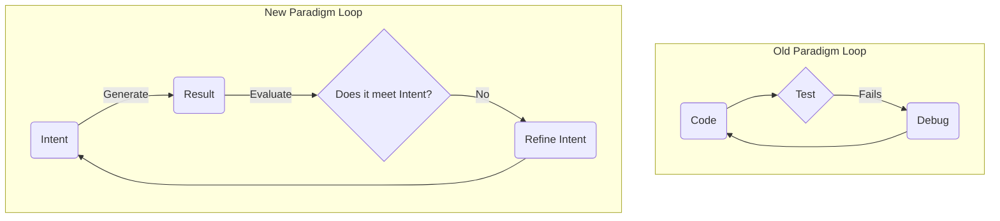
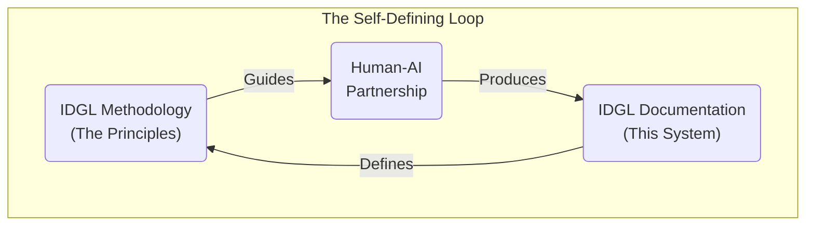

<!-- _class: invert -->

# **IDGL: An Engineering Discipline for the AI Era**
### A Methodology That Defines Itself

---

## The Problem: The Great Uneven Accelerator

> "Generative AI is one of the most powerful tools we've ever been given. It's a gift. But if we're being honest, it's also a headache."

It accelerates local tasks but introduces global chaos.
- **Inconsistent Quality**
- **Not Reproducible**
- **Unpredictable Process**

This creates risk, erodes trust, and leaves us feeling more like gamblers than architects.

---

## The Foundational Principles: Our Doctrine

Before we see *how* IDGL works, we must understand *why* it works. It’s built on three core beliefs that separate it from naive automation.

1.  **YAGNI ("You Ain't Gonna Need It")**
    *A toolkit, not a bureaucracy. Use the simplest path by default.*

2.  **Embrace Alternatives**
    *The goal is to explore multiple solutions cheaply, not just get one answer faster.*

3.  **The Practitioner, Not the Process**
    *The system exists to augment *your* intellect, not to replace it.*

---

## The Core Paradigm Shift: The New Loop

For decades, our effort has been focused on fixing the *output*.
The new paradigm shifts our focus to where it has the most leverage: the **intent**.

---

<!-- _class: invert -->

# **The IDGL Framework**
### Anatomy of the System

---

## The Spec: The Executable Contract

The heart of the entire system is the **`Spec`**. It is a formal, version-controlled artifact that serves as an **executable contract** for our AI partner.

It forces us to answer three profound questions *before* we generate code:
1.  **Objective:** What are we building?
2.  **Rationale:** Why are we building it?
3.  **Verification:** How will we know it’s correct?

---

## The Art of Refinement: The Creative Core

The "Refinement Process" is the creative heart of the IDGL.

Its most powerful function is psychological: it uses a rapid first draft to **overcome the "blank page" anxiety**, providing a tangible artifact that allows our natural skill of critique and improvement to take over.

We are no longer just debugging; **we are discovering.**

---

## Refinement in Practice

Because generation is cheap, we can employ sophisticated strategies:

- **Multi-Variant Generation**
  *Generate multiple versions to compare trade-offs.*

- **AI-Assisted Decomposition**
  *Use the AI as a planning partner to break down complex problems.*

- **Pre-computation of Intermediates**
  *Generate "semi-finished" components to speed up composition.*

---

<!-- _class: invert -->

# **IDGL in Action**
### From Theory to Practice

---

## Pattern Spotlight: AI-Assisted Decomposition

We use the AI to generate a plan, the human validates it, and then makes a strategic choice:

> "Who executes this plan? The AI for speed, or me for learning and ownership?"

It's a conscious act of engineering judgment.

---

## Pattern Spotlight: Legacy Onboarding

IDGL isn't just for new projects.

The "Legacy Onboarding" pattern uses an AI to reverse-engineer a **`Draft Spec`** from messy, existing code.

The practitioner then performs the critical step: **correcting the draft** to reflect the *desired* behavior. This creates a canonical `Spec` for safe refactoring.

---

## Pattern Spotlight: Rapid Prototyping

<!-- _footer: "Client-Centricity in Action" -->

The traditional approach to requirement uncertainty is weeks of meetings with a high risk of failure.

The **Rapid Prototyping** pattern inverts this. In a single hour, we generate **two or three different, partially-working prototypes**.

We no longer ask the client to imagine a solution; we present them with a **concrete choice**.

---

<!-- _class: invert -->

# **The Vision**
### Where This is Going

---

## The Future is a Calibrated Partnership

Our value as engineers is shifting from manually writing code to **designing systems and articulating the intent** that guides our AI partners.

This requires more than just good prompting; it requires **alignment and respect** for the AI as a sensitive system that needs to be calibrated.

---

## The Ultimate Proof: A Self-Defining System

This methodology was built using this methodology.

The entire IDGL documentation is the result of a human practitioner and an AI agent using the `spec -> generate -> evaluate -> refine-spec` loop.

A system robust enough to define itself is not a theory; it is a **proven reality**.

---

## The Path Forward: From IDGL to ADGL

The **IDGL** is the timeless methodology.

The next evolutionary step is the **ADGL (Agentic-Driven Generative Lifecycle)**—an opinionated, automated framework that brings these principles to life with tools like CrewAI.

[**Explore the ADGL Framework →**](./03-adgl-framework/)

---

<!-- _class: invert -->

# **Thank You**
### Questions?

**Link to Documentation:** [https://github.com/bahsim/idgl-dev-system](https://https://github.com/bahsim/idgl-dev-system)

---
<!-- _class: lead -->
### What This Means For You

- **For Architects:** A powerful tool to ensure architectural consistency.
- **For Developers:** Automates the tedious work, freeing you to focus on complex logic.
- **For QA:** Clear, formal, and executable `Verification Criteria` directly from the `Spec`.

---
<!-- _class: lead -->
### Our Proposal: The Vanguard Project

Let's not "train" abstractly. Let's build something real.

1.  **The Vanguard Project:** A small team tackles one high-impact project slice with IDGL.
2.  **The Time Dividend:** Their success and speed creates a surplus of expert time.
3.  **Scale Through Mentorship:** They invest this new time in co-authoring `Spec`s with other teams.

**This is the first step. It's pragmatic, low-risk, and proves the value immediately.**

---
<!-- _class: lead -->
### Q&A

**Thank You**

[Contact Information]

[Link to Documentation]

