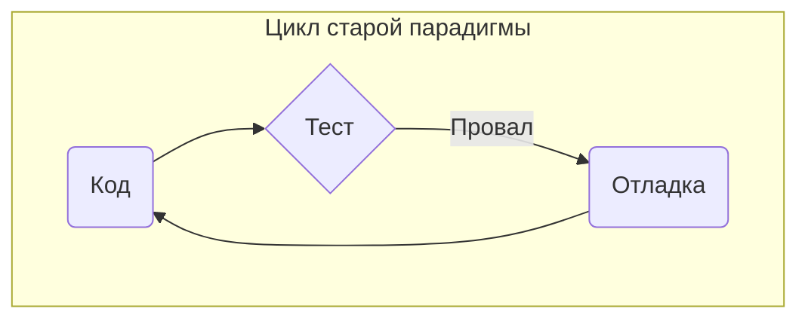
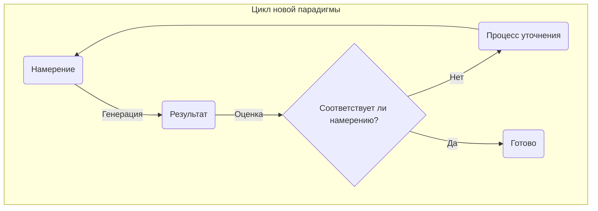
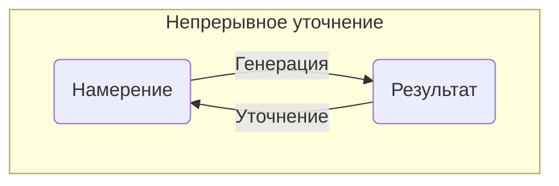
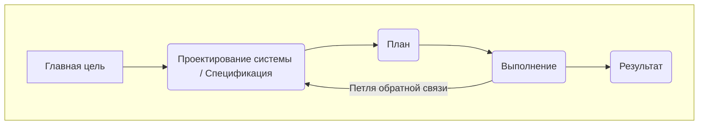
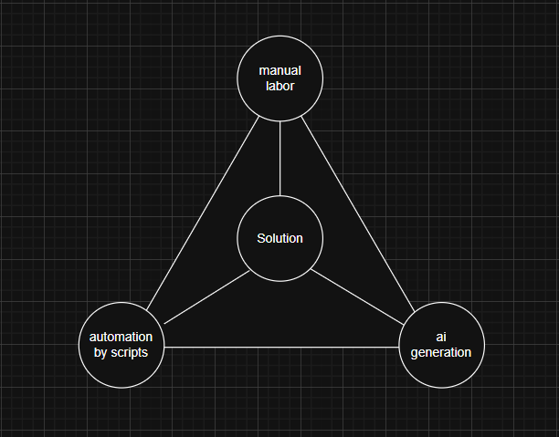

# Ключевая парадигма: от инкрементального процесса к генеративному результату

## Старая парадигма: святость процесса

Традиционная разработка программного обеспечения, даже в самых гибких ее проявлениях, в своей основе сводится к управлению **процессом**. Это дисциплина, рожденная из ограничений ручного кодирования, выполняемого человеком.

- **Основная проблема:** Как координировать сложный, подверженный ошибкам и трудоемкий труд множества людей, пишущих код для создания большой системы?
- **Решение:** Мы создаем процесс. Мы разбиваем работу на небольшие, управляемые единицы (истории, задачи). Мы организуем эти единицы во времени (спринты, бэклоги). Мы инкрементально создаем, тестируем и интегрируем.
- **Первичный артефакт:** Исходный код.
- **Фокус:** **Путь** к результату. Мы тратим энергию на управление этим путешествием.

Эта модель предназначена для того, чтобы сделать неэффективный процесс управляемым. Это оптимизация унаследованного ограничения.

Она заставляет специалиста находиться в тесном, трудоемком цикле ручного создания и исправления.

## Новая парадигма: авторитет результата

> "В эпоху, когда ИИ трансформирует разработку программного обеспечения, самый ценный навык — это не написание кода, а точная передача намерения."  
> — Шон Гроув, OpenAI

Агентная модель, определяемая Жизненным циклом генеративной разработки на основе намерений (IDGL), предлагает **полное изменение подхода**. Процесс больше не находится в центре внимания. Генеративная мощь ИИ делает акт "кодирования" **очень быстрым и простым в исполнении**.

- **Основная проблема:** Как определить идеальный, желаемый результат с такой точностью и ясностью, чтобы машина могла сгенерировать его целиком?
- **Решение:** Мы создаем **Спецификацию**. Мы вкладываем основные усилия в **мыслительный процесс, необходимый для определения** цели, обоснования и проверяемых критериев успеха.
- **Первичный артефакт:** **Спецификация** (`Spec`).
- **Фокус:** **Пункт назначения**. Мы тратим энергию на совершенствование чертежа самого результата.

В этой парадигме итерации происходят не над кодом, а над **намерением**. Цикл обратной связи — это не `код -> тест -> отладка`, а `спецификация -> генерация -> оценка -> уточнение-спецификации`.

Фокус специалиста смещается на **более эффективный цикл** уточнения самой спецификации. Этот цикл состоит из четырех различных компонентов:

1.  **Намерение (`Spec`):** Это авторитетное, версионируемое определение желаемого результата. Это формальная спецификация, созданная человеком, которая описывает, что нужно создать, почему это необходимо и как проверить корректность.
2.  **Генерация (`AI`):** ИИ лучше всего понимать не как чистого создателя, а как продвинутую **генеративную поисковую систему**. Он анализирует `Spec` и ищет в обширном, латентном пространстве решений (полученном из его обучающих данных) решения, соответствующие ограничениям. Искусство специалиста заключается в том, чтобы направить этот поиск от просто "популярных" ответов к **наиболее подходящему** для конкретного контекста. "Искусство получения результата" — это, следовательно, процесс игрового уточнения методом проб и ошибок, где каждая генерация помогает специалисту лучше понять детали того, что ему нужно, позволяя ему предоставлять лучшие ограничения для следующего "поиска".
3.  **Оценка (`Validation`):** Это существенный акт человеческого суждения, который служит барьером качества системы. Критерии, определенные в `Spec`, используются для проверки сгенерированного ИИ Артефакта.
4.  **Результат (`Digital Product`):** Это осязаемый, **проверенный результат** цикла. Это Артефакт, успешно прошедший стадию Валидации.

### Замечание о "Генерации": выбор исполнителя

Крайне важно понимать, что шаг "Генерация" в этом цикле представляет собой **реализацию `Spec` в осязаемый `Результат`**. Это не означает строго автоматическое действие ИИ без участия человека.

Агентом, выполняющим генерацию, может быть:
*   **Агент ИИ:** Наиболее распространенный случай, когда ИИ пишет код на основе `Spec`.
*   **Детерминированный скрипт:** для предсказуемых задач "генератором" может быть шаблонизатор или скрипт для создания каркаса.
*   **Человек-специалист:** это жизненно важный и дисциплинированный выбор. Специалист может выбрать выполнение `Spec` вручную, используя уточненный ИИ план как превосходный чертеж для собственного кодирования. Этот подход максимизирует обучение, чувство сопричастности и глубокое понимание конечной работы специалистом, предотвращая опасный исход, когда "ИИ владеет работой".

Этот выбор исполнителя является стратегическим решением, принимаемым `IDGL-практиком`, и составляет основную часть гибкости и мощи методологии.

### Искусство уточнения

**Процесс уточнения** — это творческое сердце IDGL. Это не простой акт исправления, а основной двигатель открытий и улучшений. Используя ИИ для создания быстрого первого черновика, специалист преодолевает первоначальную боязнь "чистого листа" и немедленно получает осязаемый артефакт для работы. Это позволяет более естественному и интуитивному человеческому навыку критики и улучшения продвигать процесс разработки вперед.

Поскольку генерация быстра и дешева, это уточнение не является однократной, линейной коррекцией. Это богатое, творческое пространство, где специалист может использовать сложные стратегии для улучшения `Намерения`. Эти стратегии включают:

*   **Многовариантная генерация:** Специалист может поручить ИИ сгенерировать несколько версий артефакта на основе одного и того же `Намерения`. Затем он может использовать ИИ как партнера по мышлению для сравнения компромиссов каждой версии, выбирая лучший подход для включения обратно в `Spec`.

*   **Декомпозиция с помощью ИИ:** для сложного `Намерения` специалист может использовать аналитические возможности ИИ для его разбиения на ряд более мелких, более управляемых под-намерений. ИИ помогает создать план, который специалист затем проверяет и выполняет.

*   **Предварительное вычисление промежуточных результатов:** вместо того чтобы генерировать весь артефакт сразу, специалист может заранее сгенерировать "полуфабрикаты" или многократно используемые детали. Это позволяет быстрее экспериментировать и компоновать конечное `Решение` из палитры предварительно сгенерированных, проверенных компонентов.

Задача больше не в управлении трудом по созданию, а в овладении дисциплиной мышления, необходимой для создания исполняемой спецификации. Мы переходим от роли сборщиков к роли архитекторов.

### Сравнение парадигм

Чтобы прояснить уникальную идентичность системы IDGL, полезно сравнить ее с традиционным подходом.

| Аспект | Традиционный подход | Подход IDGL |
|--------|---------------------|---------------|
| **Организация** | Задачи и спринты | Намерения, ориентированные на результат |
| **Планирование** | Детальное предварительное планирование | Адаптивное планирование на основе намерений |
| **Роль ИИ** | Инструмент для конкретных задач | Стратегический партнер в генерации |
| **Роль человека**| Исполнитель задач | Стратегический руководитель и валидатор |
| **Вывод** | Завершенные задачи | Рабочие, демонстрируемые результаты |
| **Адаптация** | Процесс управления изменениями | Непрерывное уточнение намерений |

## Практические реалии этого сдвига

Это не теоретическое различие; оно имеет **реальные финансовые и практические последствия**.

- **Способ итерации полностью меняется:** В старой парадигме стоимость итерации высока. Она включает часы или дни ручного кодирования. В новой парадигме стоимость генерации артефакта близка к нулю. Разработчик может "перекомпилировать" все приложение из измененной Спецификации за минуты.

- **Основная стоимость меняется:** Основной стоимостью больше не являются человеко-часы, необходимые для *написания кода*. Основная стоимость — это **экспертное мышление**, необходимое для *создания высококачественной Спецификации*. "Бутылочное горлышко" смещается от **выполнения работы к определению работы**.

- **Работа становится более стратегической:** Фокус работы смещается с низкоуровневых деталей реализации на высокоуровневое проектирование системы, моделирование домена и точную формулировку намерения. Мы не просто становимся быстрее в старой работе; мы выполняем принципиально иную, **более значимую работу**.

## Стратегический цикл разработки

Хотя описанные выше циклы описывают основную работу специалиста над одной задачей, IDGL масштабируется на целые системы через стратегический макро-цикл. Этот цикл организует множество генеративных задач для создания полного приложения.

Этот стратегический цикл напрямую соотносится с формальным процессом IDGL:

1.  **Главная цель:** Исходная высокоуровневая бизнес-цель.
2.  **Проектирование системы / Спецификация:** Критически важная работа по созданию полной `Спецификации` (например, директория `01-concept/`). Это основной акт архитектуры системы.
3.  **План:** Создание исполняемого плана для ИИ (например, директория `02-implementation/` и ее конфигурационные файлы).
4.  **Выполнение:** Специалист запускает план, направляя ИИ через серию `Генеративных задач` для создания кода.
5.  **Результат:** Конечный, проверенный программный продукт.

Самая важная особенность — это **Петля обратной связи**. Если во время выполнения обнаруживается недостаток, специалист не исправляет код. Он возвращается к **Проектированию системы**, исправляет `Спецификацию`, обновляет `План` и выполняет его заново. Это гарантирует, что `Спецификация` всегда является единственным источником истины.

## Пространство решений

В новой парадигме конечное `Решение` создается не одним методом, а возникает из **Пространства решений**, определяемого взаимодействием трех взаимосвязанных модальностей. Искусство специалиста заключается в понимании того, как комбинировать и организовывать эти силы.

1.  **Ручной труд (Человеческий интеллект):** Это стратегическая работа по созданию `Спецификации` и проверке `Решения`. Это основная направляющая сила, которая задает направление другим модальностям.

2.  **Автоматизация с помощью скриптов (Детерминированная генерация):** Эта модальность создает предсказуемую, структурную основу. Она использует такие инструменты, как команды CLI и шаблонизаторы, для создания каркаса, который другие модальности будут наполнять. Часто она основывается на первоначальной ручной настройке.

3.  **Генерация ИИ (Недетерминированная генерация):** Эта модальность обеспечивает творческую, сложную реализацию. Она берет `Спецификацию` (определенную Ручным трудом) и наполняет структуру (созданную Автоматизацией) конкретным, нюансированным кодом.

По-настоящему эффективный специалист понимает, что это не отдельные инструменты для выбора, а взаимосвязанные силы для организации. Конечное `Решение` является продуктом их синтеза.
