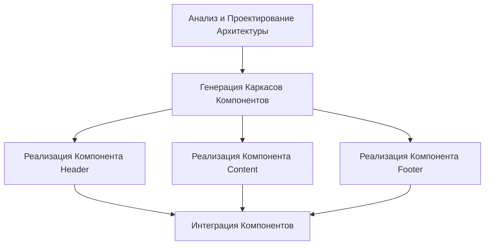
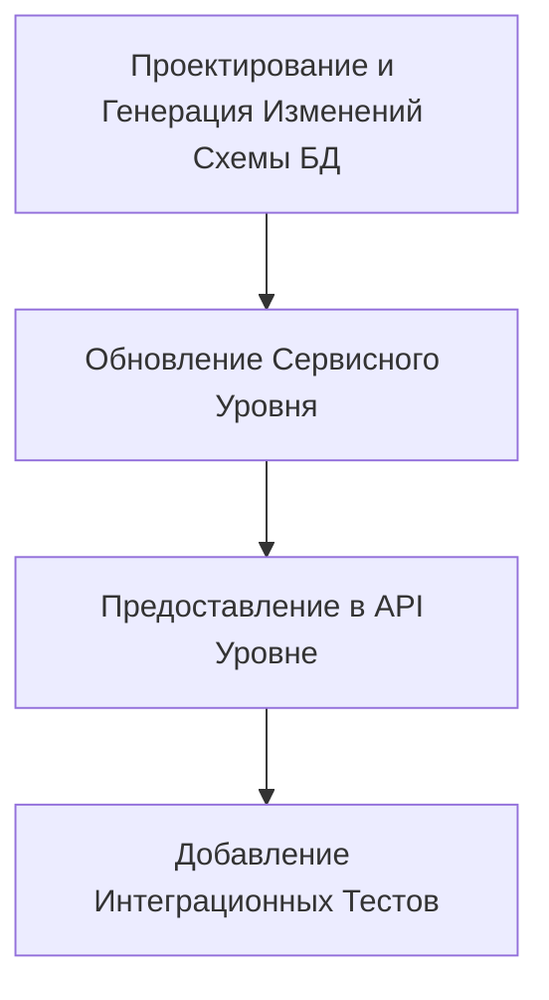

# Паттерн: Декомпозиция Задач с Помощью ИИ

#### 1. Контекст

Вы работаете в рамках Жизненного Цикла Генерации на Основе Замысла (IDGL). Стандартный и предпочтительный подход — это **Принцип Максимального Охвата**: попытка сгенерировать максимально возможную целостную единицу работы, которая все еще может быть строго и уверенно проверена экспертом-человеком.

**Ключевое понимание:** Декомпозиция — это исключение, а не правило. Она представляет собой осознанный компромисс: принятие увеличения накладных расходов на координацию в обмен на управляемые границы валидации и снижение риска при генерации.

#### 2. Проблема

Высокоуровневая цель не может быть достигнута в рамках одной генеративной задачи (нарушая Принцип Максимального Охвата), когда выполняется одно или несколько из следующих условий:

- **Предел возможностей:** Задача превышает контекстное окно или способность ИИ к рассуждению.
- **Предел валидации:** Сгенерированный результат слишком велик или сложен для надежной проверки человеком (обычно >500 строк или >30 минут времени на проверку).
- **Разделение труда:** Работа требует различной доменной экспертизы для валидации (например, специалист по базам данных против UI-дизайнера).
- **Разделение доменов:** Контекст промпта должен быть строго разделен для несвязанных доменов, которые имеют разные технологические стеки, стратегии тестирования или этапы проверки.
- **Изоляция рисков:** Критически важный компонент должен быть сгенерирован и проверен независимо до начала зависимых работ.
- **Соответствие нормативам:** Различные части системы имеют разные требования к соответствию, которые должны проверяться отдельно.

В этих случаях необходим структурированный метод для разделения работы без введения ненужных накладных расходов на планирование или потери преимуществ генерации с помощью ИИ.

#### 3. Решение: Рабочий Процесс с Участием ИИ

Используйте **Декомпозицию Задач**: преднамеренное и минимальное разделение одного высокоуровневого замысла на небольшое количество существенных, независимо проверяемых генеративных задач. Это совместный процесс, в котором практик направляет ИИ-агента для создания плана.

##### Шаг 1: Высокоуровневый Промпт
Практик инициирует процесс с промптом к ИИ, прося его выступить в роли архитектора и предложить план декомпозиции на основе высокоуровневого замысла.

> **Пример промпта:** "Моя цель — 'Рефакторинг монолитного UI-компонента на более мелкие, тестируемые подкомпоненты'. Компонент составляет ~800 строк. Ваша задача — выступить в роли старшего архитектора программного обеспечения. Предложите подробный план декомпозиции. Для каждой подзадачи определите ее входы, выходы, контракты и критерии валидации. Используйте смешение последовательных и параллельных шагов, где это уместно. Представьте план в виде диаграммы Mermaid и подробного списка спецификаций задач."

##### Шаг 2: План, Сгенерированный ИИ
ИИ анализирует запрос и генерирует кандидатский план декомпозиции, включая диаграмму, список задач, контракты и шаги валидации.

##### Шаг 3: Валидация и Уточнение Человеком
Критическая роль практика заключается в проверке и валидации предложенного ИИ плана. Затем он может утвердить план или предоставить обратную связь для уточнения.

> **Пример промпта для уточнения:** "Общая структура хороша, но контракты между новыми подкомпонентами определены недостаточно четко. Пожалуйста, обновите задачу 'Анализ и Проектирование Архитектуры', чтобы на выходе получалась формальная спецификация в формате JSON или YAML, определяющая точные пропсы и интерфейсы для каждого нового компонента. Все последующие задачи должны использовать эту спецификацию в качестве своего основного входного контракта."

Этот цикл продолжается до тех пор, пока практик не будет удовлетворен планом, сгенерированным ИИ.

##### IV. Стратегическое Соображение: Выбор Исполнителя

После того как удовлетворительный план был сгенерирован и утвержден, перед практиком встает критический стратегический выбор: **кто выполняет подзадачи?** В соответствии с основной философией IDGL "Практик, а не Процесс", ответ не всегда — ИИ.

1.  **ИИ как Исполнитель:** Это стандартный путь для четко определенных, рутинных задач, где скорость является основным соображением. Практик передает `Спецификацию` для каждой подзадачи ИИ для генерации.

2.  **Человек как Исполнитель:** Это дисциплинированный и часто превосходящий выбор для задач, где долгосрочное владение, глубокое обучение и нюансированная реализация важнее, чем чистая скорость. Практик использует сгенерированный ИИ план как первоклассный проект для руководства своей собственной ручной работой.

Этот второй подход является наиболее эффективной защитой от "присвоения работы ИИ". Он гарантирует, что практик создает и сохраняет глубокое, интуитивное понимание кодовой базы, используя ИИ как мощного партнера на этапе стратегического планирования, а не как замену на этапе исполнения. Выбор исполнителя — это осознанный акт инженерного суждения.

##### Основные Требования

Каждая декомпозированная подзадача должна иметь:
- **Собственную полную спецификацию**, которую можно понять и выполнить в изоляции
- **Стабильную границу**, соответствующую естественному шву контракта (например, спецификация API, объекты передачи данных, определение схемы или интерфейс компонента)
- **Явные входы и выходы** (артефакты/контракты), без обмена сырым исходным кодом через границы доменов
- **Краткие критерии приемки** и специальный план тестирования
- **Независимую проверяемость** — корректность задачи можно проверить без ссылки на другие задачи

##### Режимы Выполнения

Выполнение ограничено двумя простыми режимами:

1. **Последовательная Цепочка:** Для задач с прямыми зависимостями
   - Паттерн: `T1 → T2 → T3`
   - Использовать, когда: Поздние задачи требуют проверенного вывода ранних задач
   - Поток контрактов: Каждая задача производит артефакт, который становится входным контрактом для следующей
   
2. **Параллельное Разветвление/Слияние:** Для независимой работы, которую можно выполнять одновременно
   - Паттерн: `T0 → (T1 | T2 | T3) → T4`
   - Использовать, когда: Несколько задач могут выполняться независимо и интегрироваться через стабильный интерфейс
   - Требование к контракту: Предварительно определенный интерфейс интеграции, которому соответствуют все параллельные задачи

Этот подход поддерживает легкость координации и избегает сложного, "дорожно-карточного" планирования для того, что должно быть простым структурным разделением.

#### 4. План Декомпозиции, Сгенерированный ИИ

Этот раздел содержит подробные артефакты, которые являются результатом рабочего процесса с участием ИИ.

##### Схема Определения Задачи

Каждая задача в декомпозиции должна быть определена с помощью:

```yaml
task:
  id: unique-identifier
  objective: what-and-why
  inputs:
    - artifact: previous-task-output
    - contract: interface-specification
  outputs:
    - artifact: generated-code-or-config
    - contract: interface-for-next-task
  acceptance_criteria:
    - functional: does-it-work
    - quality: is-it-maintainable
    - tests: are-tests-comprehensive
  estimated_validation_time: 15-30-minutes
```

##### Матрица Решений по Декомпозиции

| Условие | Одна Задача | Декомпозиция |
|-----------|------------|-----------|
| Вывод < 500 строк | ✓ | |
| Требуется одна доменная экспертиза | ✓ | |
| Валидация < 30 мин | ✓ | |
| Единый технологический стек | ✓ | |
| Вывод > 1000 строк | | ✓ |
| Требуется несколько экспертиз | | ✓ |
| Валидация > 1 часа | | ✓ |
| Пересечение границ доменов | | ✓ |

##### Представление

План декомпозиции может быть представлен как:
- Простой нумерованный список с указанием зависимостей
- Базовая блок-схема (как показано в примерах)
- Таблица со столбцами: Задача | Входы | Выходы | Зависимости

Не требуется канонического манифеста или сложных инструментов.

#### 5. Примеры Планов Декомпозиции, Сгенерированных ИИ

##### Пример 1: Многоэтапный Рефакторинг UI-компонента

**Высокоуровневый Замысел:** "Рефакторинг монолитного UI-компонента на более мелкие, тестируемые подкомпоненты"

**Почему Декомпозиция:** Монолитный компонент составляет 800+ строк, требует архитектурных решений и параллельной реализации независимых подкомпонентов.

**План, Сгенерированный ИИ (Диаграмма):**



**План, Сгенерированный ИИ (Спецификации Задач):**

1. **Анализ и Проектирование Архитектуры**
   - Вход: Исходный код монолитного компонента
   - Выход: Спецификация архитектуры (JSON/YAML), определяющая границы компонентов, свойства и отношения
   - Контракт: Определения интерфейсов компонентов
   - Валидация: Проверка на логическое разделение и полноту интерфейсов

2. **Генерация Каркасов Компонентов**
   - Вход: Спецификация архитектуры
   - Выход: Заглушки файлов с интерфейсами, типами и временными реализациями
   - Контракт: Определения типов и интерфейсы свойств
   - Валидация: Проверка соответствия всех интерфейсов спецификации

3. **Реализация Компонентов (Параллельно)**
   - Вход: Заглушки компонентов + соответствующий код из монолита
   - Выход: Полные реализации компонентов с тестами
   - Контракт: Предопределенные интерфейсы компонентов
   - Валидация: Каждый компонент работает в изоляции с mock-данными

4. **Интеграция Компонентов**
   - Вход: Все реализованные компоненты
   - Выход: Рефакторинговый контейнерный компонент, использующий подкомпоненты
   - Валидация: Полная система работает идентично оригиналу

##### Пример 2: Добавление Функциональности на Нескольких Уровнях

**Высокоуровневый Замысел:** "Добавить функциональность тегирования на уровнях базы данных, сервисов и API"

**Почему Декомпозиция:** Изменения затрагивают несколько архитектурных уровней с разными требованиями к валидации и экспертизе.

**План, Сгенерированный ИИ (Последовательный):**



**План, Сгенерированный ИИ (Спецификации Задач):**

1. **Проектирование и Генерация Изменений Схемы БД**
   - Вход: Текущая схема + требования к тегированию
   - Выход: Миграционные скрипты + обновленная схема
   - Контракт: Определение схемы (таблицы, отношения, ограничения)
   - Валидация: Проверка DBA на производительность и корректность

2. **Обновление Сервисного Уровня**
   - Вход: Новое определение схемы
   - Выход: Объекты доступа к данным, сервисные методы
   - Контракт: Сервисный интерфейс (сигнатуры методов, DTO)
   - Валидация: Прохождение юнит-тестов, корректность бизнес-логики

3. **Предоставление в API Уровне**
   - Вход: Сервисный интерфейс
   - Выход: Конечные точки API, модели запросов/ответов
   - Контракт: Спецификация OpenAPI
   - Валидация: Прохождение API-тестов, полнота документации

4. **Добавление Интеграционных Тестов**
   - Вход: Спецификация API
   - Выход: Набор сквозных тестов
   - Валидация: Покрытие всех сценариев, прохождение тестов

#### 6. Продвинутые Паттерны с Участием ИИ

##### Паттерн: Исследовательская Декомпозиция

Когда полный охват неясен, используйте исследовательскую первую задачу:

```
T0[Исследование и Анализ] → T1[Проектирование Решения] → (T2 | T3 | T4)[Реализация]
```

##### Паттерн: Прогрессивная Валидация

Для высокорисковых изменений добавьте этапы валидации:

```
T1[Генерация Ядра] → V1[Валидация] → T2[Генерация Расширений] → V2[Валидация] → T3[Интеграция]
```

##### Паттерн: Декомпозиция "Контракт Прежде Всего"

Определите все интерфейсы до реализации:

```
T0[Определение Всех Контрактов] → (T1 | T2 | T3)[Реализация по Контрактам] → T4[Интеграция]
```

#### 7. Ограничения и Анти-Паттерны

##### Ограничения (Что делать)

- **Максимизировать охват задачи** в пределах валидации
- **Явно определять контракты** до начала параллельной работы
- **Поддерживать неглубокую декомпозицию** (максимум 1-2 уровня)
- **Группировать связанные изменения** в одну задачу, когда это возможно
- **Четко документировать точки интеграции** в спецификациях задач
- **Оценивать время валидации** для каждой задачи (цель: 15-45 минут)

##### Анти-Паттерны (Чего не делать)

- **Микро-декомпозиция:** Разделение на задачи < 100 строк или < 15 мин валидации
- **Неявные контракты:** Предположение, что компоненты "просто заработают вместе"
- **Глубокая вложенность:** Создание деревьев декомпозиции > 2 уровней
- **Преждевременная декомпозиция:** Разделение до подтверждения, что подход с одной задачей не сработает
- **Перекрестное загрязнение:** Обмен деталями реализации вместо контрактов между задачами
- **Избыточное планирование:** Создание подробных планов проекта вместо простых списков задач

#### 8. Контрольный Список для Принятия Решений

Перед декомпозицией задайте вопросы:

1. **Можно ли это проверить как одну задачу менее чем за 60 минут?**
   - Если да → Не декомпозировать
   
2. **Пересекает ли это несколько доменных границ с разными потребностями в валидации?**
   - Если да → Декомпозировать по границам доменов
   
3. **Можно ли легко восстановиться после неудачной генерации?**
   - Если нет → Декомпозировать для изоляции риска
   
4. **Существуют ли естественные точки контрактов в архитектуре?**
   - Если да → Декомпозировать по этим границам
   
5. **Значительно ли сократит параллельное выполнение время до завершения?**
   - Если да → Рассмотреть параллельную декомпозицию

#### 9. Метрики Успеха

Хорошо выполненная декомпозиция демонстрирует:

- **Эффективность валидации:** Каждая задача проверяется за 15-45 минут
- **Стабильность контрактов:** Интерфейсы остаются неизменными во время реализации
- **Независимость:** Задачи можно переупорядочивать (в пределах зависимостей) без нарушений
- **Полнота:** Интеграция не требует дополнительного "клеящего кода"
- **Прослеживаемость:** Четкий путь от первоначального замысла до конечного интегрированного решения

#### 10. Связь с Другими Паттернами IDGL

- **Паттерн Компиляции Спецификации:** Каждая декомпозированная задача нуждается в своей скомпилированной спецификации
- **Паттерн Записи о Генерации:** Каждая задача производит свою запись о генерации для аудита
- **Паттерн Фазы Разработки:** Большие декомпозиции могут составлять полную фазу разработки
- **Паттерн Адаптации Легаси-кода:** Декомпозиция полезна для инкрементальной трансформации легаси-систем
