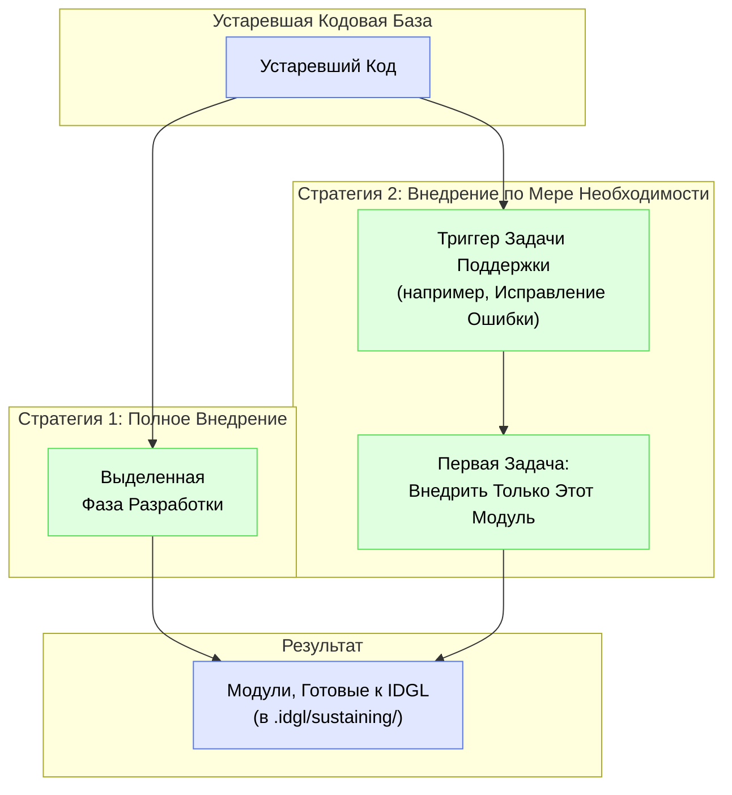

# Внедрение Устаревших Артефактов

## Обоснование

Основной принцип IDGL заключается в том, что вся разработка руководствуется явной, версионируемой **Спецификацией** (`intent.md`). В унаследованных проектах, по определению, эти артефакты отсутствуют. **Внедрение Устаревших Артефактов** — это процесс генерации этих основополагающих спецификаций для уже существующего кода, что делает его полностью совместимым с **Жизненным Циклом Поддержки** IDGL.

Это не универсальный процесс. В зависимости от потребностей проекта и ресурсов, практик может выбрать одну из двух основных стратегий: комплексное «Полное Внедрение» или более гибкий подход «Внедрение по Мере Необходимости».

## Стратегия 1: Полное Внедрение (как Фаза Разработки)

Это комплексное усилие на уровне проекта по внедрению всего унаследованного приложения за один раз.

*   **Когда использовать:** Когда есть стратегическое обязательство по модернизации всей унаследованной системы, и у вас есть выделенные ресурсы для масштабной работы по документированию и структурированию.
*   **Процесс:** Внедрение рассматривается как формальная **Фаза Разработки**.
    1.  **Главная Цель:** "Внедрить унаследованный проект 'Монолит' в фреймворк IDGL."
    2.  **Проектирование Системы:** Задача с участием ИИ, где практик дает ИИ промпт проанализировать монолит и создать спецификацию, определяющую его основные архитектурные модули.
    3.  **Комплексный План:** Задача с участием ИИ по созданию плана для выполнения задачи внедрения для каждого определенного модуля.
    4.  **Выполнение (для каждого модуля):**
        *   ИИ-агенту дается инструкция провести реверс-инжиниринг `Черновой Спецификации` из унаследованного кода.
        *   **Практик проверяет и редактирует `Черновую Спецификацию`**, исправляя любую логику, чтобы отразить *желаемое* поведение, а не просто существующее ошибочное поведение. Этот шаг под руководством человека создает каноническую `Спецификацию v1.0`.
*   **Результат:** Каталог `.idgl/sustaining/` полностью заполняется базовыми структурами для всех модулей унаследованного приложения, делая весь проект готовым к будущей работе по поддержке.

## Стратегия 2: Внедрение по Мере Необходимости (как Деятельность по Поддержке)

Это непрерывный, гибкий подход, при котором части унаследованной системы внедряются по мере необходимости.

*   **Когда использовать:** Это наиболее распространенный и практичный подход. Он интегрирует работу по созданию спецификаций в естественный поток ежедневного обслуживания и разработки.
*   **Процесс:**
    1.  Практик получает задачу исправить ошибку в унаследованном модуле (например, в системе аутентификации).
    2.  Он переходит в `.idgl/sustaining/` и видит, что папка `authentication/` еще не существует.
    3.  **Задача Внедрения:**
        *   **Шаг A (Черновик, Сгенерированный ИИ):** Первой генеративной задачей практика является промпт ИИ: *"Ваша задача — выступить в роли реверс-инженера. Проанализируйте приложенный унаследованный код аутентификации и сгенерируйте для него полную **Черновую Спецификацию**."*
        *   **Шаг B (Исправление под Руководством Человека):** Практик тщательно проверяет `Черновую Спецификацию`. Он редактирует ее, чтобы исправить любую логику, добавить недостающие крайние случаи и убедиться, что она представляет *правильное, желаемое поведение* модуля. Это создает каноническую `Спецификацию v1.0`.
    4.  **Задача по Исправлению Ошибки:** Как только исправленная `Спецификация v1.0` установлена, практик может создать свою **вторую генеративную задачу** для фактического исправления ошибки: `sustaining/authentication/fix-login-bug/`.
*   **Преимущество:** Это создает положительный цикл. Покрытие системы спецификациями органично увеличивается по мере того, как разработчики затрагивают разные части кода. Это позволяет избежать большого, предварительного проекта по внедрению и делает создание документации естественной частью процесса обслуживания.
