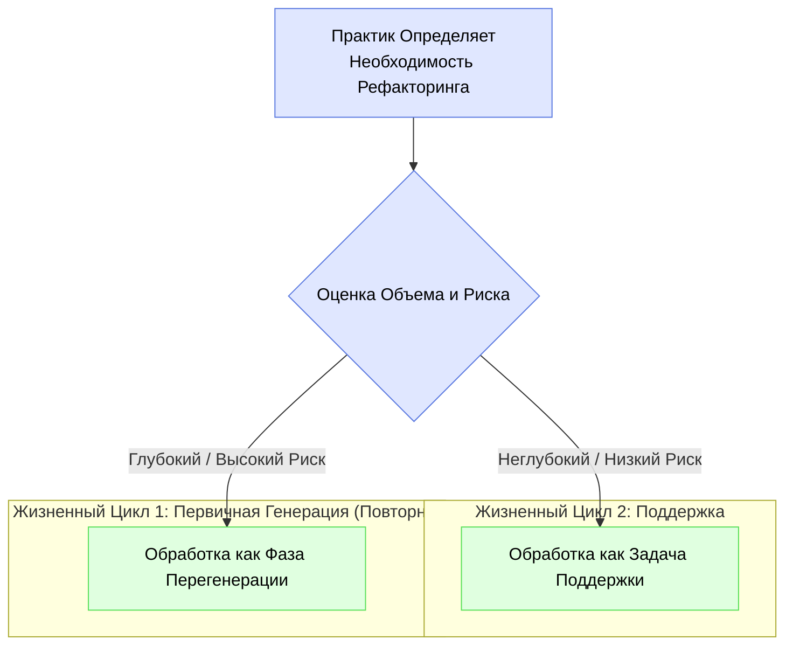

# Рефакторинг с IDGL: Стратегический, Управляемый Спецификацией Подход

## Партнерство Человека и ИИ в Рефакторинге

В рамках IDGL рефакторинг — это стратегическая, возглавляемая человеком деятельность, а не слепой, автоматизированный процесс. ИИ служит мощным и эффективным инструментом для выполнения изменений, но Практик IDGL является архитектором, который направляет процесс. В этом партнерстве существует четкое разделение труда:

*   **Практик IDGL (Стратег):** Определяет необходимость рефакторинга, определяет точную цель в высококачественной **Спецификации** (`intent.md`) и выступает в качестве конечного валидатора результата.
*   **ИИ (Инструмент):** Анализирует кодовую базу на предмет потенциальных улучшений и выполняет утомительные, крупномасштабные изменения, определенные в спецификации практика, с высокой скоростью и точностью.

## Два Масштаба Рефакторинга

IDGL предоставляет два различных, формальных процесса для проведения рефакторинга, в зависимости от объема и риска изменений. Практик должен стратегически решить, какой процесс подходит для данной задачи.



### 1. Неглубокий Рефакторинг (как Задача Поддержки)

Этот процесс используется для локализованных, низкорисковых изменений, которые улучшают состояние конкретного компонента, не изменяя архитектуру системы.

*   **Примеры:** Переименование переменной для ясности, извлечение сложной функции, преобразование одного модуля к новому паттерну (например, `async/await`).
*   **Процесс:** Неглубокий рефакторинг рассматривается как специальная **Генеративная Задача** в рамках **Жизненного Цикла Поддержки**. Практик составляет четкую `intent.md`, в которой указывается желаемое изменение, которое затем выполняет ИИ.
    *   **Пример Замысла:** *"В приложенном файле `auth.service.ts` функция `checkUser` слишком длинная. Извлеките логику валидации пароля в отдельный приватный метод с именем `_validatePassword` и обновите исходную функцию, чтобы она его вызывала. Новый метод должен иметь тот же уровень обработки ошибок, что и исходная логика."*
*   **Структура Каталогов:** В каталоге `sustaining/` соответствующей функциональности создается новая папка задачи.
    ```
    .idgl/sustaining/authentication/refactor-login-function-for-clarity/
    ```

### 2. Глубокий Рефакторинг (как Фаза Перегенерации)

Этот процесс предназначен для крупномасштабных, высокорисковых, архитектурных изменений, которые коренным образом изменяют часть системы.

*   **Примеры:** Миграция бэкенд-фреймворка, разделение монолита на микросервисы, изменение основной парадигмы базы данных.
*   **Процесс:** Глубокий рефакторинг **должен быть повышен до формальной Фазы Перегенерации**. Это полная **Фаза Разработки**, в которой ключевые архитектурные задачи выполняются с помощью ИИ.
    *   **Ключевой Шаг с Участием ИИ:** Задача `01_system_design` для этой фазы является критически важной. Практик дает ИИ промпт выступить в роли старшего архитектора, предоставляя всю историю обслуживания из папки `sustaining/` в качестве контекста. Задача ИИ — предложить новую, чистую архитектуру, которая явно решает задокументированные проблемы старой.
    *   **Валидация Человеком:** Затем практик проверяет и уточняет этот сгенерированный ИИ архитектурный план, прежде чем приступить к остальной части фазы.
*   **Структура Каталогов:** В корневом каталоге `.idgl` создается новая, пронумерованная папка `Фазы Разработки`.
    ```
    .idgl/04-refactor-backend-to-microservices-phase/
    ```

Предоставляя различные, формальные процессы для как неглубокого, так и глубокого рефакторинга, IDGL гарантирует, что каждое изменение, от простого переименования до полной архитектурной перестройки, является преднамеренной, управляемой спецификацией и отслеживаемой деятельностью, обеспечивая долгосрочное здоровье и поддерживаемость проекта.
