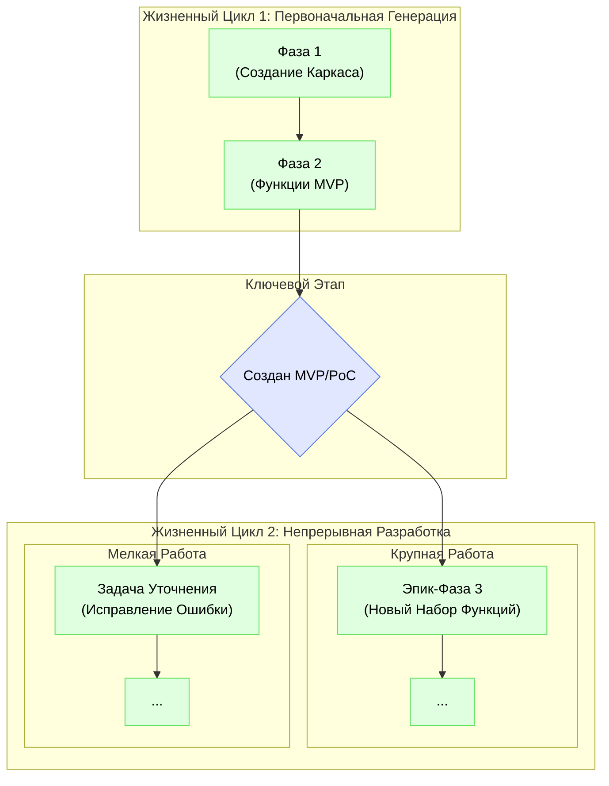
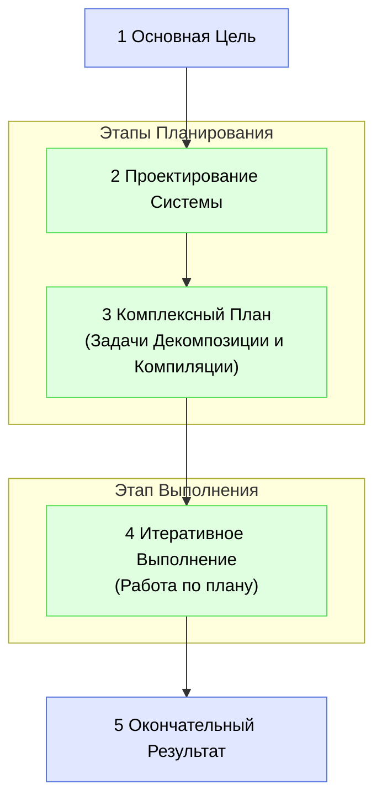
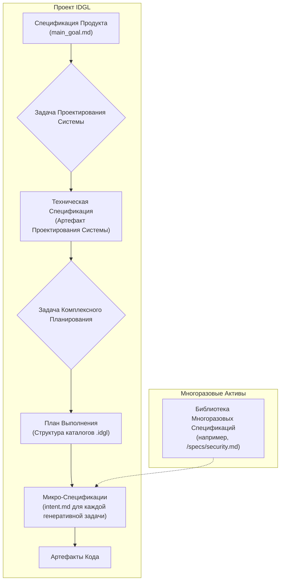
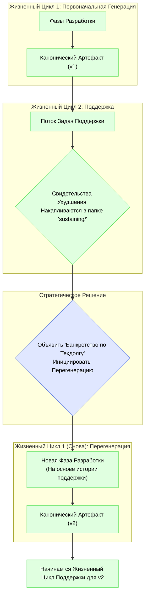

# Два Жизненных Цикла Проекта IDGL

## Обоснование: От Первоначального Создания до Непрерывной Эволюции

Жизненный цикл проекта делится на два основных этапа: **Первоначальная Генерация** для создания первой версии артефакта и постоянный этап **Непрерывной Разработки** для всей последующей работы. Эта модель обеспечивает гибкость для обработки как крупных, запланированных эпиков функций, так и небольших, инкрементных изменений после первоначального выпуска.

## Жизненный Цикл 1: Первоначальная Генерация
Это специальный, одноразовый процесс создания первого канонического артефакта (например, MVP или PoC) с чистого листа.

*   **Единица Работы:** Формальная, многоэтапная **Фаза Разработки**.
*   **Процесс:** Состоит из последовательности одной или нескольких `Фаз Разработки`, необходимых для достижения первой стабильной, готовой к выпуску версии продукта.

### Пять Шагов Фазы Разработки
Каждая Фаза Разработки следует последовательному пятиэтапному процессу, переходя от высокоуровневой цели к конкретному, проверенному результату.

1.  **Определение Основной Цели:** Сфокусированная цель фазы. Она определяет "почему" и является источником для `intent.md` верхнего уровня.
2.  **Проектирование Системы:** Генеративная задача для создания архитектурного проекта. Она определяет "что" и "как".
3.  **Комплексное Планирование:** Центральный этап оркестрации. Он использует `Проектирование Системы` для создания полного графа зависимостей всей работы.
4.  **Итеративное Выполнение:** "Рабочий" этап, на котором практик выполняет задачи, изложенные в плане.
5.  **Окончательный Результат:** Осязаемый, проверенный результат фазы, который служит основой для следующей фазы.

### Иерархия Спецификаций в Фазе Разработки
Спецификации в рамках фазы следуют четкой иерархии.

## Жизненный Цикл 2: Непрерывная Разработка
Этот жизненный цикл начинается после создания первоначального артефакта и охватывает всю последующую эволюцию продукта. Он имеет два режима работы в зависимости от масштаба работы.

*   **Режим A: Крупные Эпики (Создание "остальной части" продукта)**
    *   **Единица Работы:** Формальная **Фаза Разработки**.
    *   **Процесс:** При добавлении значительного нового набора функций инициируется новая `Фаза Разработки`. Она следует полному 5-этапному процессу, но использует существующую кодовую базу в качестве отправной точки.
    *   **Когда использовать:** Для крупных, запланированных эпиков функций, которые требуют собственного проектирования и комплексного планирования.

*   **Режим B: Инкрементные Изменения**
    *   **Единица Работы:** Специальная **Генеративная Задача**.
    *   **Процесс:** Для небольших изменений инициируется одна генеративная задача. Это более гибкий подход, который обходит формальную структуру фаз.
    *   **Когда использовать:** Для исправления ошибок, оптимизации производительности, незначительных улучшений и другой мелкомасштабной, инкрементной работы.

Эта двухрежимная модель для непрерывной разработки обеспечивает правильный уровень структуры для любой задачи, гарантируя как гибкость для небольших изменений, так и строгость для крупных добавлений.

---

## Реализация Структуры Каталогов

Способ организации работы в файловой системе является прямым отражением этих режимов жизненного цикла. Для получения полной, подробной спецификации о том, как структурировать каталог `.idgl` как для крупных фаз, так и для задач поддержки, см. авторитетный документ о паттерне:

*   **[./07-Pattern-Directory-Structure.md](./07-Pattern-Directory-Structure.md)**

---

## Полный Жизненный Цикл: Управление Техническим Долгом с Помощью Фаз Перегенерации

Жизненный Цикл Поддержки — это не просто пассивный режим обслуживания; это активный процесс, который производит критически важный информационный актив: историю обслуживания каждой функции, логируемую в каталоге `sustaining/`. Эта история является основным инструментом для управления долгосрочным здоровьем кодовой базы.

Со временем накопление исправлений ошибок и незначительных изменений может привести к архитектурному дрейфу и техническому долгу. Когда стоимость и сложность добавления к функции становятся слишком высокими, методология предоставляет стратегический "аварийный выход": **Фазу Перегенерации**.

### Фаза Перегенерации

Фаза Перегенерации — это формальная **Фаза Разработки**, инициированная с конкретной `Основной Целью` восстановления и замены существующей, пришедшей в упадок функции.

*   **Триггер:** Стратегическое решение, основанное на свидетельствах в папке `sustaining/` (например, высокая частота ошибок, возрастающая сложность изменений, низкая производительность).
*   **Процесс:** Следует стандартному 5-этапному процессу Фазы Разработки. Критически важно, что задача `01_system_design` для этой фазы использует всю историю обслуживания из папки `sustaining/` в качестве основного входа. Это гарантирует, что проектирование "v2" явно основано на всех задокументированных проблемах и исправлениях "v1".
*   **Результат:** Новая, чистая версия артефакта функции, которая заменяет старую в кодовой базе. Старая история `sustaining/` архивируется, и для обновленной функции начинается новый, чистый лог.

Эта последняя петля обратной связи гарантирует, что IDGL — это не просто методология для создания программного обеспечения, а полный фреймворк для управления всем, долгосрочным жизненным циклом проекта, предотвращая его упадок и обеспечивая его постоянное здоровье и поддерживаемость.
