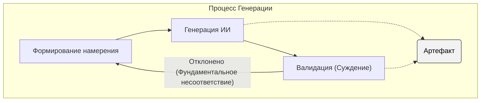
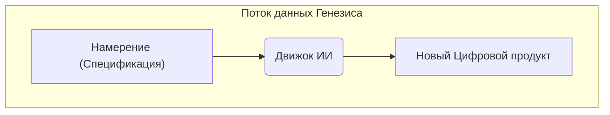
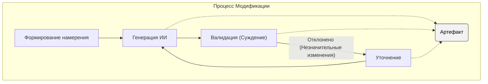
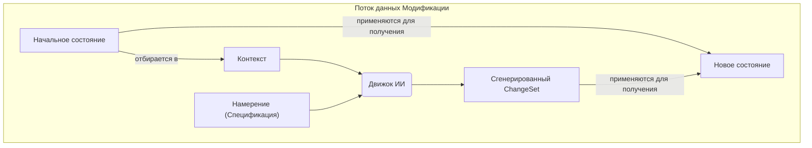
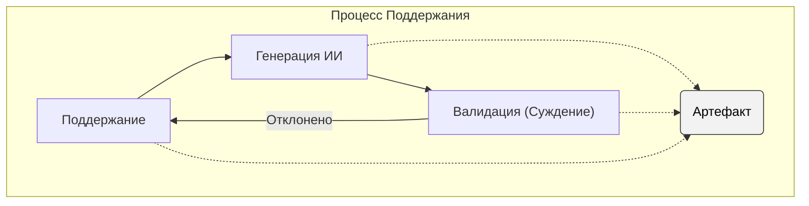

# Жизненный цикл Артефакта: Процессы IDGL

## 1. Введение: Жизненный цикл Артефакта

Этот документ определяет основные процессы Жизненного цикла генеративной разработки на основе намерений (IDGL). В то время как **[Генеративная задача](#2-анатомия-генеративной-задачи)** является фундаментальной единицей выполнения, ее поведение регулируется одним из трех различных процессов, которые определяют жизненный цикл **Артефакта**, от его первоначального создания до постоянного сопровождения.

Основная философия заключается в достижении идеальной **Генерации**, где хорошо сформированная `Спецификация` преобразуется непосредственно в корректный `Артефакт`. Процессы **Модификации** и **Поддержания** предоставляют надежные, формальные механизмы для практической реализации итеративной разработки и долгосрочного сопровождения.

## 2. Анатомия Генеративной задачи

Генеративная задача является фундаментальной единицей выполнения в IDGL. Ее рамки определяются не теоретическими возможностями ИИ, а практическими ограничениями человеческой валидации. Она обладает двумя универсальными свойствами:

*   **Ориентированность на намерение:** Ее выполнение полностью регулируется формальной **[Спецификацией](./02-anatomy-of-a-spec.md)**.
*   **Проверяемый объем:** Ее объем должен быть ограничен тем, что может быть строго валидировано экспертом-человеком.

## 3. Процесс Генерации

Этот процесс выполняется ровно один раз для каждого Цифрового продукта. Он представляет собой идеальный "счастливый путь" для первоначального создания Артефакта с чистого листа. Отклонение на этом этапе, скорее всего, будет указывать на фундаментальное несоответствие `Спецификации`.

#### Диаграмма процесса

#### Реализация потока данных: Поток Генезиса
Этап `Генерации ИИ` в этом процессе реализуется **Потоком данных Генезиса**, который создает новый Цифровой продукт из одного входа: `Спецификации`.

## 4. Процесс Модификации

Этот процесс используется для всех запланированных, итеративных изменений существующего Артефакта. Отклонение, скорее всего, будет незначительной проблемой реализации, которую можно исправить через быстрый цикл **Уточнения**.

#### Диаграмма процесса

#### Реализация потока данных: Поток Модификации
Этап `Генерации ИИ` в этом процессе реализуется **Потоком данных Модификации**, который использует отобранный **Контекст** для создания **Набора изменений (ChangeSet)**.

*   **Контекст:** Отобранное подмножество `Начального состояния`, предоставленное ИИ.
*   **Сгенерированный ChangeSet:** Вывод от ИИ, содержащий набор операций `add`, `modify` или `delete`.
*   **Применение:** Действие по применению `ChangeSet` к `Начальному состоянию` для получения `Нового состояния`.

## 5. Процесс Поддержания

Этот процесс моделирует постоянное сопровождение или эволюцию Артефакта, где изменения обусловлены непрерывным циклом генерации и валидации.

#### Диаграмма процесса

#### Реализация потока данных
Этап `Генерации ИИ` в этом процессе также реализуется **Потоком данных Модификации**.
