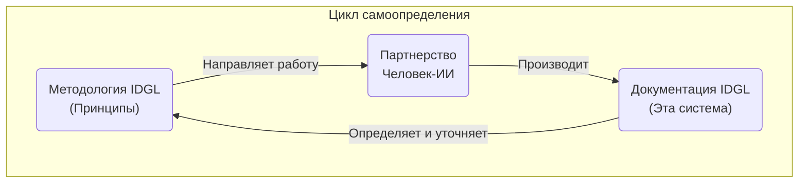
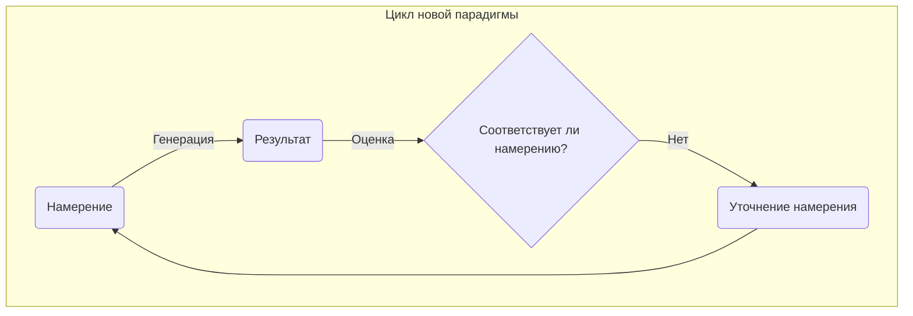
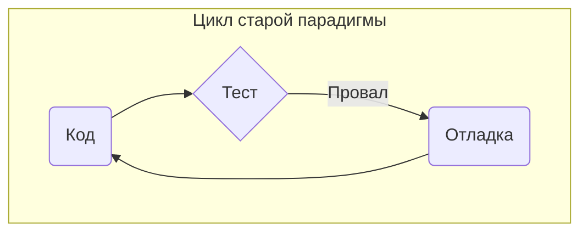
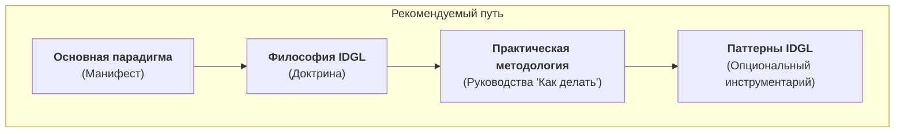
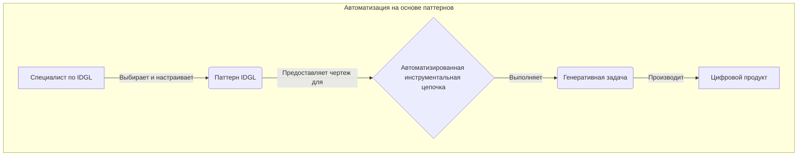

> "В эпоху, когда ИИ трансформирует разработку программного обеспечения, самый ценный навык — это не написание кода, а точная передача намерения."  
> — Шон Гроув, OpenAI

# Добро пожаловать в нативную для ИИ SDLC

Мир программного обеспечения претерпевает фундаментальную трансформацию. Старый жизненный цикл разработки программного обеспечения (SDLC) медленно, но верно "ИИ-зируется", по мере того как каждая роль и процесс эволюционируют, чтобы включить в себя искусственный интеллект. Это не временный тренд; это рождение новой, **нативной для ИИ системы разработки.**

**Жизненный цикл генеративной разработки на основе намерений (IDGL)** — это чертеж этого нового мира, основанный на первых принципах. Это легковесная, прагматичная методология, построенная на одном мощном предположении: **человеческое намерение**, зафиксированное в формальной `Спецификации`, должно быть основным, авторитетным источником истины. Наша цель больше не в том, чтобы вручную кодировать решение, а в том, чтобы создать идеальную `Спецификацию`, а затем использовать ИИ для поиска в огромном пространстве решений наилучшей возможной реализации.

Это система для инженеров, которые хотят быть **архитекторами, а не азартными игроками.** Она обеспечивает дисциплину, чтобы превратить непредсказуемую "магию" ИИ в предсказуемый инженерный процесс. Она руководствуется тремя вечными принципами: **YAGNI**, **Принятие альтернатив** и, что наиболее важно, **Специалист, а не процесс.**

Критически важно, что IDGL — это система, которая была **использована для определения самой себя.** Эта самая документация является "доказательством работы", созданным через тот же цикл `спецификация -> генерация -> оценка -> уточнение`, который она описывает. Это полная, экспертного уровня система для разработки программного обеспечения в партнерстве с искусственным интеллектом.

Добро пожаловать на автобус до поезда прогресса.

---
# Система разработки IDGL: чертеж для нативной для ИИ SDLC

## Неизбежная ИИ-зация разработки программного обеспечения

Если мы посмотрим на жизненный цикл разработки программного обеспечения (SDLC) в динамике, мы увидим четкий и ускоряющийся тренд: **"ИИ-зация"** нашей индустрии. Аспект за аспектом, роль за ролью, традиционные процессы дополняются, упрощаются, консолидируются или заменяются системами, ассистируемыми ИИ и агентными системами ИИ. Это не временный этап, а фундаментальная эволюция к новой, **нативной для ИИ системе разработки**.

**Жизненный цикл генеративной разработки на основе намерений (IDGL)** — это методологическая попытка спроектировать это будущее состояние. Это не инкрементальное улучшение старого способа ведения дел, а чертеж, основанный на первых принципах, для системы, разработанной для мира, где ИИ является полностью адаптированным, первоклассным партнером в творчестве.

Его основные принципы:
*   **Переиспользование важнее переизобретения:** Основная задача генеративного ИИ — действовать как продвинутая поисковая и синтезирующая система. Мы должны использовать его способность находить и адаптировать наиболее релевантные и популярные решения из его огромных обучающих данных, а не "изобретать велосипед" с каждым новым проектом.
*   **Система, которая определяет сама себя:** Эта документация является окончательным доказательством работы методологии, которую она описывает. Это артефакт, который был создан путем применения собственных принципов IDGL: специалист-человек и агент ИИ, вовлеченные в цикл `спецификация -> генерация -> оценка -> уточнение-спецификации`, чтобы определить ту самую систему, которую они использовали. Методология, которую можно успешно использовать для определения и построения самой себя, — это не просто теория; это целостная и доказанная реальность.

Этот сборник документов является результатом этого процесса: полная, экспертного уровня система для разработки программного обеспечения в партнерстве с искусственным интеллектом.

## Основная философия

Система IDGL — это инженерная дисциплина, построенная на одном мощном предположении: **человеческое намерение**, а не сгенерированный код, должно быть основным, авторитетным источником истины.

Для достижения этого IDGL определяет четкую модель партнерства: **человек выступает в роли стратегического директора**, обеспечивая видение и суждение, в то время как **ИИ служит мощным тактическим исполнителем**, генерируя комплексные решения на основе этого стратегического руководства. Человек определяет "что" и "почему"; ИИ занимается "как".

Эти отношения формализованы через аудируемую связь между созданной человеком `Спецификацией` (намерением) и сгенерированным ИИ `Цифровым продуктом` (реализацией). Это вводит определенную степень формального процесса, но это не следует рассматривать как накладные расходы. Подобно тому, как TypeScript добавляет слой структуры к JavaScript для обеспечения масштабируемости на уровне предприятия, процесс IDGL вносит необходимый формализм в сотрудничество с ИИ, чтобы обеспечить его предсказуемость, надежность и аудируемость. Для подробного изучения руководящих принципов и распространенных ловушек этого подхода см. **[Философию IDGL](./00-idgl-philosophy.md)**.

### Инженерия для предсказуемого совершенства

Основная проблема в работе с большими языковыми моделями (LLM) — их **недетерминированный характер**: один и тот же входной промпт может давать результаты кардинально разного качества при разных запусках. Одна попытка может дать базовый, функциональный результат, тогда как следующая может произвести сложный, архитектурно блестящий артефакт — "вспышку вдохновения".

Философия IDGL отказывается оставлять качество на волю случая. Мы не хотим просто *надеяться* на высококачественный результат. Вместо этого мы используем итеративный процесс для создания системы, которая **проектирует предсказуемое совершенство.**

Этот процесс работает следующим образом:
1.  Мы начинаем с набора инструкций ("промпта") для руководства ИИ.
2.  Иногда ИИ будет производить исключительно высококачественный результат — "удачный" исход.
3.  Вместо того чтобы просто принять эту удачу, мы анализируем, *почему* результат был превосходным.
4.  Затем мы кодируем эти критерии успеха обратно в наши основные инструкции, делая их более явными и надежными.

Этот цикл превращает "удачный" исход, который ненадежен, в **повторяемый, спроектированный результат**. Он поднимает систему разработки с уровня, который просто "достаточно хорош" (производя переменные результаты), до уровня, который **явно и надежно требует совершенства** по своей сути.

## С чего начать: сквозное руководство

Лучший способ понять IDGL — это увидеть его в действии. Прежде чем углубляться в детальную методологию, мы рекомендуем начать с нашего сквозного практического руководства.

*   **[Сквозное руководство: создание React-хука](./02-implementation/02-end-to-end-tutorial/00-tutorial-overview.md)**

Это руководство проведет вас через полную, реалистичную Генеративную задачу, от высокоуровневой идеи до полностью протестированного и валидированного программного компонента. Это самый прямой способ почувствовать новый цикл разработки и роль специалиста по IDGL.

## Основная документация

IDGL определяется набором документов, которые строятся друг на друге. Рекомендуемый путь изучения следующий:

### 1. Видение: "Что и почему"
Это манифест, который определяет новую генеративную парадигму. Это окончательная отправная точка.

*   **[Основная парадигма](./00-core.md):** Определяет сдвиг от процессно-ориентированной к результато-ориентированной разработке и вводит основные концепции IDGL.

### 2. Мышление: "Как думать"
Это доктрина для специалиста. Она предоставляет формальную методологию и ментальные модели для эффективной работы в новой парадигме.

*   **[Философия IDGL](./00-idgl-philosophy.md):** Определяет принципы, догмы и мышление, необходимые для эффективного партнерства с генеративным ИИ.

### 3. Практическая методология: "Как делать"
Эти документы предоставляют конкретные, действенные инженерные стандарты для выполнения генеративных задач.

*   **[Анатомия Спецификации](./02-anatomy-of-a-spec.md):** Стандарт для создания высококачественной Спецификации.
*   **[Жизненный цикл Артефакта](./03-the-artifact-lifecycle.md):** Процессы генерации, модификации и поддержания программного обеспечения.
*   **[Принципы коммуникации](./04-communication-principles.md):** Фундаментальный навык для управления любым генеративным агентом.

## Паттерны IDGL: чертежи для автоматизации

Как только вы твердо освоите основную методологию, вы можете изучить опциональные, но мощные **[Паттерны IDGL](./01-patterns/)**.

В отличие от обязательной Основной методологии, Паттерны являются формализованными, переиспользуемыми решениями для повторяющихся проблем в жизненном цикле разработки с участием человека и ИИ. Они являются **архитектурными чертежами для автоматизированной инструментальной цепочки IDGL.**

Хотя формальность процесса IDGL обеспечивает структуру, она не предназначена для создания ручной "бумажной работы". Эта рутина явно разработана для облегчения с помощью набора инструментов автоматизации — от простых скриптов до выделенного сервера разработки, которые обрабатывают шаблонный код, управляют потоками данных и обеспечивают архитектурную согласованность, определенную в Паттернах.

IDGL как чистая методология — это хорошее и необходимое начало. Однако логическим продолжением ее эволюции является **Агентный генеративный жизненный цикл (ADGL)**: специализированный, автоматизированный фреймворк, который воплощает принципы IDGL в жизнь. Для конкретного руководства по реализации этого следующего этапа см. **[Фреймворк ADGL](./03-adgl-framework/)**.

## Основные роли

- Специалист по IDGL: см. [Профиль специалиста по IDGL](./06-idgl-practitioner-profile.md).

## Почему это важно: автобус до поезда прогресса

Мир ИИ меняется с невероятной скоростью. Искушение отстать реально, так же как и парадокс "нехватки времени" на изучение тех самых инструментов, которые обещают сэкономить нам время. Это может ощущаться как попытка догнать поезд прогресса, который уже уходит вдаль.

**IDGL — это автобус до этого поезда.**

Это легковесная, прагматичная система, разработанная, чтобы идти *в ногу* с потоком ИИ, а не против него. Усилия, затраченные на понимание и усвоение этой методологии, имеют немедленную окупаемость, повышая производительность достаточно, чтобы создать то самое время, необходимое для ее освоения. Это правильный инструмент для этого переходного момента, обеспечивающий структуру, необходимую для того, чтобы сделать трансформацию ИИ реальной и конкретной сегодня, и при этом разработанный для естественной эволюции в полноценный, автоматизированный фреймворк ADGL завтрашнего дня.

Поскольку делиться приносит больше пользы, чем копить, эта система открыта для всех. Добро пожаловать на борт.
