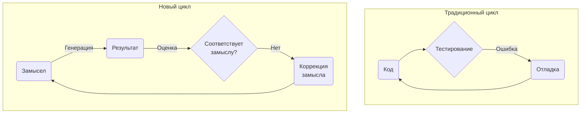
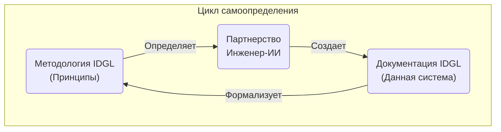

<!-- _class: invert -->

# **IDGL: Инженерная дисциплина в эпоху ИИ**
### Методология, определяющая себя

---

## Проблема: Неконтролируемое ускорение

> «Генеративный ИИ — один из мощнейших инструментов, когда-либо созданных. Это дар, но вместе с тем и источник серьезных проблем».

Ускоряя решение локальных задач, он порождает глобальный системный хаос:
- **Нестабильность качества**
- **Невозможность воспроизведения результата**
- **Непредсказуемость процесса**

Это повышает риски, подрывает доверие и низводит роль архитектора до уровня игрока в рулетку.

---

## Фундаментальные принципы: Наша доктрина

Прежде чем изучить, *как* работает IDGL, необходимо понять, *почему* он эффективен. В основе лежат три ключевых принципа, кардинально отличающих его от примитивной автоматизации.

1.  **YAGNI («Вам это не понадобится»)**
    *Не бюрократия, а инструментарий. По умолчанию — выбор наиболее прямого пути.*

2.  **Многообразие гипотез**
    *Цель — быстрая и экономичная проверка альтернативных решений, а не ускорение получения единственного ответа.*

3.  **Инженер во главе, не процесс**
    *Система создана для усиления интеллекта специалиста, а не для его замены.*

---

## Смена парадигмы: новый цикл разработки

Десятилетиями инженерная мысль была сфокусирована на исправлении *результата*.
Новая парадигма смещает фокус на точку максимального воздействия — на **формулировку замысла**.

---

<!-- _class: invert -->

# **Фреймворк IDGL**
### Анатомия системы

---

## Спецификация (Spec): Исполняемый контракт

Ядро системы — **Спецификация (Spec)**. Это формализованный, версионируемый артефакт, который функционирует как **исполняемый контракт** для ИИ-ассистента.

Спецификация требует от нас дать исчерпывающие ответы на три фундаментальных вопроса *до* начала генерации кода:
1.  **Цель:** Каков целевой объект разработки?
2.  **Обоснование:** Каковы причины для его создания?
3.  **Верификация:** Как будет проверяться корректность реализации?

---

## Искусство итерации: творческое ядро

Итеративный процесс уточнения — это творческое ядро IDGL.

Его главная ценность — психологическая: наличие быстро созданного черновика **устраняет барьер «чистого листа»**. Он предоставляет осязаемый артефакт, позволяя задействовать наш ключевой профессиональный навык: критический анализ и последовательное улучшение.

Мы переходим от отладки к **целенаправленному проектированию**.

---

## Итерационный процесс на практике

Поскольку стоимость генерации пренебрежимо мала, мы можем применять продвинутые стратегии:

- **Вариативная генерация**
  *Создание нескольких версий для объективного сравнения компромиссов.*

- **Декомпозиция с ассистированием ИИ**
  *Привлечение ИИ в качестве партнера по планированию для структуризации сложных задач.*

- **Прекомпиляция артефактов**
  *Генерация «полуфабрикатов» и заготовок для ускорения финальной сборки.*

---

<!-- _class: invert -->

# **IDGL в действии**
### От теории к практике

---

## Паттерн: Декомпозиция с ассистированием ИИ

Мы делегируем ИИ создание плана. Инженер его валидирует, а затем принимает стратегическое решение:

> «Кто исполнит этот план? ИИ — для максимальной скорости, или я — для углубления экспертизы и полного контроля над процессом?»

Это акт осознанного инженерного выбора.

---

## Паттерн: Интеграция унаследованных систем

IDGL эффективен не только для новых проектов.

Паттерн «Интеграция унаследованных систем» использует ИИ для реверс-инжиниринга и создания **черновой Спецификации** на основе существующего, запутанного кода.

Ключевой этап — **коррекция черновика** инженером для отражения *целевого*, а не текущего состояния системы. Так создается каноническая Спецификация для безопасного и контролируемого рефакторинга.

---

## Паттерн: Быстрое прототипирование

<!-- _footer: "Клиентоориентированность в действии" -->

Классический подход к работе с неопределенностью — это недели согласований с высоким риском неверных выводов.

Паттерн **«Быстрое прототипирование»** меняет правила игры. В течение часа мы генерируем **два или три различных, частично функциональных прототипа**.

Мы больше не просим клиента вообразить решение. Мы предоставляем ему **осязаемый выбор**.

---

<!-- _class: invert -->

# **Видение**
### Вектор развития

---

## Будущее: откалиброванное партнерство

Ценность инженера смещается от написания кода к **проектированию систем и формализации замысла**, который направляет ИИ-ассистентов.

Это требует не просто качественных промптов. Это требует **глубокой системной согласованности и отношения** к ИИ как к сложному инструменту, нуждающемуся в точной калибровке.

---

## Финальный аргумент: самоопределяемая система

Данная методология была создана с помощью самой себя.

Вся документация IDGL — это результат итеративного процесса `замысел -> генерация -> оценка -> коррекция` в партнерстве инженера и ИИ.

Система, способная определить саму себя — это не теоретическая модель. Это **доказанная реальность**.

---

## Следующий шаг: от IDGL к ADGL

**IDGL** — это фундаментальная методология.

Следующий эволюционный этап — **ADGL (Agentic-Driven Generative Lifecycle)**. Это готовый к внедрению, автоматизированный фреймворк, который реализует эти принципы с помощью таких инструментов, как CrewAI.

[**Изучить фреймворк ADGL →**](./03-adgl-framework/)

---

<!-- _class: invert -->

# **Благодарю за внимание**
### Вопросы?

**Ссылка на документацию:** [https://github.com/bahsim/idgl-dev-system](https://github.com/bahsim/idgl-dev-system)

---
<!-- _class: lead -->
### Ключевые выгоды

- **Для архитекторов:** Инструмент поддержания архитектурной целостности.
- **Для разработчиков:** Автоматизация рутинных операций, высвобождающая ресурсы для нетривиальных задач.
- **Для QA-инженеров:** Четкие, формализованные и исполняемые критерии приемки, выведенные напрямую из Спецификации.

---
<!-- _class: lead -->
### Наше предложение: Пилотный проект «Авангард»

Предлагаем перейти от теории к практике.

1.  **Проект «Авангард»:** Выделенная команда решает одну бизнес-критичную задачу, используя IDGL.
2.  **Высвобождение ресурсов:** Успех и скорость команды создают избыток экспертного времени.
3.  **Масштабирование экспертизы:** Эксперты инвестируют это время в совместную разработку Спецификаций с другими командами.

**Это первый шаг. Он прагматичен, имеет низкие риски и обеспечивает немедленную демонстрацию ценности.**

---
<!-- _class: lead -->
### Вопросы и ответы

**Спасибо**

[Контактная информация]

[Ссылка на документацию]
