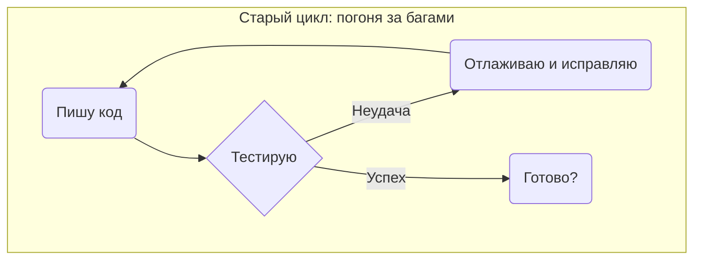
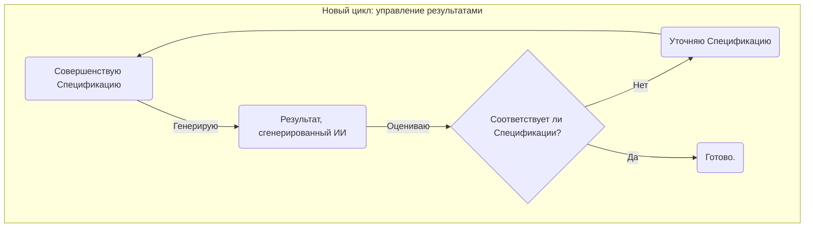

# Основная парадигма: от кодера к архитектору

На протяжении десятилетий сутью нашей профессии было **написание кода**. Мы решали проблемы, напрямую переводя человеческие требования в машинные инструкции. Чем лучше мы справлялись с этим переводом, тем ценнее мы были.

Генеративный ИИ коренным образом перевернул эту модель.

Новым узким местом стал не **перевод** намерения в код, а **формулирование** самого намерения. ИИ может мгновенно генерировать огромные объемы кода, но у него нет понимания цели, нет концепции ценности и нет стратегического суждения. Он может с невероятной скоростью ответить на вопрос «как», но не может спросить «что» или «почему».

Это создает новую парадигму, определяемую простым выбором:

*   **Кодер (прошлое):** Конкурирует с ИИ в том, «как» делать. Он фокусируется на механике генерации кода — битве, которую он неизбежно проиграет. Он становится тактическим уборщиком кода, подчищающим результаты работы машины, которой он по-настоящему не управляет.
*   **Архитектор (будущее):** Управляет ИИ с помощью «почему». Он фокусируется на определении безупречного, проверяемого намерения, которое ИИ может исполнить. Он становится стратегическим дирижером, владеющим ИИ как мощным и предсказуемым мультипликатором силы.

IDGL — это дисциплина, позволяющая совершить этот скачок. Она предоставляет методологию, чтобы перестать быть кодером и стать архитектором.

---

## Два цикла: на что вы тратите свое время?

Этот сдвиг парадигмы лучше всего понять, взглянув на два цикла разработки — старый и новый.

### Старый цикл: рутина отладки

Традиционный цикл разработки является реактивным. Разработчик пишет код, тестирует его, а затем проводит большую часть своего времени в утомительном тактическом цикле отладки и исправлений.

В этом мире ваша ценность пропорциональна вашему умению отлаживать — бесконечной задаче с низкой отдачей.

### Новый цикл: рычаг уточнения намерения

Цикл IDGL является проактивным. Основная работа архитектора — довести до совершенства `Спецификацию`. Генерация кода передается ИИ, а время архитектора тратится на стратегический цикл с высокой отдачей: оценка результата на соответствие исходному намерению и уточнение `Спецификации` до тех пор, пока она не станет идеальной.

В этом мире ваша ценность пропорциональна вашему умению **определять и проверять намерения**. Вы больше не гоняетесь за ошибками в коде; вы устраняете двусмысленность в мыслях. Это и есть основная работа архитектора.
