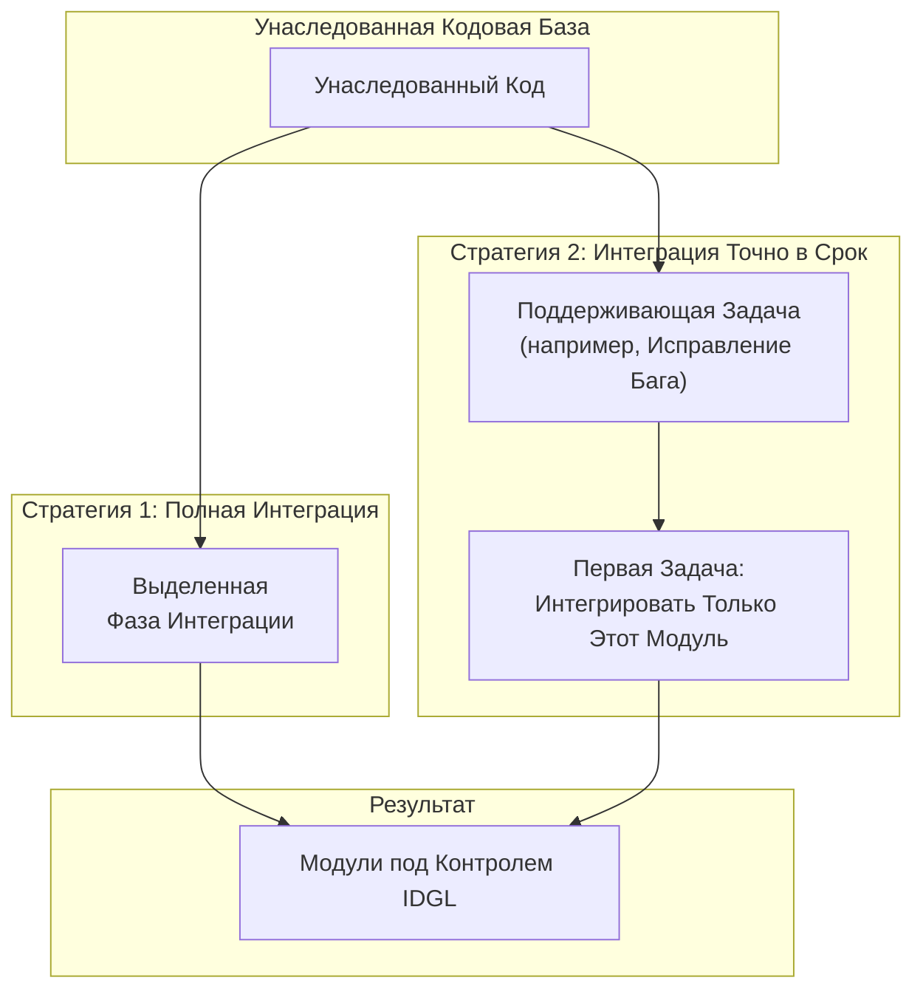

# Паттерн: Интеграция Унаследованного Кода

## 1. Суть Паттерна
Контроль Архитектора исходит из `Спецификации`. В унаследованных проектах, по определению, этот контракт отсутствует. Паттерн **Интеграция Унаследованного Кода** — это стратегия Архитектора для генерации этих основополагающих спецификаций для уже существующего кода, переводя его под контроль IDGL.

Это не универсальный процесс. Архитектор выбирает между двумя основными стратегиями: комплексной «Полной Интеграцией» или более гибким подходом «Точно в Срок».

## 2. Стратегия 1: Полная Интеграция
Это комплексное, на уровне проекта, усилие по интеграции всего унаследованного приложения за один раз.

*   **Когда Применять Этот Паттерн:** Когда есть стратегическое обязательство по модернизации всей унаследованной системы и доступны выделенные ресурсы.
*   **Как Его Выполнять:** Интеграция рассматривается как формальная **Фаза Разработки**.
    1.  Архитектор использует ИИ-партнера по планированию для анализа монолита и определения его основных архитектурных модулей.
    2.  Для каждого модуля агенту ИИ дается указание провести обратный инжиниринг `Черновой Спецификации` из унаследованного кода.
    3.  **Архитектор просматривает и редактирует `Черновую Спецификацию`**, исправляя любую логику, чтобы она отражала *желаемое* поведение, а не просто существующее ошибочное поведение. Этот шаг под руководством человека создает каноническую `Спецификацию`.

## 3. Стратегия 2: Интеграция Точно в Срок
Это непрерывный, гибкий подход, при котором части унаследованной системы интегрируются по мере необходимости. Это наиболее распространенная и практичная стратегия.

*   **Когда Применять Этот Паттерн:** В рамках обычного потока ежедневного обслуживания и разработки.
*   **Как Его Выполнять:**
    1.  Архитектор получает задачу исправить ошибку в унаследованном модуле.
    2.  Первая генеративная задача Архитектора — дать промпт ИИ: *«Ваша задача — выступить в роли реверс-инженера. Проанализируйте приложенный унаследованный код аутентификации и сгенерируйте полную **Черновую Спецификацию** для него».*
    3.  **Архитектор тщательно просматривает `Черновую Спецификацию`**. Он редактирует ее, чтобы исправить любую логику, добавить недостающие крайние случаи и убедиться, что она представляет *правильное, желаемое поведение* модуля. Так создается каноническая `Спецификация`.
    4.  После того как исправленная `Спецификация` установлена, Архитектор может создать свою вторую генеративную задачу для фактического исправления ошибки.

Этот гибкий подход создает добродетельный цикл: покрытие системы `Спецификациями` органически увеличивается по мере того, как разработчики затрагивают разные части кода, делая создание документации естественной частью процесса обслуживания.
