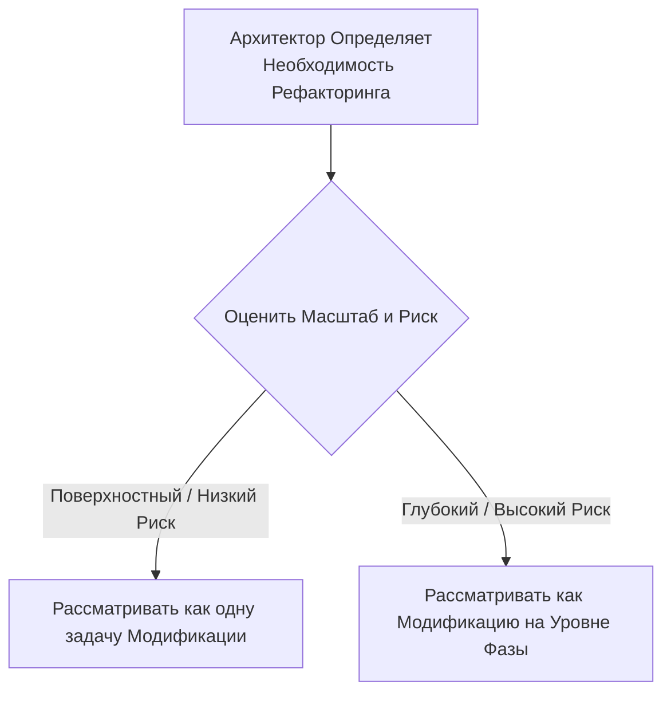

# Паттерн: Управляемый Рефакторинг

## 1. Суть Паттерна
Рефакторинг — это стратегическая, руководимая человеком деятельность, а не слепой, автоматизированный процесс. Паттерн **Управляемый Рефакторинг** — это стратегия Архитектора для поддержания абсолютного контроля над изменениями в кодовой базе, от незначительных правок до крупных архитектурных перестроек.

В этом паттерне Архитектор является стратегом, который определяет цель в `Спецификации`, а ИИ — это инструмент, который выполняет утомительные, крупномасштабные изменения с высокой скоростью и точностью.

## 2. Два Масштаба Рефакторинга
Архитектор должен сначала оценить масштаб и риск изменения, чтобы выбрать правильный подход.

### Стратегия 1: Поверхностный Рефакторинг (Задача Модификации)
Это для локализованных, низкорискованных изменений, которые улучшают состояние компонента, не изменяя его контракт.

*   **Примеры:** Переименование переменной, извлечение сложной функции в приватный метод.
*   **Как Его Выполнять:** Поверхностный рефакторинг рассматривается как стандартная задача **Модификации**. Архитектор составляет четкую `Спецификацию`, которая описывает желаемое изменение, которое затем выполняет ИИ.
    *   **Пример Спецификации:** *«В приложенном файле `auth.service.ts` функция `checkUser` слишком длинная. Извлеките логику валидации пароля в отдельный приватный метод с именем `_validatePassword`. Новый метод должен иметь тот же уровень обработки ошибок, а внешнее поведение `checkUser` не должно измениться».*

### Стратегия 2: Глубокий Рефакторинг (Модификация на Уровне Фазы)
Это для крупномасштабных, высокорискованных, архитектурных изменений, которые фундаментально преобразуют часть системы.

*   **Примеры:** Миграция бэкенд-фреймворка, разделение монолита на микросервисы.
*   **Как Его Выполнять:** Глубокий рефакторинг — это крупномасштабная **Модификация**, и он должен управляться с дисциплиной формальной фазы проекта.
    *   Критически важный первый шаг Архитектора — создать `Спецификацию` для новой, желаемой архитектуры. Это часто включает использование ИИ-партнера по планированию для анализа старой системы и предложения нового дизайна.
    *   Архитектор проверяет и уточняет этот сгенерированный ИИ архитектурный план.
    *   Остальная часть фазы протекает как серия скоординированных задач **Модификации**, используя новую архитектурную `Спецификацию` в качестве руководства.

Этот дисциплинированный, двухпроцессный подход гарантирует, что каждое усилие по рефакторингу, независимо от его размера, является преднамеренной, управляемой спецификацией и отслеживаемой деятельностью, которая улучшает состояние проекта.
