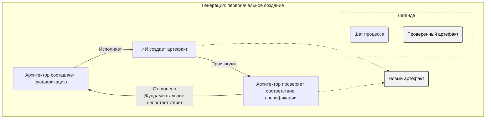
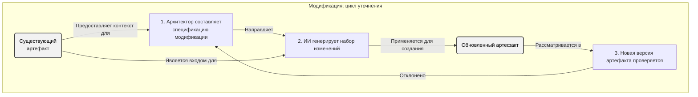

# Жизненный цикл артефакта: рабочий процесс архитектора

`Спецификация` — это контракт, но контракт бесполезен без формального процесса его исполнения. Жизненный цикл артефакта определяет два дисциплинированных рабочих процесса, которые архитектор использует для преобразования `Спецификации` в осязаемый, проверенный результат.

Каждое действие, которое архитектор совершает над артефактом, относится к одному из этих двух процессов: **Генерация** или **Модификация**. Понимание их является ключом к поддержанию контроля и предсказуемости на протяжении всего проекта.

---

## 1. Рабочий процесс генерации: создание первоначального артефакта

Этот рабочий процесс используется ровно один раз для каждого артефакта: в момент его создания. Это идеальный «счастливый путь», когда высококачественная `Спецификация` используется для создания нового артефакта с чистого листа.

Отказ на этом этапе является значительным. Он не предполагает незначительной ошибки; он сигнализирует о фундаментальном недостатке в самой `Спецификации`, требуя от архитектора вернуться к контракту и уточнить свое намерение.

### Ход процесса

---

## 2. Рабочий процесс модификации: контролируемое, итеративное изменение

Это основной рабочий процесс архитектора для всех запланированных, итеративных изменений **существующего артефакта**. Это основной цикл повседневной разработки и долгосрочного обслуживания. Процесс всегда инициируется с существующим артефактом и новой `Спецификацией`, которая определяет желаемые изменения.

В отличие от генерации, отказ здесь ожидаем и управляем. Обычно он указывает на незначительную проблему реализации, которую архитектор может исправить с помощью быстрого цикла **Уточнения**, корректируя `Спецификацию` для предоставления более четких инструкций для следующей попытки генерации.

### Ход процесса

