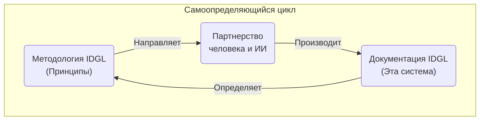

# IDGL: От хаоса к контролю

Генеративный ИИ внес новое напряжение в нашу работу: невероятная **скорость** ИИ против профессиональной **дисциплины**, необходимой для создания надежного программного обеспечения. Этот хаос ставит каждого инженера перед выбором:

Являемся ли мы **игроками**, которые надеются на удачный промпт и проводят свои дни, убирая беспорядок?

Или мы **архитекторы**, которые управляют ИИ с четким планом, чтобы гарантировать результат?

Этот репозиторий содержит **Intent-Driven Generative Lifecycle (IDGL)**: исчерпывающее руководство по становлению архитектором в эпоху ИИ. Это легковесная, не зависящая от инструментов дисциплина для превращения хаоса генеративного ИИ в предсказуемые, контролируемые результаты путем смещения нашего фокуса с **труда** по написанию кода на **рычаг** совершенствования намерений.

---

## Путь к становлению архитектором
Эта документация — ваш гид по освоению пути архитектора. Она структурирована так, чтобы выстраивать ваше понимание от основополагающей философии до практического применения.

*   **Основная доктрина:** Фундаментальные принципы и мышление архитектора.
    *   **[Основная парадигма](./00-core.md)**
    *   **[Мышление архитектора](./00-idgl-philosophy.md)**
    *   **[Профиль архитектора](./06-the-architect-profile.md)**
    *   **[Часто задаваемые вопросы](./07-faq.md)**
*   **Рабочий процесс архитектора:** Практическая методология для управления ИИ.
    *   **[Анатомия спецификации](./02-anatomy-of-a-spec.md)**
    *   **[Жизненный цикл артефакта](./03-the-artifact-lifecycle.md)**
*   **Сборник приемов архитектора:** Каталог повторяемых стратегий для достижения продвинутых результатов.
    *   **[Принципы коммуникации](./04-communication-principles.md)**
    *   **[Продвинутые приемы (паттерны)](./05-patterns.md)**

---

## Начало работы: от теории к практике
Чтения недостаточно. Путь к становлению архитектором лежит через создание. У нас есть ясное, прагматичное руководство для вашего первого шага, независимо от того, являетесь ли вы индивидуальным разработчиком или руководителем группы.

**[Нажмите здесь, чтобы начать свой путь →](./GETTING-STARTED.md)**

---

## Окончательное доказательство: самоопределяющаяся система

Окончательное доказательство дисциплины архитектора? **Когда она достаточно надежна, чтобы создавать саму себя.**

Вся эта система IDGL является продуктом своего собственного процесса. Система, которая может сама себя запустить, — это не теория; это **доказанная реальность.**

